Exploratory Data Analysis - Environmental variable selection
================
Denisse Fierro Arcos
2023-07-13

- <a href="#environmental-variable-selection"
  id="toc-environmental-variable-selection">Environmental variable
  selection</a>
  - <a href="#loading-libraries" id="toc-loading-libraries">Loading
    libraries</a>
  - <a href="#loading-observations-and-background-data"
    id="toc-loading-observations-and-background-data">Loading observations
    and background data</a>
  - <a href="#extracting-environmental-variables"
    id="toc-extracting-environmental-variables">Extracting environmental
    variables</a>
    - <a href="#calculating-and-plotting-correlation-matrix"
      id="toc-calculating-and-plotting-correlation-matrix">Calculating and
      plotting correlation matrix</a>
  - <a
    href="#calculating-linear-regression-between-predicting-and-response-variable"
    id="toc-calculating-linear-regression-between-predicting-and-response-variable">Calculating
    linear regression between predicting and response variable</a>
  - <a href="#calculating-and-plotting-vif-values"
    id="toc-calculating-and-plotting-vif-values">Calculating and plotting
    VIF values</a>
  - <a href="#correlation-matrix-without-freezing-potential"
    id="toc-correlation-matrix-without-freezing-potential">Correlation
    matrix without freezing potential</a>
  - <a href="#linear-regression-without-freezing-potential"
    id="toc-linear-regression-without-freezing-potential">Linear regression
    without freezing potential</a>
  - <a href="#calculating-vif-without-freezing-potential"
    id="toc-calculating-vif-without-freezing-potential">Calculating VIF
    without freezing potential</a>
  - <a href="#correlation-matrix-without-bottom-salinity"
    id="toc-correlation-matrix-without-bottom-salinity">Correlation matrix
    without bottom salinity</a>
  - <a href="#linear-regression-without-bottom-salinity"
    id="toc-linear-regression-without-bottom-salinity">Linear regression
    without bottom salinity</a>
  - <a href="#calculating-vif-without-bottom-salinity"
    id="toc-calculating-vif-without-bottom-salinity">Calculating VIF without
    bottom salinity</a>
  - <a href="#correlation-matrix-without-sst"
    id="toc-correlation-matrix-without-sst">Correlation matrix without
    SST</a>
  - <a href="#linear-regression-without-sst"
    id="toc-linear-regression-without-sst">Linear regression without SST</a>
  - <a href="#calculating-vif-without-sst"
    id="toc-calculating-vif-without-sst">Calculating VIF without SST</a>
  - <a href="#correlation-matrix-without-sic"
    id="toc-correlation-matrix-without-sic">Correlation matrix without
    SIC</a>
  - <a href="#linear-regression-without-sic"
    id="toc-linear-regression-without-sic">Linear regression without SIC</a>
  - <a href="#calculating-vif-without-sic"
    id="toc-calculating-vif-without-sic">Calculating VIF without SIC</a>
  - <a href="#correlation-matrix-without-distance-to-continental-shelf"
    id="toc-correlation-matrix-without-distance-to-continental-shelf">Correlation
    matrix without distance to continental shelf</a>
  - <a href="#linear-regression-without-distance-to-continental-shelf"
    id="toc-linear-regression-without-distance-to-continental-shelf">Linear
    regression without distance to continental shelf</a>
  - <a href="#calculating-vif-without-distance-to-continental-shelf"
    id="toc-calculating-vif-without-distance-to-continental-shelf">Calculating
    VIF without distance to continental shelf</a>
  - <a href="#correlation-matrix-without-distance-to-sea-ice-edge"
    id="toc-correlation-matrix-without-distance-to-sea-ice-edge">Correlation
    matrix without distance to sea ice edge</a>
  - <a href="#linear-regression-without-distance-to-sea-ice-edge"
    id="toc-linear-regression-without-distance-to-sea-ice-edge">Linear
    regression without distance to sea ice edge</a>
  - <a href="#calculating-vif-without-distance-to-sea-ice-edge"
    id="toc-calculating-vif-without-distance-to-sea-ice-edge">Calculating
    VIF without distance to sea ice edge</a>
  - <a href="#correlation-matrix-without-long-term-presence-of-pack-ice"
    id="toc-correlation-matrix-without-long-term-presence-of-pack-ice">Correlation
    matrix without long-term presence of pack ice</a>
  - <a href="#linear-regression-without-long-term-presence-of-pack-ice"
    id="toc-linear-regression-without-long-term-presence-of-pack-ice">Linear
    regression without long-term presence of pack ice</a>
  - <a href="#calculating-vif-without-long-term-presence-of-pack-ice"
    id="toc-calculating-vif-without-long-term-presence-of-pack-ice">Calculating
    VIF without long-term presence of pack ice</a>
  - <a href="#saving-new-dataset" id="toc-saving-new-dataset">Saving new
    dataset</a>

# Environmental variable selection

Before developing a Generalised Additive Model (GAM) to estimate the
distribution of crabeater seals in East Antarctica, we will check all
that the 17 environmental variables identified as potential predictors
of crabeater seal distribution are not highly correlated with each
other. This is known as multicollinearity and it can cause problems with
regression analyses as highly correlated variables do not provide
independent information to the regression model and this can cause
problems when fitting the model.

To identify multicollinearity, we will calculate the correlation among
all environmental variables. High correlation (r \> 0.75) can be an
indicator of multicollinearity. We will follow this by applying a linear
regression using all environmental variables as predictors and the
`presence` column as the response (a value of `1` in this columns
indicates an observation while `0` refers to background data). We will
use these results to calculte the variance inflation factor (VIF). The
VIF is the most common way to detect multicollinearity with values above
5 indicating a strong correlation across variables.

Finally, to help us decide which environmental variables we will keep if
multicollinearity is detected, we will use the results from the linear
regression. We will also plot the density distribution of the
environmental variables between observation and background points to
help identify which variable to keep as a predictor. Variables that
appear to show a larger difference in their density distribution will be
preferred as predictors as they capture differences in environmental
conditions detected at seal sighting location in comparison to
background points.

## Loading libraries

``` r
library(tidyverse)
library(GGally)
library(car)
library(cowplot)
```

## Loading observations and background data

We will load these two datasets and merge them together before running
our exploratory analysis.

``` r
crab_ind <- read_csv("../../Environmental_Data/ACCESS-OM2-01/unique_crabeater_obs_all_env.csv") %>% 
  #Selecting observations for the Indian sector during the weaning period
  filter(str_detect(sector, "Indian") & life_stage == "weaning") %>% 
  #Binding to background data
  bind_rows(read_csv("../../Environmental_Data/ACCESS-OM2-01/unique_background_20x_obs_all_env.csv")) %>% 
  select(!c(event_date:source))
```

    ## Rows: 3240 Columns: 33
    ## ── Column specification ────────────────────────────────────────────────────────
    ## Delimiter: ","
    ## chr   (6): date, source, sector, zone, season_year, life_stage
    ## dbl  (26): latitude, longitude, year, yt_ocean, xt_ocean, month, decade, pre...
    ## dttm  (1): event_date
    ## 
    ## ℹ Use `spec()` to retrieve the full column specification for this data.
    ## ℹ Specify the column types or set `show_col_types = FALSE` to quiet this message.
    ## Rows: 30671 Columns: 31
    ## ── Column specification ────────────────────────────────────────────────────────
    ## Delimiter: ","
    ## chr  (5): date, sector, zone, season_year, life_stage
    ## dbl (26): year, longitude, latitude, xt_ocean, yt_ocean, month, decade, pres...
    ## 
    ## ℹ Use `spec()` to retrieve the full column specification for this data.
    ## ℹ Specify the column types or set `show_col_types = FALSE` to quiet this message.

``` r
#Checking data structure
glimpse(crab_ind)
```

    ## Rows: 32,512
    ## Columns: 28
    ## $ year                <dbl> 1998, 1998, 1996, 1998, 1998, 1998, 1998, 1998, 19…
    ## $ sector              <chr> "Central Indian", "Central Indian", "Central India…
    ## $ zone                <chr> "Antarctic", "Antarctic", "Antarctic", "Antarctic"…
    ## $ yt_ocean            <dbl> -69.113, -69.028, -68.986, -68.606, -68.395, -68.1…
    ## $ xt_ocean            <dbl> 75.85, 75.35, 76.05, 75.45, 75.35, 74.25, 74.25, 7…
    ## $ month               <dbl> 11, 11, 11, 11, 11, 11, 11, 11, 12, 12, 12, 11, 12…
    ## $ season_year         <chr> "autumn", "autumn", "autumn", "autumn", "autumn", …
    ## $ life_stage          <chr> "weaning", "weaning", "weaning", "weaning", "weani…
    ## $ decade              <dbl> 1990, 1990, 1990, 1990, 1990, 1990, 1990, 1990, 19…
    ## $ presence            <dbl> 1, 1, 1, 1, 1, 1, 1, 1, 1, 1, 1, 1, 1, 1, 1, 1, 1,…
    ## $ bottom_slope_deg    <dbl> 89.937, 89.651, 89.957, 89.725, 89.720, 89.801, 89…
    ## $ dist_shelf_km       <dbl> -492.145, -481.137, -479.088, -434.549, -410.830, …
    ## $ dist_coast_km       <dbl> 130.290, 117.409, 119.262, 71.716, 47.949, 23.210,…
    ## $ depth_m             <dbl> 628.583, 729.212, 771.083, 657.067, 578.417, 588.4…
    ## $ freez_pot_Wm2       <dbl> -541.15330, -501.89883, -1807.57590, -372.80582, -…
    ## $ SIT_m               <dbl> 0.3415394, 0.3846430, 0.1630751, 0.4103234, 0.4209…
    ## $ SIC                 <dbl> 0.6499641, 0.6814973, 0.6300092, 0.7778370, 0.9494…
    ## $ SST_degC            <dbl> -1.794739, -1.801086, -1.641327, -1.816406, -1.854…
    ## $ bottom_temp_degC    <dbl> -1.846130, -1.842529, -1.853790, -1.860046, -1.863…
    ## $ SSS_psu             <dbl> 34.44893, 34.47804, 34.44453, 34.47337, 34.53225, …
    ## $ bottom_sal_psu      <dbl> 34.51963, 34.54789, 34.52097, 34.53065, 34.54361, …
    ## $ vel_lat_surf_msec   <dbl> -0.027873990, -0.056935396, -0.041804970, -0.02206…
    ## $ vel_lat_bottom_msec <dbl> 0.0015187905, -0.0097520831, 0.0188726233, 0.02458…
    ## $ vel_lon_surf_msec   <dbl> -0.0814870740, -0.0606862900, -0.0243415890, -0.15…
    ## $ vel_lon_bottom_msec <dbl> 0.0134439742, 0.0119439794, 0.0261001389, -0.06493…
    ## $ lt_pack_ice         <dbl> 0.5952381, 0.6309524, 0.5952381, 0.6309524, 0.6309…
    ## $ dist_ice_edge_km    <dbl> -1007.8298, -996.3414, -945.3168, -950.0118, -926.…
    ## $ krill_ggp           <dbl> 0.9249391, 0.9233525, 0.9316934, 0.9241932, 0.9209…

## Extracting environmental variables

We will create a new variable to facilitate this exploratory analysis.

``` r
#Checking correlation between numeric variables
num_var <- crab_ind %>% 
  select(bottom_slope_deg:krill_ggp) %>% 
  #Removing rows containing NA values
  drop_na()
```

### Calculating and plotting correlation matrix

We will calculate the Spearman correlations across all variables. We use
Spearman because it does not assume relationships across variables are
linear.

``` r
#Calculating correlations and plotting results
ggcorr(num_var, method = c("pairwise", "spearman"), 
       label = T, label_size = 3, angle = -15)+
  theme(legend.justification = c(1, 0),
        legend.position = c(0.5, 0.7),
        legend.direction = "horizontal") +
  guides(fill = guide_colorbar(barwidth = 9, 
                               barheight = 1, 
                               title.position = "top", 
                               title.hjust = 0.5, 
                               title = "Spearman correlation"))
```

    ## Warning: A numeric `legend.position` argument in `theme()` was deprecated in ggplot2
    ## 3.5.0.
    ## ℹ Please use the `legend.position.inside` argument of `theme()` instead.
    ## This warning is displayed once every 8 hours.
    ## Call `lifecycle::last_lifecycle_warnings()` to see where this warning was
    ## generated.

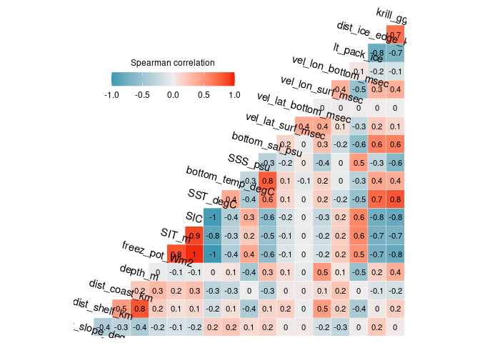<!-- -->
There are a number of variables with a strong correlation (0.75 or
above). This suggests that multicollinearity would be an issue in our
model if we were to include all variables as predictors. We will
continue the analysis by calculating the variance inflation factor
(VIF). This will help us identify the variables that we should consider
excluding from the model due to their lack of independence with one or
more predictor variables.

## Calculating linear regression between predicting and response variable

The response variable will be the `presence` column, which identifies
observations and background data. The predicting variables are all the
variables shown in the correlation plot above.

``` r
# First we will define the formula to be used in the linear regression. We will use the names of all variables in the num_var data frame
form_lm <- paste("presence", paste(colnames(num_var), sep = "+", 
                                   collapse = "+"), 
                 sep = " ~ ")

#Fitting linear model
model <- lm(as.formula(form_lm), data = crab_ind)

#Checking results
summary(model)
```

    ## 
    ## Call:
    ## lm(formula = as.formula(form_lm), data = crab_ind)
    ## 
    ## Residuals:
    ##      Min       1Q   Median       3Q      Max 
    ## -0.30398 -0.07027 -0.05576 -0.03995  0.98619 
    ## 
    ## Coefficients:
    ##                       Estimate Std. Error t value Pr(>|t|)    
    ## (Intercept)          4.489e+00  2.579e+00   1.740  0.08182 .  
    ## bottom_slope_deg     1.265e-04  3.549e-04   0.357  0.72147    
    ## dist_shelf_km       -1.496e-04  2.931e-05  -5.106 3.32e-07 ***
    ## dist_coast_km        4.282e-06  2.692e-05   0.159  0.87362    
    ## depth_m              1.322e-05  2.849e-06   4.639 3.51e-06 ***
    ## freez_pot_Wm2        2.607e-06  2.636e-06   0.989  0.32276    
    ## SIT_m               -3.346e-02  6.789e-03  -4.929 8.32e-07 ***
    ## SIC                 -6.079e-03  1.609e-02  -0.378  0.70562    
    ## SST_degC             1.488e-02  2.282e-02   0.652  0.51431    
    ## bottom_temp_degC    -3.924e-03  8.276e-03  -0.474  0.63539    
    ## SSS_psu             -1.388e-01  1.073e-02 -12.945  < 2e-16 ***
    ## bottom_sal_psu       2.216e-02  7.602e-02   0.291  0.77068    
    ## vel_lat_surf_msec    1.962e-02  3.604e-02   0.544  0.58614    
    ## vel_lat_bottom_msec  1.692e-01  5.584e-02   3.030  0.00245 ** 
    ## vel_lon_surf_msec    8.247e-02  2.549e-02   3.236  0.00121 ** 
    ## vel_lon_bottom_msec -1.800e-03  5.012e-02  -0.036  0.97135    
    ## lt_pack_ice          2.761e-02  1.309e-02   2.109  0.03498 *  
    ## dist_ice_edge_km     2.167e-05  9.862e-06   2.198  0.02798 *  
    ## krill_ggp           -4.774e-01  5.679e-02  -8.406  < 2e-16 ***
    ## ---
    ## Signif. codes:  0 '***' 0.001 '**' 0.01 '*' 0.05 '.' 0.1 ' ' 1
    ## 
    ## Residual standard error: 0.2307 on 32347 degrees of freedom
    ##   (146 observations deleted due to missingness)
    ## Multiple R-squared:  0.008347,   Adjusted R-squared:  0.007795 
    ## F-statistic: 15.13 on 18 and 32347 DF,  p-value: < 2.2e-16

We can see that not all variables under consideration were found to have
a significant correlation to the `presence` column. We can now calculate
VIF values for all predicting variables.

## Calculating and plotting VIF values

``` r
#Calculating VIF values for all predictors in the linear regression
vif_vals <- vif(model)

#Plotting results as a horizontal bar plot
par(mar = c(2, 10, 2, 2))
barplot(vif_vals, horiz = T, las = 1)
#We will add a vertical line at 5 to identify variables with large VIF values
abline(v = 5)
```

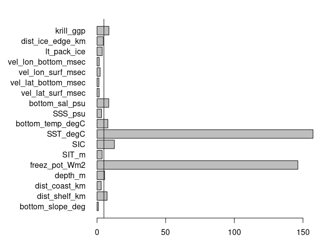<!-- -->

Freezing potential (`freez_pot_Wm2`) and sea surface temperature
(`SST_degC`) are the two factors with the largest VIF values. Neither of
these factors are significant in the model. We will check the density
distribution of these variables between observations and backgrounds to
help us decide which variable to remove from further analyses.

``` r
#Density distribution for freezing potential
den1 <- crab_ind %>% 
  drop_na() %>% 
  ggplot(aes(x = freez_pot_Wm2, fill = factor(presence)))+
  geom_density(alpha = 0.5)+
  scale_fill_brewer(palette = "Dark2")+
  theme_bw()

#Density distribution for SST
den2 <- crab_ind %>% 
  drop_na() %>% 
  ggplot(aes(x = SST_degC, fill = factor(presence)))+
  geom_density(alpha = 0.5)+
  scale_fill_brewer(palette = "Dark2")+
  theme_bw()

#Plotting together
plot_grid(den1, den2, nrow = 2)
```

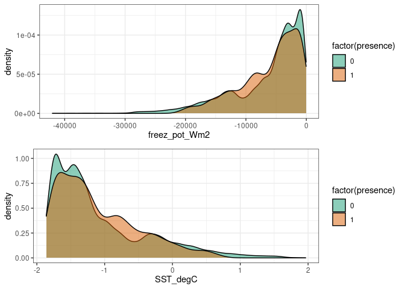<!-- -->

The density distribution of these two variables are almost a mirror
image of each other. Neither were considered to be statistically
significant in the linear regression. Looking at the correlation plot,
we can see that freezing potential has strong correlation with a larger
number of variables that SST, so we will drop freezing potential and run
the analysis again.

## Correlation matrix without freezing potential

``` r
#Removing freezing potential from num_var data frame and plot correlations again
num_var <- num_var %>% 
  #Removing rows containing NA values
  drop_na() %>% 
  select(!freez_pot_Wm2)

#Calculating correlations and plotting results
ggcorr(num_var, method = c("pairwise", "spearman"), 
       label = T, label_size = 3, angle = -15)+
  theme(legend.justification = c(1, 0),
        legend.position = c(0.5, 0.7),
        legend.direction = "horizontal") +
  guides(fill = guide_colorbar(barwidth = 9, 
                               barheight = 1, 
                               title.position = "top", 
                               title.hjust = 0.5, 
                               title = "Spearman correlation"))
```

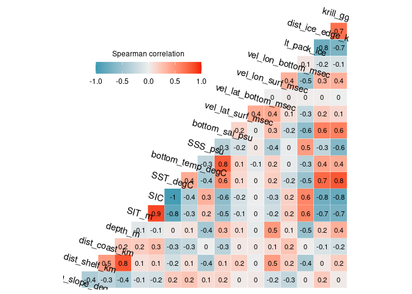<!-- -->

## Linear regression without freezing potential

High correlations are still detected, so we will run the linear
regression and calculate VIF once again.

``` r
#Linear regression formula
form_lm <- paste("presence", 
                 paste(colnames(num_var), sep = "+", collapse = "+"), 
                 sep = " ~ ")

#Fitting linear model
model <- lm(as.formula(form_lm), data = crab_ind)

#Checking results
summary(model)
```

    ## 
    ## Call:
    ## lm(formula = as.formula(form_lm), data = crab_ind)
    ## 
    ## Residuals:
    ##      Min       1Q   Median       3Q      Max 
    ## -0.30265 -0.07023 -0.05580 -0.04000  0.98579 
    ## 
    ## Coefficients:
    ##                       Estimate Std. Error t value Pr(>|t|)    
    ## (Intercept)          4.489e+00  2.579e+00   1.740  0.08180 .  
    ## bottom_slope_deg     1.252e-04  3.549e-04   0.353  0.72422    
    ## dist_shelf_km       -1.493e-04  2.931e-05  -5.096 3.48e-07 ***
    ## dist_coast_km        3.968e-06  2.692e-05   0.147  0.88283    
    ## depth_m              1.327e-05  2.849e-06   4.659 3.19e-06 ***
    ## SIT_m               -3.338e-02  6.789e-03  -4.916 8.86e-07 ***
    ## SIC                 -7.027e-03  1.606e-02  -0.437  0.66179    
    ## SST_degC            -7.250e-03  4.447e-03  -1.630  0.10307    
    ## bottom_temp_degC    -3.894e-03  8.276e-03  -0.470  0.63802    
    ## SSS_psu             -1.394e-01  1.071e-02 -13.023  < 2e-16 ***
    ## bottom_sal_psu       2.157e-02  7.601e-02   0.284  0.77657    
    ## vel_lat_surf_msec    1.881e-02  3.603e-02   0.522  0.60163    
    ## vel_lat_bottom_msec  1.696e-01  5.584e-02   3.037  0.00239 ** 
    ## vel_lon_surf_msec    8.140e-02  2.546e-02   3.196  0.00139 ** 
    ## vel_lon_bottom_msec -7.742e-04  5.011e-02  -0.015  0.98767    
    ## lt_pack_ice          2.764e-02  1.309e-02   2.111  0.03478 *  
    ## dist_ice_edge_km     2.196e-05  9.858e-06   2.227  0.02592 *  
    ## krill_ggp           -4.766e-01  5.679e-02  -8.393  < 2e-16 ***
    ## ---
    ## Signif. codes:  0 '***' 0.001 '**' 0.01 '*' 0.05 '.' 0.1 ' ' 1
    ## 
    ## Residual standard error: 0.2307 on 32348 degrees of freedom
    ##   (146 observations deleted due to missingness)
    ## Multiple R-squared:  0.008317,   Adjusted R-squared:  0.007795 
    ## F-statistic: 15.96 on 17 and 32348 DF,  p-value: < 2.2e-16

## Calculating VIF without freezing potential

``` r
#Calculating VIF values for all predictors in the linear regression
vif_vals <- vif(model)

#Plotting results as a horizontal bar plot
par(mar = c(2, 10, 2, 2))
barplot(vif_vals, horiz = T, las = 1)
#We will add a vertical line at 5 to identify variables with large VIF values
abline(v = 5)
```

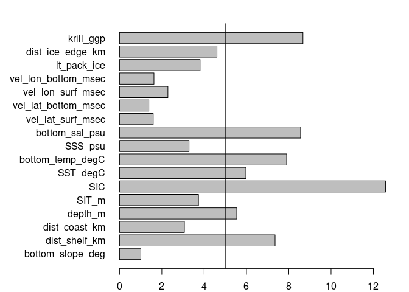<!-- -->

By removing the freezing potential, the VIF value for SST decrease in
about 90%. We will now consider the bottom salinity (`bottom_sal_PSU`)
and the sea ice concentration (`SIC`). In this case, both variables were
found to be significant in the linear regression. We will now look at
the density distribution of these variables.

``` r
#Density distribution for freezing potential
den1 <- crab_ind %>% 
  drop_na() %>% 
  ggplot(aes(x = bottom_sal_psu, fill = factor(presence)))+
  geom_density(alpha = 0.5)+
  scale_fill_brewer(palette = "Dark2")+
  theme_bw()

#Density distribution for SST
den2 <- crab_ind %>% 
  drop_na() %>% 
  ggplot(aes(x = SIC, fill = factor(presence)))+
  geom_density(alpha = 0.5)+
  scale_fill_brewer(palette = "Dark2")+
  theme_bw()

#Plotting together
plot_grid(den1, den2, nrow = 2)
```

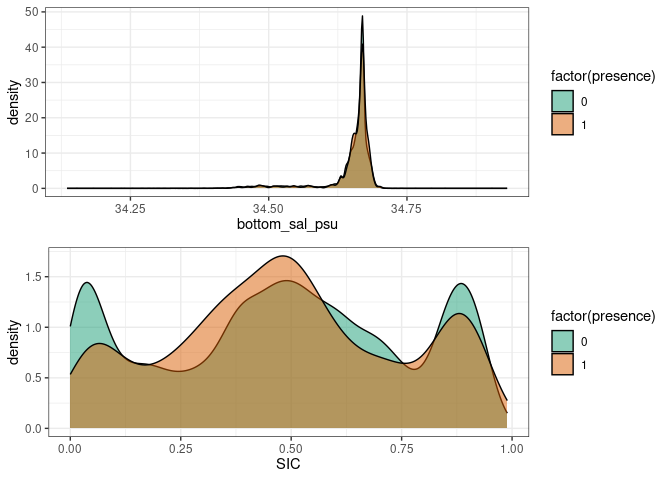<!-- -->

There is a larger difference in the density distribution of SIC, while
the bottom salinity shows a very similar distribution between background
and observations. Since there is not a large difference in the bottom
salinity, this may not provide useful information to our model, so we
will remove it and run the analysis once more.

## Correlation matrix without bottom salinity

``` r
#Removing freezing potential from num_var data frame and plot correlations again
num_var <- num_var %>% 
  #Removing rows containing NA values
  drop_na() %>% 
  select(!bottom_sal_psu)

#Calculating correlations and plotting results
ggcorr(num_var, method = c("pairwise", "spearman"), 
       label = T, label_size = 3, angle = -15)+
  theme(legend.justification = c(1, 0),
        legend.position = c(0.5, 0.7),
        legend.direction = "horizontal") +
  guides(fill = guide_colorbar(barwidth = 9, 
                               barheight = 1, 
                               title.position = "top", 
                               title.hjust = 0.5, 
                               title = "Spearman correlation"))
```

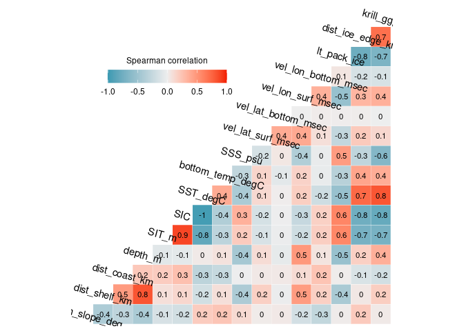<!-- -->

## Linear regression without bottom salinity

High correlations are still present. SIC appears to still be an issue,
so we will run the linear regression and calculate VIF once again.

``` r
#Linear regression formula
form_lm <- paste("presence", 
                 paste(colnames(num_var), sep = "+", collapse = "+"), 
                 sep = " ~ ")

#Fitting linear model
model <- lm(as.formula(form_lm), data = crab_ind)

#Checking results
summary(model)
```

    ## 
    ## Call:
    ## lm(formula = as.formula(form_lm), data = crab_ind)
    ## 
    ## Residuals:
    ##      Min       1Q   Median       3Q      Max 
    ## -0.30494 -0.07020 -0.05581 -0.04007  0.98546 
    ## 
    ## Coefficients:
    ##                       Estimate Std. Error t value Pr(>|t|)    
    ## (Intercept)          5.212e+00  4.005e-01  13.013  < 2e-16 ***
    ## bottom_slope_deg     1.247e-04  3.549e-04   0.351  0.72528    
    ## dist_shelf_km       -1.508e-04  2.887e-05  -5.222 1.78e-07 ***
    ## dist_coast_km        4.685e-06  2.680e-05   0.175  0.86124    
    ## depth_m              1.355e-05  2.680e-06   5.056 4.30e-07 ***
    ## SIT_m               -3.354e-02  6.765e-03  -4.957 7.18e-07 ***
    ## SIC                 -7.192e-03  1.605e-02  -0.448  0.65414    
    ## SST_degC            -7.357e-03  4.431e-03  -1.660  0.09689 .  
    ## bottom_temp_degC    -1.923e-03  4.505e-03  -0.427  0.66943    
    ## SSS_psu             -1.388e-01  1.046e-02 -13.268  < 2e-16 ***
    ## vel_lat_surf_msec    1.904e-02  3.602e-02   0.529  0.59704    
    ## vel_lat_bottom_msec  1.710e-01  5.561e-02   3.075  0.00210 ** 
    ## vel_lon_surf_msec    8.151e-02  2.546e-02   3.201  0.00137 ** 
    ## vel_lon_bottom_msec -2.570e-03  4.971e-02  -0.052  0.95876    
    ## lt_pack_ice          2.785e-02  1.307e-02   2.131  0.03313 *  
    ## dist_ice_edge_km     2.207e-05  9.850e-06   2.241  0.02505 *  
    ## krill_ggp           -4.746e-01  5.635e-02  -8.423  < 2e-16 ***
    ## ---
    ## Signif. codes:  0 '***' 0.001 '**' 0.01 '*' 0.05 '.' 0.1 ' ' 1
    ## 
    ## Residual standard error: 0.2307 on 32349 degrees of freedom
    ##   (146 observations deleted due to missingness)
    ## Multiple R-squared:  0.008314,   Adjusted R-squared:  0.007824 
    ## F-statistic: 16.95 on 16 and 32349 DF,  p-value: < 2.2e-16

## Calculating VIF without bottom salinity

``` r
#Calculating VIF values for all predictors in the linear regression
vif_vals <- vif(model)

#Plotting results as a horizontal bar plot
par(mar = c(2, 10, 2, 2))
barplot(vif_vals, horiz = T, las = 1)
#We will add a vertical line at 5 to identify variables with large VIF values
abline(v = 5)
```

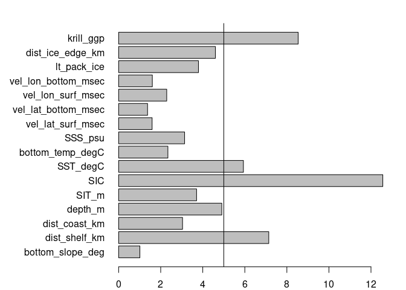<!-- -->

SIC and SST still show a high level of multicollinearity. Both variables
are significant in the linear regression, but given that there are
larger differences in the density distribution between background points
and observations for SIC (see figures in steps above) than for SST, we
will drop SST. We will remove SST and run the analysis once more.

## Correlation matrix without SST

``` r
#Removing freezing potential from num_var data frame and plot correlations again
num_var <- num_var %>% 
  #Removing rows containing NA values
  drop_na() %>% 
  select(!SST_degC)

#Calculating correlations and plotting results
ggcorr(num_var, method = c("pairwise", "spearman"), 
       label = T, label_size = 3, angle = -15)+
  theme(legend.justification = c(1, 0),
        legend.position = c(0.5, 0.7),
        legend.direction = "horizontal") +
  guides(fill = guide_colorbar(barwidth = 9, 
                               barheight = 1, 
                               title.position = "top", 
                               title.hjust = 0.5, 
                               title = "Spearman correlation"))
```

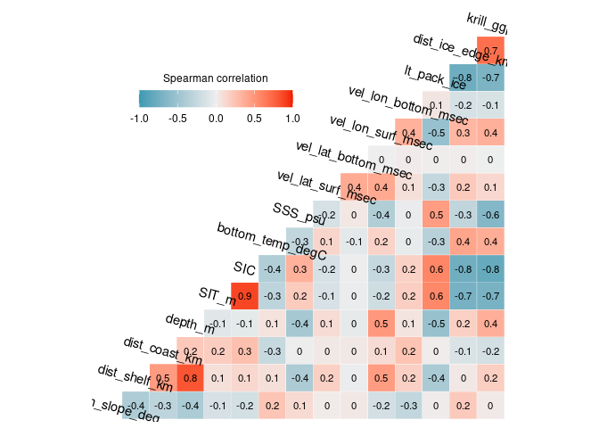<!-- -->

Multicollinearity may still be present as correlation values of \|0.9\|
can still be seen in the figure above.

## Linear regression without SST

``` r
#Linear regression formula
form_lm <- paste("presence",
                 paste(colnames(num_var), sep = "+", collapse = "+"),
                 sep = " ~ ")

#Fitting linear model
model <- lm(as.formula(form_lm), data = crab_ind)

#Checking results
summary(model)
```

    ## 
    ## Call:
    ## lm(formula = as.formula(form_lm), data = crab_ind)
    ## 
    ## Residuals:
    ##      Min       1Q   Median       3Q      Max 
    ## -0.30672 -0.07003 -0.05529 -0.03993  0.99096 
    ## 
    ## Coefficients:
    ##                       Estimate Std. Error t value Pr(>|t|)    
    ## (Intercept)          5.234e+00  4.003e-01  13.073  < 2e-16 ***
    ## bottom_slope_deg     1.228e-04  3.549e-04   0.346 0.729324    
    ## dist_shelf_km       -1.463e-04  2.875e-05  -5.089 3.61e-07 ***
    ## dist_coast_km        5.058e-06  2.680e-05   0.189 0.850313    
    ## depth_m              1.301e-05  2.660e-06   4.891 1.01e-06 ***
    ## SIT_m               -3.376e-02  6.764e-03  -4.991 6.04e-07 ***
    ## SIC                  7.467e-03  1.341e-02   0.557 0.577514    
    ## bottom_temp_degC    -1.796e-03  4.505e-03  -0.399 0.690182    
    ## SSS_psu             -1.395e-01  1.045e-02 -13.350  < 2e-16 ***
    ## vel_lat_surf_msec    2.458e-02  3.586e-02   0.685 0.493144    
    ## vel_lat_bottom_msec  1.651e-01  5.550e-02   2.975 0.002937 ** 
    ## vel_lon_surf_msec    8.873e-02  2.509e-02   3.537 0.000406 ***
    ## vel_lon_bottom_msec -4.729e-03  4.969e-02  -0.095 0.924175    
    ## lt_pack_ice          2.827e-02  1.307e-02   2.163 0.030547 *  
    ## dist_ice_edge_km     1.788e-05  9.522e-06   1.878 0.060342 .  
    ## krill_ggp           -4.694e-01  5.626e-02  -8.343  < 2e-16 ***
    ## ---
    ## Signif. codes:  0 '***' 0.001 '**' 0.01 '*' 0.05 '.' 0.1 ' ' 1
    ## 
    ## Residual standard error: 0.2307 on 32350 degrees of freedom
    ##   (146 observations deleted due to missingness)
    ## Multiple R-squared:  0.00823,    Adjusted R-squared:  0.00777 
    ## F-statistic:  17.9 on 15 and 32350 DF,  p-value: < 2.2e-16

## Calculating VIF without SST

``` r
#Calculating VIF values for all predictors in the linear regression
vif_vals <- vif(model)

#Plotting results as a horizontal bar plot
par(mar = c(2, 10, 2, 2))
barplot(vif_vals, horiz = T, las = 1)
#We will add a vertical line at 5 to identify variables with large VIF values
abline(v = 5)
```

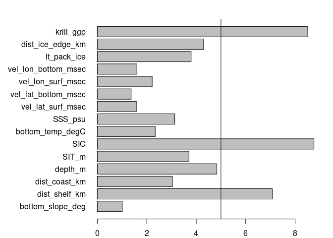<!-- -->

Multicollinearity is still present between SIC, distance to continental
shelf (`dist_shelf_km`) and krill habitat (`krill_ggp`). We will plot
their density distribution.

``` r
#Density distribution for sea ice thickness
den1 <- crab_ind %>% 
  drop_na() %>% 
  ggplot(aes(x = krill_ggp, fill = factor(presence)))+
  geom_density(alpha = 0.5)+
  scale_fill_brewer(palette = "Dark2")+
  theme_bw()

#Density distribution for SIC
den2 <- crab_ind %>% 
  drop_na() %>% 
  ggplot(aes(x = SIC, fill = factor(presence)))+
  geom_density(alpha = 0.5)+
  scale_fill_brewer(palette = "Dark2")+
  theme_bw()

#Plotting together
plot_grid(den1, den2, nrow = 2)
```

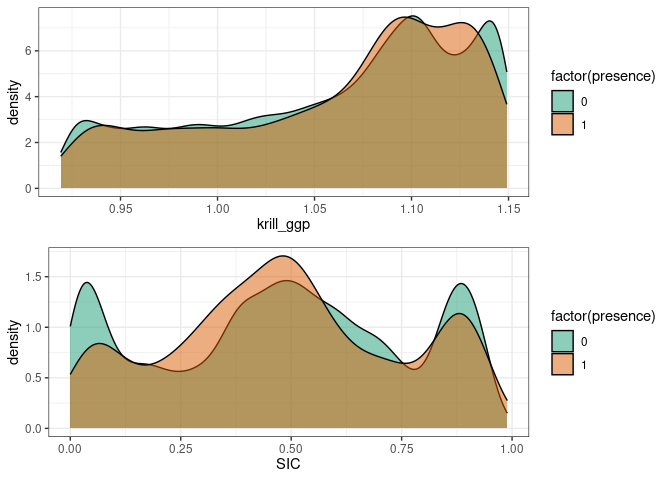<!-- -->

Since SIC was non-significant in the linear regression when krill was
also considered, we will remove SIC and test for multicollinearity
again.

## Correlation matrix without SIC

``` r
#Removing freezing potential from num_var data frame and plot correlations again
num_var <- num_var %>% 
  #Removing rows containing NA values
  drop_na() %>% 
  select(!SIC)

#Calculating correlations and plotting results
ggcorr(num_var, method = c("pairwise", "spearman"), 
       label = T, label_size = 3, angle = -15)+
  theme(legend.justification = c(1, 0),
        legend.position = c(0.5, 0.7),
        legend.direction = "horizontal") +
  guides(fill = guide_colorbar(barwidth = 9, 
                               barheight = 1, 
                               title.position = "top", 
                               title.hjust = 0.5, 
                               title = "Spearman correlation"))
```

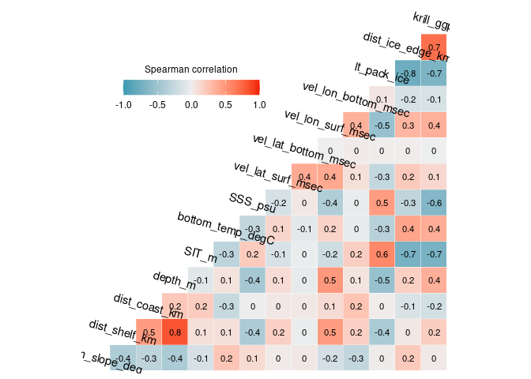<!-- -->

There are still some variables that are highly correlated. We will
calculate VIF on the remaining variables.

## Linear regression without SIC

``` r
#Linear regression formula
form_lm <- paste("presence", 
                 paste(colnames(num_var), sep = "+", collapse = "+"), 
                 sep = " ~ ")

#Fitting linear model
model <- lm(as.formula(form_lm), data = crab_ind)

#Checking results
summary(model)
```

    ## 
    ## Call:
    ## lm(formula = as.formula(form_lm), data = crab_ind)
    ## 
    ## Residuals:
    ##      Min       1Q   Median       3Q      Max 
    ## -0.30874 -0.07003 -0.05515 -0.03980  0.99033 
    ## 
    ## Coefficients:
    ##                       Estimate Std. Error t value Pr(>|t|)    
    ## (Intercept)          5.290e+00  3.874e-01  13.655  < 2e-16 ***
    ## bottom_slope_deg     1.221e-04  3.549e-04   0.344 0.730822    
    ## dist_shelf_km       -1.439e-04  2.842e-05  -5.063 4.14e-07 ***
    ## dist_coast_km        5.181e-06  2.680e-05   0.193 0.846703    
    ## depth_m              1.319e-05  2.641e-06   4.993 5.96e-07 ***
    ## SIT_m               -3.184e-02  5.825e-03  -5.467 4.62e-08 ***
    ## bottom_temp_degC    -1.793e-03  4.505e-03  -0.398 0.690630    
    ## SSS_psu             -1.406e-01  1.028e-02 -13.670  < 2e-16 ***
    ## vel_lat_surf_msec    2.427e-02  3.586e-02   0.677 0.498432    
    ## vel_lat_bottom_msec  1.660e-01  5.547e-02   2.993 0.002765 ** 
    ## vel_lon_surf_msec    8.773e-02  2.502e-02   3.506 0.000456 ***
    ## vel_lon_bottom_msec -4.374e-03  4.969e-02  -0.088 0.929850    
    ## lt_pack_ice          2.822e-02  1.307e-02   2.159 0.030844 *  
    ## dist_ice_edge_km     1.627e-05  9.067e-06   1.794 0.072828 .  
    ## krill_ggp           -4.873e-01  4.616e-02 -10.557  < 2e-16 ***
    ## ---
    ## Signif. codes:  0 '***' 0.001 '**' 0.01 '*' 0.05 '.' 0.1 ' ' 1
    ## 
    ## Residual standard error: 0.2307 on 32351 degrees of freedom
    ##   (146 observations deleted due to missingness)
    ## Multiple R-squared:  0.00822,    Adjusted R-squared:  0.007791 
    ## F-statistic: 19.15 on 14 and 32351 DF,  p-value: < 2.2e-16

## Calculating VIF without SIC

``` r
#Calculating VIF values for all predictors in the linear regression
vif_vals <- vif(model)

#Plotting results as a horizontal bar plot
par(mar = c(2, 10, 2, 2))
barplot(vif_vals, horiz = T, las = 1)
#We will add a vertical line at 5 to identify variables with large VIF values
abline(v = 5)
```

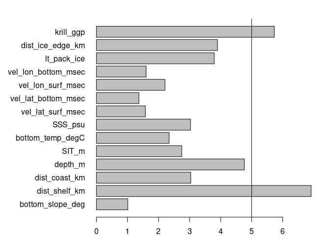<!-- -->

Distance to continental shelf (`dist_shelf_km`) and krill habitat
(`krill_ggp`) continue to show multicollinearity. We will inspect their
distribution.

``` r
#Density distribution for sea ice thickness
den1 <- crab_ind %>% 
  drop_na() %>% 
  ggplot(aes(x = krill_ggp, fill = factor(presence)))+
  geom_density(alpha = 0.5)+
  scale_fill_brewer(palette = "Dark2")+
  theme_bw()

#Density distribution for distance to shelf
den2 <- crab_ind %>% 
  drop_na() %>% 
  ggplot(aes(x = dist_shelf_km, fill = factor(presence)))+
  geom_density(alpha = 0.5)+
  scale_fill_brewer(palette = "Dark2")+
  theme_bw()

#Plotting together
plot_grid(den1, den2, nrow = 2)
```

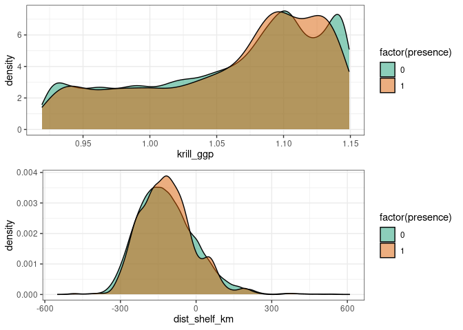<!-- -->

The distributions between presences and background mostly overlap in
these two variables, but given that given that krill has a relationship
with presence that is significant at 95% probability, we will keep this
variable.

## Correlation matrix without distance to continental shelf

``` r
#Removing freezing potential from num_var data frame and plot correlations again
num_var <- num_var %>% 
  #Removing rows containing NA values
  drop_na() %>% 
  select(!dist_shelf_km)

#Calculating correlations and plotting results
ggcorr(num_var, method = c("pairwise", "spearman"), 
       label = T, label_size = 3, angle = -15)+
  theme(legend.justification = c(1, 0),
        legend.position = c(0.5, 0.7),
        legend.direction = "horizontal") +
  guides(fill = guide_colorbar(barwidth = 9, 
                               barheight = 1, 
                               title.position = "top", 
                               title.hjust = 0.5, 
                               title = "Spearman correlation"))
```

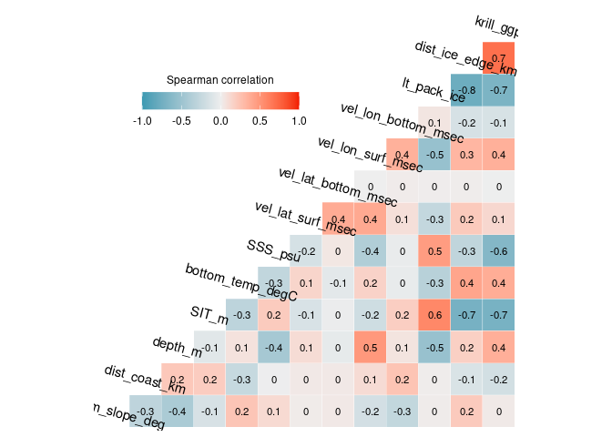<!-- -->

We can still see some strong relationships between krill and a few other
variables, so will calculate VIF once more.

## Linear regression without distance to continental shelf

``` r
#Linear regression formula
form_lm <- paste("presence", 
                 paste(colnames(num_var), sep = "+", collapse = "+"), 
                 sep = " ~ ")

#Fitting linear model
model <- lm(as.formula(form_lm), data = crab_ind)

#Checking results
summary(model)
```

    ## 
    ## Call:
    ## lm(formula = as.formula(form_lm), data = crab_ind)
    ## 
    ## Residuals:
    ##      Min       1Q   Median       3Q      Max 
    ## -0.27034 -0.06939 -0.05487 -0.04077  0.98529 
    ## 
    ## Coefficients:
    ##                       Estimate Std. Error t value Pr(>|t|)    
    ## (Intercept)          4.955e+00  3.818e-01  12.975  < 2e-16 ***
    ## bottom_slope_deg     1.380e-04  3.550e-04   0.389 0.697450    
    ## dist_coast_km       -9.955e-05  1.705e-05  -5.838 5.33e-09 ***
    ## depth_m              5.152e-06  2.112e-06   2.440 0.014705 *  
    ## SIT_m               -3.396e-02  5.812e-03  -5.842 5.20e-09 ***
    ## bottom_temp_degC    -3.365e-03  4.496e-03  -0.749 0.454163    
    ## SSS_psu             -1.305e-01  1.009e-02 -12.928  < 2e-16 ***
    ## vel_lat_surf_msec    4.122e-03  3.565e-02   0.116 0.907946    
    ## vel_lat_bottom_msec  1.722e-01  5.548e-02   3.104 0.001909 ** 
    ## vel_lon_surf_msec    8.523e-02  2.503e-02   3.405 0.000662 ***
    ## vel_lon_bottom_msec -1.685e-02  4.964e-02  -0.339 0.734354    
    ## lt_pack_ice          4.716e-02  1.253e-02   3.764 0.000167 ***
    ## dist_ice_edge_km     2.173e-05  9.006e-06   2.413 0.015812 *  
    ## krill_ggp           -4.555e-01  4.575e-02  -9.957  < 2e-16 ***
    ## ---
    ## Signif. codes:  0 '***' 0.001 '**' 0.01 '*' 0.05 '.' 0.1 ' ' 1
    ## 
    ## Residual standard error: 0.2308 on 32352 degrees of freedom
    ##   (146 observations deleted due to missingness)
    ## Multiple R-squared:  0.007434,   Adjusted R-squared:  0.007035 
    ## F-statistic: 18.64 on 13 and 32352 DF,  p-value: < 2.2e-16

## Calculating VIF without distance to continental shelf

``` r
#Calculating VIF values for all predictors in the linear regression
vif_vals <- vif(model)

#Plotting results as a horizontal bar plot
par(mar = c(2, 10, 2, 2))
barplot(vif_vals, horiz = T, las = 1, xlim = c(0, 6))
#We will add a vertical line at 5 to identify variables with large VIF values
abline(v = 5)
```

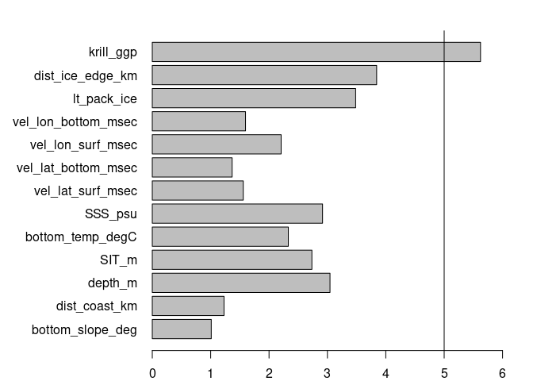<!-- -->

Krill has strong correlations with distance to the sea ice edge
(`dist_ice_edge_km`), long-term presence of sea ice (`lt_pack_ice`), and
sea ice thickness (`SIT_m`). The relationships between all these
variables and presence is significant, but we will check
`dist_ice_edge_km` because it significance is at a lower alpha (0.95
instead of \<0.001).

## Correlation matrix without distance to sea ice edge

``` r
#Removing freezing potential from num_var data frame and plot correlations again
num_var <- num_var %>% 
  #Removing rows containing NA values
  drop_na() %>% 
  select(!dist_ice_edge_km)

#Calculating correlations and plotting results
ggcorr(num_var, method = c("pairwise", "spearman"), 
       label = T, label_size = 3, angle = -15)+
  theme(legend.justification = c(1, 0),
        legend.position = c(0.5, 0.7),
        legend.direction = "horizontal") +
  guides(fill = guide_colorbar(barwidth = 9, 
                               barheight = 1, 
                               title.position = "top", 
                               title.hjust = 0.5, 
                               title = "Spearman correlation"))
```

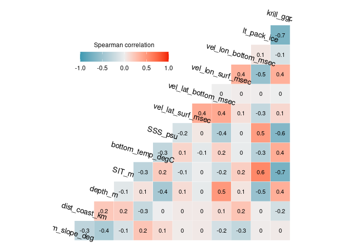<!-- -->

## Linear regression without distance to sea ice edge

``` r
#Linear regression formula
form_lm <- paste("presence", 
                 paste(colnames(num_var), sep = "+", collapse = "+"), 
                 sep = " ~ ")

#Fitting linear model
model <- lm(as.formula(form_lm), data = crab_ind)

#Checking results
summary(model)
```

    ## 
    ## Call:
    ## lm(formula = as.formula(form_lm), data = crab_ind)
    ## 
    ## Residuals:
    ##      Min       1Q   Median       3Q      Max 
    ## -0.26260 -0.06924 -0.05552 -0.04107  0.98630 
    ## 
    ## Coefficients:
    ##                       Estimate Std. Error t value Pr(>|t|)    
    ## (Intercept)          4.790e+00  3.758e-01  12.748  < 2e-16 ***
    ## bottom_slope_deg     1.483e-04  3.550e-04   0.418 0.676243    
    ## dist_coast_km       -9.638e-05  1.700e-05  -5.669 1.45e-08 ***
    ## depth_m              3.152e-06  1.943e-06   1.623 0.104688    
    ## SIT_m               -3.647e-02  5.719e-03  -6.376 1.84e-10 ***
    ## bottom_temp_degC     6.582e-04  4.176e-03   0.158 0.874750    
    ## SSS_psu             -1.264e-01  9.949e-03 -12.702  < 2e-16 ***
    ## vel_lat_surf_msec    3.757e-03  3.565e-02   0.105 0.916083    
    ## vel_lat_bottom_msec  1.766e-01  5.546e-02   3.184 0.001453 ** 
    ## vel_lon_surf_msec    9.096e-02  2.492e-02   3.650 0.000262 ***
    ## vel_lon_bottom_msec -3.232e-02  4.923e-02  -0.657 0.511475    
    ## lt_pack_ice          3.034e-02  1.041e-02   2.914 0.003569 ** 
    ## krill_ggp           -4.250e-01  4.397e-02  -9.666  < 2e-16 ***
    ## ---
    ## Signif. codes:  0 '***' 0.001 '**' 0.01 '*' 0.05 '.' 0.1 ' ' 1
    ## 
    ## Residual standard error: 0.2308 on 32353 degrees of freedom
    ##   (146 observations deleted due to missingness)
    ## Multiple R-squared:  0.007255,   Adjusted R-squared:  0.006887 
    ## F-statistic:  19.7 on 12 and 32353 DF,  p-value: < 2.2e-16

## Calculating VIF without distance to sea ice edge

``` r
#Calculating VIF values for all predictors in the linear regression
vif_vals <- vif(model)

#Plotting results as a horizontal bar plot
par(mar = c(2, 10, 2, 2))
barplot(vif_vals, horiz = T, las = 1, xlim = c(0, 6))
#We will add a vertical line at 5 to identify variables with large VIF values
abline(v = 5)
```

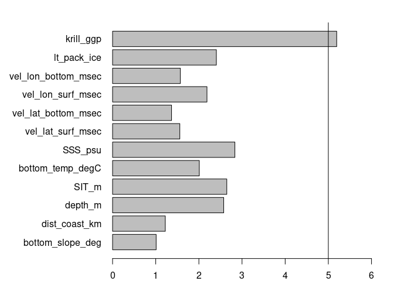<!-- -->

Multicollinearity is still present, but now the significance of
relationship between `lt_pack_ice` and presence is at a lower alpha. We
will remove this variable and check once more.

## Correlation matrix without long-term presence of pack ice

``` r
#Removing freezing potential from num_var data frame and plot correlations again
num_var <- num_var %>% 
  #Removing rows containing NA values
  drop_na() %>% 
  select(!lt_pack_ice)

#Calculating correlations and plotting results
ggcorr(num_var, method = c("pairwise", "spearman"), 
       label = T, label_size = 3, angle = -15)+
  theme(legend.justification = c(1, 0),
        legend.position = c(0.5, 0.7),
        legend.direction = "horizontal") +
  guides(fill = guide_colorbar(barwidth = 9, 
                               barheight = 1, 
                               title.position = "top", 
                               title.hjust = 0.5, 
                               title = "Spearman correlation"))
```

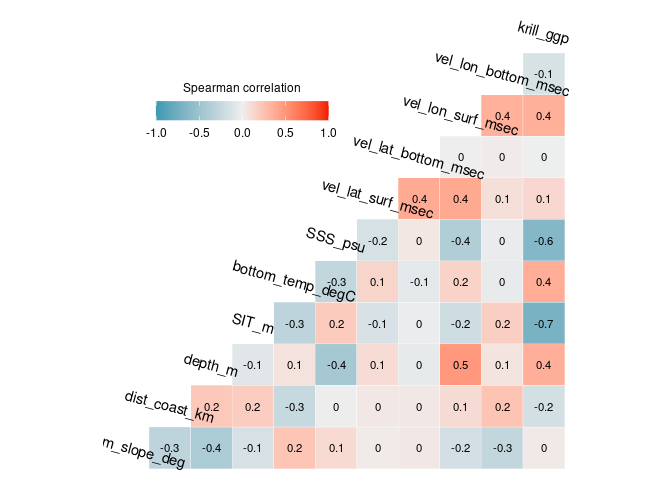<!-- -->

## Linear regression without long-term presence of pack ice

``` r
#Linear regression formula
form_lm <- paste("presence", 
                 paste(colnames(num_var), sep = "+", collapse = "+"), 
                 sep = " ~ ")

#Fitting linear model
model <- lm(as.formula(form_lm), data = crab_ind)

#Checking results
summary(model)
```

    ## 
    ## Call:
    ## lm(formula = as.formula(form_lm), data = crab_ind)
    ## 
    ## Residuals:
    ##      Min       1Q   Median       3Q      Max 
    ## -0.27680 -0.06912 -0.05540 -0.04100  0.98965 
    ## 
    ## Coefficients:
    ##                       Estimate Std. Error t value Pr(>|t|)    
    ## (Intercept)          4.909e+00  3.736e-01  13.139  < 2e-16 ***
    ## bottom_slope_deg     1.434e-04  3.551e-04   0.404 0.686215    
    ## dist_coast_km       -1.035e-04  1.683e-05  -6.151 7.81e-10 ***
    ## depth_m              1.786e-06  1.885e-06   0.947 0.343425    
    ## SIT_m               -3.232e-02  5.540e-03  -5.835 5.45e-09 ***
    ## bottom_temp_degC     6.439e-04  4.176e-03   0.154 0.877465    
    ## SSS_psu             -1.285e-01  9.923e-03 -12.952  < 2e-16 ***
    ## vel_lat_surf_msec   -4.010e-03  3.556e-02  -0.113 0.910215    
    ## vel_lat_bottom_msec  1.865e-01  5.536e-02   3.369 0.000754 ***
    ## vel_lon_surf_msec    7.253e-02  2.410e-02   3.009 0.002622 ** 
    ## vel_lon_bottom_msec -9.549e-03  4.861e-02  -0.196 0.844283    
    ## krill_ggp           -4.535e-01  4.288e-02 -10.577  < 2e-16 ***
    ## ---
    ## Signif. codes:  0 '***' 0.001 '**' 0.01 '*' 0.05 '.' 0.1 ' ' 1
    ## 
    ## Residual standard error: 0.2308 on 32354 degrees of freedom
    ##   (146 observations deleted due to missingness)
    ## Multiple R-squared:  0.006995,   Adjusted R-squared:  0.006657 
    ## F-statistic: 20.72 on 11 and 32354 DF,  p-value: < 2.2e-16

## Calculating VIF without long-term presence of pack ice

``` r
#Calculating VIF values for all predictors in the linear regression
vif_vals <- vif(model)

#Plotting results as a horizontal bar plot
par(mar = c(2, 10, 2, 2))
barplot(vif_vals, horiz = T, las = 1, xlim = c(0, 6))
#We will add a vertical line at 5 to identify variables with large VIF values
abline(v = 5)
```

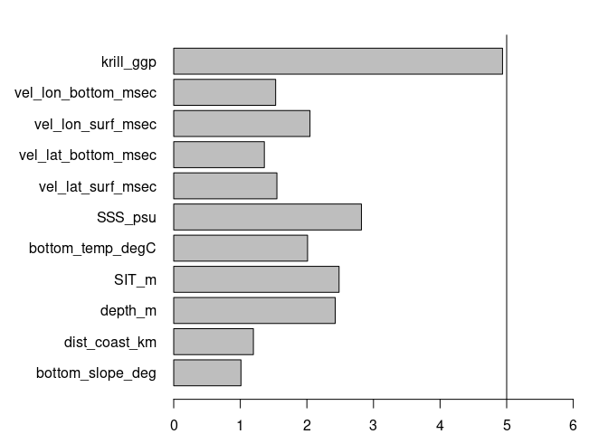<!-- -->

All VIF values are under 5, which suggests that multicollinearity
between predictor variables is not an issue anymore. We have reduced our
predictor variables from 18 to 11. These are the final set of predictor
variables that we will use to estimate the distribution of crabeater
seals.

## Saving new dataset

This dataset will not contain the variables that were identified as
having high correlation with one or more predictor variables.

``` r
crab_ind %>% 
  #Keep columns containing dates, coords, etc, and low VIF variables
  select(year:presence | all_of(names(num_var))) %>% 
  write_csv("../../Environmental_Data/ACCESS-OM2-01/Obs_BG_20x_Indian_weaning_LowVIF.csv")
```
