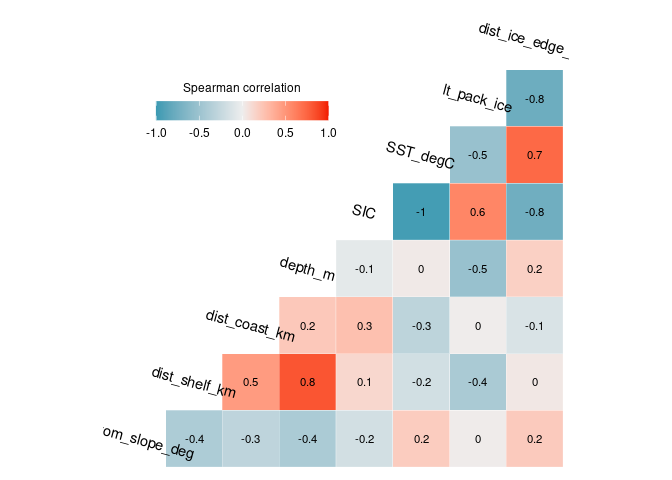
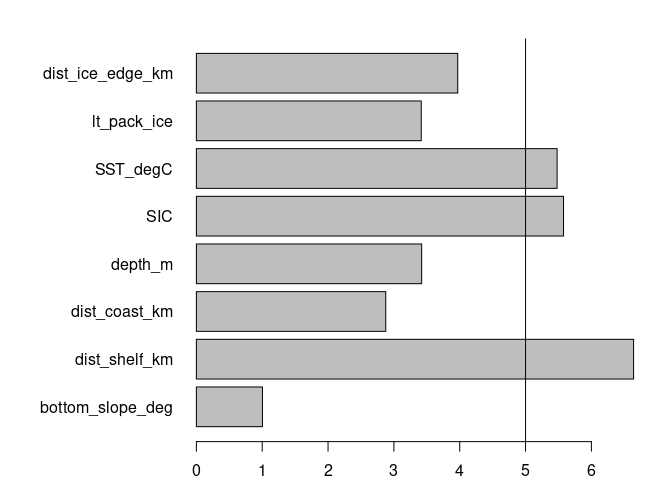
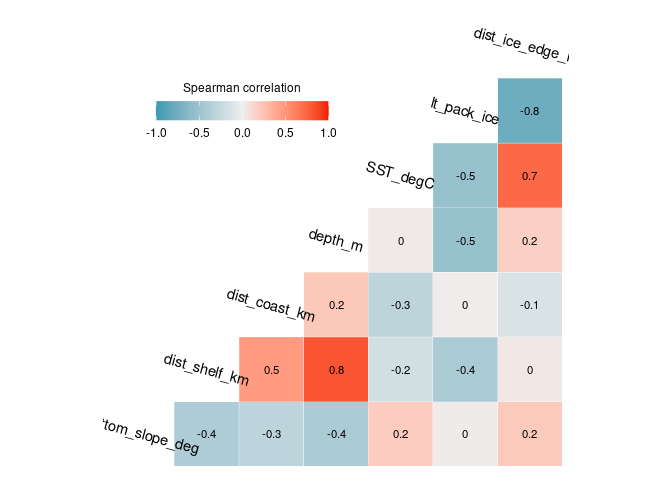
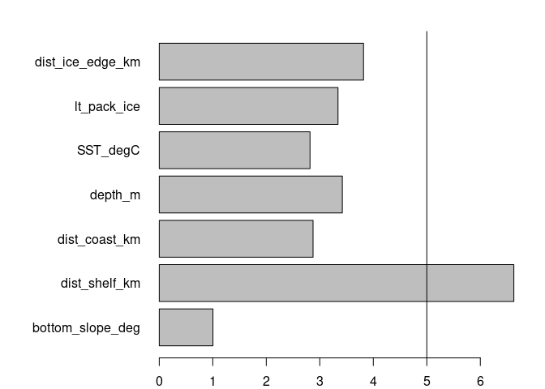
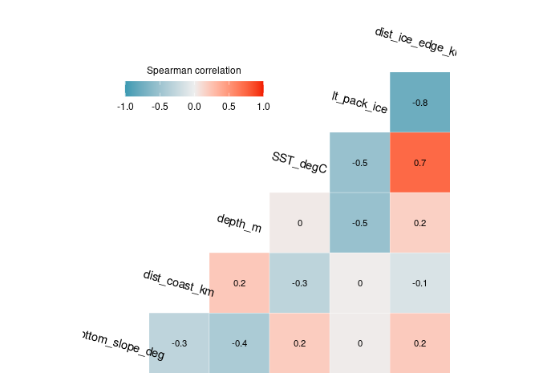
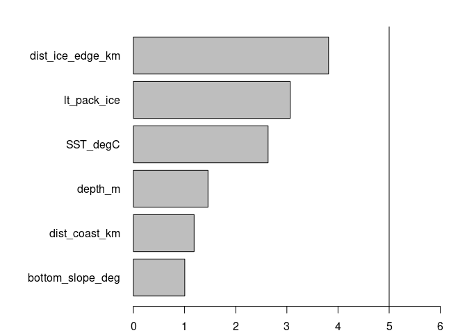

Exploratory Data Analysis - Environmental variable selection (ACCESS
subset)
================
Denisse Fierro Arcos
2023-08-25

- <a href="#environmental-variable-selection"
  id="toc-environmental-variable-selection">Environmental variable
  selection</a>
  - <a href="#loading-libraries" id="toc-loading-libraries">Loading
    libraries</a>
  - <a href="#loading-observations-and-background-data"
    id="toc-loading-observations-and-background-data">Loading observations
    and background data</a>
  - <a href="#extracting-environmental-variables"
    id="toc-extracting-environmental-variables">Extracting environmental
    variables</a>
    - <a href="#calculating-and-plotting-correlation-matrix"
      id="toc-calculating-and-plotting-correlation-matrix">Calculating and
      plotting correlation matrix</a>
  - <a
    href="#calculating-linear-regression-between-predicting-and-response-variable"
    id="toc-calculating-linear-regression-between-predicting-and-response-variable">Calculating
    linear regression between predicting and response variable</a>
  - <a href="#calculating-and-plotting-vif-values"
    id="toc-calculating-and-plotting-vif-values">Calculating and plotting
    VIF values</a>
  - <a href="#correlation-matrix-without-sea-ice-concentration"
    id="toc-correlation-matrix-without-sea-ice-concentration">Correlation
    matrix without sea ice concentration</a>
  - <a href="#linear-regression-without-sic"
    id="toc-linear-regression-without-sic">Linear regression without SIC</a>
  - <a href="#calculating-vif-without-sst"
    id="toc-calculating-vif-without-sst">Calculating VIF without SST</a>
  - <a href="#correlation-matrix-without-distance-to-shelf"
    id="toc-correlation-matrix-without-distance-to-shelf">Correlation matrix
    without distance to shelf</a>
  - <a href="#linear-regression-without-distance-to-shelf"
    id="toc-linear-regression-without-distance-to-shelf">Linear regression
    without distance to shelf</a>
  - <a href="#calculating-vif-without-distance-to-shelf"
    id="toc-calculating-vif-without-distance-to-shelf">Calculating VIF
    without distance to shelf</a>
  - <a href="#saving-new-dataset" id="toc-saving-new-dataset">Saving new
    dataset</a>

# Environmental variable selection

Before developing a Generalised Additive Model (GAM) to estimate the
distribution of crabeater seals in East Antarctica, we will check all
that the 17 environmental variables identified as potential predictors
of crabeater seal distribution are not highly correlated with each
other. This is known as multicollinearity and it can cause problems with
regression analyses as highly correlated variables do not provide
independent information to the regression model and this can cause
problems when fitting the model.

To identify multicollinearity, we will calculate the correlation among
all environmental variables. High correlation (r \> 0.75) can be an
indicator of multicollinearity. We will follow this by applying a linear
regression using all environmental variables as predictors and the
`presence` column as the response (a value of `1` in this columns
indicates an observation while `0` refers to background data). We will
use these results to calculte the variance inflation factor (VIF). The
VIF is the most common way to detect multicollinearity with values above
5 indicating a strong correlation across variables.

Finally, to help us decide which environmental variables we will keep if
multicollinearity is detected, we will use the results from the linear
regression. We will also plot the density distribution of the
environmental variables between observation and background points to
help identify which variable to keep as a predictor. Variables that
appear to show a larger difference in their density distribution will be
preferred as predictors as they capture differences in environmental
conditions detected at seal sighting location in comparison to
background points.

## Loading libraries

``` r
library(tidyverse)
library(GGally)
library(car)
```

## Loading observations and background data

We will load these two datasets and merge them together before running
our exploratory analysis.

``` r
#Getting names of environmental variables available through observations
obs_env <- read_csv("../../Environmental_Data/Env_obs/unique_crabeater_obs_all_env.csv") %>% 
  names()
```

    ## Rows: 3240 Columns: 23
    ## ── Column specification ────────────────────────────────────────────────────────
    ## Delimiter: ","
    ## chr   (6): date, source, sector, zone, season_year, life_stage
    ## dbl  (16): latitude, longitude, year, yt_ocean, xt_ocean, month, decade, pre...
    ## dttm  (1): event_date
    ## 
    ## ℹ Use `spec()` to retrieve the full column specification for this data.
    ## ℹ Specify the column types or set `show_col_types = FALSE` to quiet this message.

``` r
#Getting environmental data from ACCESS-OM2-01 model
crab_ind <- read_csv("../../Environmental_Data/ACCESS-OM2-01/unique_crabeater_obs_all_env.csv") %>% 
  #Selecting observations for the Indian sector during the weaning period
  filter(str_detect(sector, "Indian") & life_stage == "weaning") %>% 
  #Binding to background data
  bind_rows(read_csv("../../Environmental_Data/ACCESS-OM2-01/unique_background_20x_obs_all_env.csv"))
```

    ## Rows: 3240 Columns: 33
    ## ── Column specification ────────────────────────────────────────────────────────
    ## Delimiter: ","
    ## chr   (6): date, source, sector, zone, season_year, life_stage
    ## dbl  (26): latitude, longitude, year, yt_ocean, xt_ocean, month, decade, pre...
    ## dttm  (1): event_date
    ## 
    ## ℹ Use `spec()` to retrieve the full column specification for this data.
    ## ℹ Specify the column types or set `show_col_types = FALSE` to quiet this message.
    ## Rows: 30671 Columns: 31
    ## ── Column specification ────────────────────────────────────────────────────────
    ## Delimiter: ","
    ## chr  (5): date, sector, zone, season_year, life_stage
    ## dbl (26): year, longitude, latitude, xt_ocean, yt_ocean, month, decade, pres...
    ## 
    ## ℹ Use `spec()` to retrieve the full column specification for this data.
    ## ℹ Specify the column types or set `show_col_types = FALSE` to quiet this message.

``` r
#Keeping only variables for which observations are available 
crab_ind <- crab_ind[obs_env] %>% 
  #Removing duplicate date information
  select(!c(event_date:date))
  

#Checking data structure
glimpse(crab_ind)
```

    ## Rows: 32,512
    ## Columns: 21
    ## $ latitude         <dbl> -69.10605, -69.04563, -69.00233, -68.58860, -68.39024…
    ## $ longitude        <dbl> 75.80495, 75.33389, 76.04200, 75.48460, 75.34283, 74.…
    ## $ source           <chr> "OBIS_7e92433a-d086-4527-ab2b-3af86bcbd083_AADC", "OB…
    ## $ year             <dbl> 1998, 1998, 1996, 1998, 1998, 1998, 1998, 1998, 1999,…
    ## $ sector           <chr> "Central Indian", "Central Indian", "Central Indian",…
    ## $ zone             <chr> "Antarctic", "Antarctic", "Antarctic", "Antarctic", "…
    ## $ yt_ocean         <dbl> -69.113, -69.028, -68.986, -68.606, -68.395, -68.183,…
    ## $ xt_ocean         <dbl> 75.85, 75.35, 76.05, 75.45, 75.35, 74.25, 74.25, 75.8…
    ## $ month            <dbl> 11, 11, 11, 11, 11, 11, 11, 11, 12, 12, 12, 11, 12, 1…
    ## $ season_year      <chr> "autumn", "autumn", "autumn", "autumn", "autumn", "au…
    ## $ life_stage       <chr> "weaning", "weaning", "weaning", "weaning", "weaning"…
    ## $ decade           <dbl> 1990, 1990, 1990, 1990, 1990, 1990, 1990, 1990, 1990,…
    ## $ presence         <dbl> 1, 1, 1, 1, 1, 1, 1, 1, 1, 1, 1, 1, 1, 1, 1, 1, 1, 1,…
    ## $ bottom_slope_deg <dbl> 89.937, 89.651, 89.957, 89.725, 89.720, 89.801, 89.83…
    ## $ dist_shelf_km    <dbl> -492.145, -481.137, -479.088, -434.549, -410.830, -38…
    ## $ dist_coast_km    <dbl> 130.290, 117.409, 119.262, 71.716, 47.949, 23.210, 18…
    ## $ depth_m          <dbl> 628.583, 729.212, 771.083, 657.067, 578.417, 588.472,…
    ## $ SIC              <dbl> 0.6499641, 0.6814973, 0.6300092, 0.7778370, 0.9494607…
    ## $ SST_degC         <dbl> -1.794739, -1.801086, -1.641327, -1.816406, -1.854187…
    ## $ lt_pack_ice      <dbl> 0.5952381, 0.6309524, 0.5952381, 0.6309524, 0.6309524…
    ## $ dist_ice_edge_km <dbl> -1007.8298, -996.3414, -945.3168, -950.0118, -926.231…

## Extracting environmental variables

We will create a new variable to facilitate this exploratory analysis.

``` r
#Checking correlation between numeric variables
num_var <- crab_ind %>% 
  select(bottom_slope_deg:dist_ice_edge_km) %>% 
  #Removing rows containing NA values
  drop_na()
```

### Calculating and plotting correlation matrix

We will calculate the Spearman correlations across all variables. We use
Spearman because it does not assume relationships across variables are
linear.

``` r
#Calculating correlations and plotting results
ggcorr(num_var, method = c("pairwise", "spearman"), 
       label = T, label_size = 3, angle = -15)+
  theme(legend.justification = c(1, 0),
        legend.position = c(0.5, 0.7),
        legend.direction = "horizontal") +
  guides(fill = guide_colorbar(barwidth = 9, 
                               barheight = 1, 
                               title.position = "top", 
                               title.hjust = 0.5, 
                               title = "Spearman correlation"))
```

    ## Warning: A numeric `legend.position` argument in `theme()` was deprecated in ggplot2
    ## 3.5.0.
    ## ℹ Please use the `legend.position.inside` argument of `theme()` instead.
    ## This warning is displayed once every 8 hours.
    ## Call `lifecycle::last_lifecycle_warnings()` to see where this warning was
    ## generated.

<!-- -->
There are a number of variables with a strong correlation (0.75 or
above). This suggests that multicollinearity would be an issue in our
model if we were to include all variables as predictors. We will
continue the analysis by calculating the variance inflation factor
(VIF). This will help us identify the variables that we should consider
excluding from the model due to their lack of independence with one or
more predictor variables.

## Calculating linear regression between predicting and response variable

The response variable will be the `presence` column, which identifies
observations and background data. The predicting variables are all the
variables shown in the correlation plot above.

``` r
# First we will define the formula to be used in the linear regression. We will use the names of all variables in the num_var data frame
form_lm <- paste("presence", 
                 paste(colnames(num_var), sep = "+", collapse = "+"), 
                 sep = " ~ ")

#Fitting linear model
model <- lm(as.formula(form_lm), data = crab_ind)

#Checking results
summary(model)
```

    ## 
    ## Call:
    ## lm(formula = as.formula(form_lm), data = crab_ind)
    ## 
    ## Residuals:
    ##      Min       1Q   Median       3Q      Max 
    ## -0.08065 -0.06332 -0.05834 -0.04915  0.98290 
    ## 
    ## Coefficients:
    ##                    Estimate Std. Error t value Pr(>|t|)    
    ## (Intercept)      -3.905e-04  3.388e-02  -0.012 0.990802    
    ## bottom_slope_deg  4.111e-05  3.549e-04   0.116 0.907773    
    ## dist_shelf_km    -6.975e-05  2.793e-05  -2.497 0.012526 *  
    ## dist_coast_km    -2.014e-05  2.616e-05  -0.770 0.441265    
    ## depth_m           1.230e-05  2.245e-06   5.478 4.35e-08 ***
    ## SIC              -1.481e-02  1.073e-02  -1.380 0.167490    
    ## SST_degC         -1.456e-02  4.269e-03  -3.411 0.000649 ***
    ## lt_pack_ice       2.562e-02  1.244e-02   2.060 0.039414 *  
    ## dist_ice_edge_km  2.033e-05  9.178e-06   2.215 0.026773 *  
    ## ---
    ## Signif. codes:  0 '***' 0.001 '**' 0.01 '*' 0.05 '.' 0.1 ' ' 1
    ## 
    ## Residual standard error: 0.2314 on 32359 degrees of freedom
    ##   (144 observations deleted due to missingness)
    ## Multiple R-squared:  0.001802,   Adjusted R-squared:  0.001555 
    ## F-statistic: 7.301 on 8 and 32359 DF,  p-value: 9.758e-10

We can see that not all variables under consideration were found to have
a significant correlation to the `presence` column. We can now calculate
VIF values for all predicting variables.

## Calculating and plotting VIF values

``` r
#Calculating VIF values for all predictors in the linear regression
vif_vals <- vif(model)

#Plotting results as a horizontal bar plot
par(mar = c(2, 10, 2, 2))
barplot(vif_vals, horiz = T, las = 1)
#We will add a vertical line at 5 to identify variables with large VIF values
abline(v = 5)
```

<!-- -->

Sea ice concentration (`SIC`), distance to the continental shelf
(`dist_shelf_km`) and sea surface temperature (`SST_degC`) are the three
factors with the largest VIF values. Since SIC was found to be NOT
significant in the model, we will remove it from further analyses. We
will check for multicollinearity once removed.

## Correlation matrix without sea ice concentration

``` r
#Removing freezing potential from num_var data frame and plot correlations again
num_var <- num_var %>% 
  #Removing rows containing NA values
  drop_na() %>% 
  select(!SIC)

#Calculating correlations and plotting results
ggcorr(num_var, method = c("pairwise", "spearman"), 
       label = T, label_size = 3, angle = -15)+
  theme(legend.justification = c(1, 0),
        legend.position = c(0.5, 0.7),
        legend.direction = "horizontal") +
  guides(fill = guide_colorbar(barwidth = 9, 
                               barheight = 1, 
                               title.position = "top", 
                               title.hjust = 0.5, 
                               title = "Spearman correlation"))
```

<!-- -->

## Linear regression without SIC

High correlations are still detected, so we will run the linear
regression and calculate VIF once again.

``` r
#Linear regression formula
form_lm <- paste("presence", 
                 paste(colnames(num_var), sep = "+", collapse = "+"), 
                 sep = " ~ ")

#Fitting linear model
model <- lm(as.formula(form_lm), data = crab_ind)

#Checking results
summary(model)
```

    ## 
    ## Call:
    ## lm(formula = as.formula(form_lm), data = crab_ind)
    ## 
    ## Residuals:
    ##      Min       1Q   Median       3Q      Max 
    ## -0.08157 -0.06305 -0.05806 -0.04975  0.98343 
    ## 
    ## Coefficients:
    ##                    Estimate Std. Error t value Pr(>|t|)    
    ## (Intercept)      -4.933e-04  3.388e-02  -0.015  0.98838    
    ## bottom_slope_deg  3.322e-05  3.549e-04   0.094  0.92542    
    ## dist_shelf_km    -7.155e-05  2.790e-05  -2.564  0.01035 *  
    ## dist_coast_km    -2.123e-05  2.615e-05  -0.812  0.41680    
    ## depth_m           1.225e-05  2.245e-06   5.457 4.89e-08 ***
    ## SST_degC         -1.045e-02  3.061e-03  -3.415  0.00064 ***
    ## lt_pack_ice       2.307e-02  1.230e-02   1.875  0.06075 .  
    ## dist_ice_edge_km  2.281e-05  9.000e-06   2.535  0.01126 *  
    ## ---
    ## Signif. codes:  0 '***' 0.001 '**' 0.01 '*' 0.05 '.' 0.1 ' ' 1
    ## 
    ## Residual standard error: 0.2314 on 32360 degrees of freedom
    ##   (144 observations deleted due to missingness)
    ## Multiple R-squared:  0.001743,   Adjusted R-squared:  0.001527 
    ## F-statistic: 8.072 on 7 and 32360 DF,  p-value: 7.662e-10

## Calculating VIF without SST

``` r
#Calculating VIF values for all predictors in the linear regression
vif_vals <- vif(model)

#Plotting results as a horizontal bar plot
par(mar = c(2, 10, 2, 2))
barplot(vif_vals, horiz = T, las = 1)
#We will add a vertical line at 5 to easily identify variables with large VIF values
abline(v = 5)
```

<!-- -->

Distance to the shelf is highly correlated to depth, and both these
variables have relationships to presence that are significant. However,
given that the significance of depth is at a lower alpha, we will remove
distance to the shelf and test for multicollinearity once more.

## Correlation matrix without distance to shelf

``` r
#Removing freezing potential from num_var data frame and plot correlations again
num_var <- num_var %>% 
  #Removing rows containing NA values
  drop_na() %>% 
  select(!dist_shelf_km)

#Calculating correlations and plotting results
ggcorr(num_var, method = c("pairwise", "spearman"), 
       label = T, label_size = 3, angle = -15)+
  theme(legend.justification = c(1, 0),
        legend.position = c(0.5, 0.7),
        legend.direction = "horizontal") +
  guides(fill = guide_colorbar(barwidth = 9, 
                               barheight = 1, 
                               title.position = "top", 
                               title.hjust = 0.5, 
                               title = "Spearman correlation"))
```

<!-- -->

There are still some variables that are highly correlated, so we will
check VIF again.

## Linear regression without distance to shelf

``` r
#Linear regression formula
form_lm <- paste("presence", 
                 paste(colnames(num_var), sep = "+", collapse = "+"), 
                 sep = " ~ ")

#Fitting linear model
model <- lm(as.formula(form_lm), data = crab_ind)

#Checking results
summary(model)
```

    ## 
    ## Call:
    ## lm(formula = as.formula(form_lm), data = crab_ind)
    ## 
    ## Residuals:
    ##      Min       1Q   Median       3Q      Max 
    ## -0.08137 -0.06293 -0.05722 -0.05030  0.97917 
    ## 
    ## Coefficients:
    ##                    Estimate Std. Error t value Pr(>|t|)    
    ## (Intercept)       2.235e-02  3.269e-02   0.684  0.49411    
    ## bottom_slope_deg  4.607e-05  3.548e-04   0.130  0.89671    
    ## dist_coast_km    -7.260e-05  1.680e-05  -4.322 1.55e-05 ***
    ## depth_m           7.888e-06  1.465e-06   5.383 7.37e-08 ***
    ## SST_degC         -8.445e-03  2.960e-03  -2.853  0.00433 ** 
    ## lt_pack_ice       3.213e-02  1.178e-02   2.727  0.00640 ** 
    ## dist_ice_edge_km  2.339e-05  8.998e-06   2.600  0.00933 ** 
    ## ---
    ## Signif. codes:  0 '***' 0.001 '**' 0.01 '*' 0.05 '.' 0.1 ' ' 1
    ## 
    ## Residual standard error: 0.2315 on 32361 degrees of freedom
    ##   (144 observations deleted due to missingness)
    ## Multiple R-squared:  0.00154,    Adjusted R-squared:  0.001355 
    ## F-statistic:  8.32 on 6 and 32361 DF,  p-value: 4.961e-09

## Calculating VIF without distance to shelf

``` r
#Calculating VIF values for all predictors in the linear regression
vif_vals <- vif(model)

#Plotting results as a horizontal bar plot
par(mar = c(2, 10, 2, 2))
barplot(vif_vals, horiz = T, las = 1, xlim = c(0, 6))
#We will add a vertical line at 5 to easily identify variables with large VIF values
abline(v = 5)
```

<!-- -->

All VIF values are under 5, which suggests that multicollinearity across
predictor variables is not an issue anymore. We have reduced our
predictor variables from 8 to 7. These are the final set of predictor
variables that we will use to estimate the distribution of crabeater
seals.

## Saving new dataset

This dataset will not contain the variables that were identified as
having high correlation with one or more predictor variables.

``` r
crab_ind %>% 
  #Keep columns containing dates, coords, etc, and low VIF variables
  select(year:presence | all_of(names(num_var))) %>% 
  write_csv("../../Environmental_Data/mod-match-obs_env_pres_bg_20x_Indian_weaning_LowVIF.csv")
```
