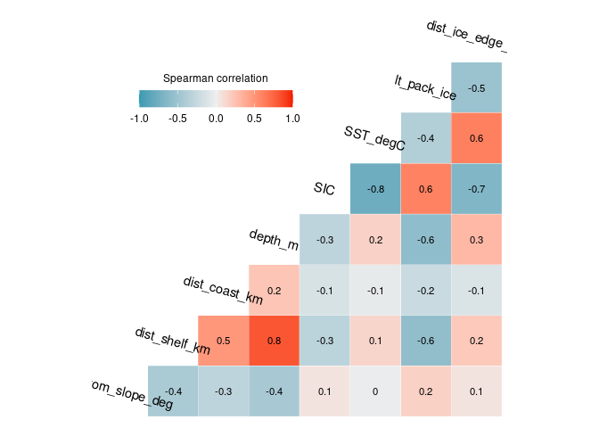
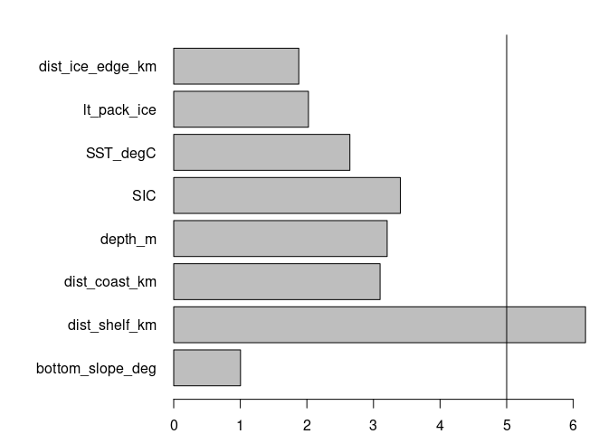
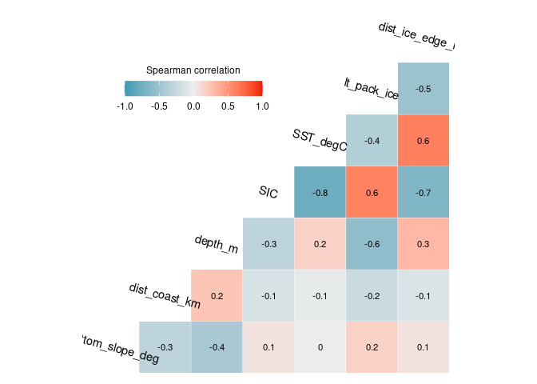
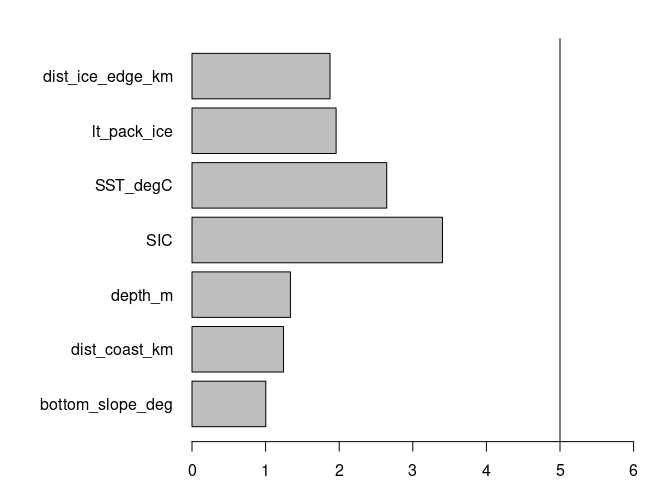

Exploratory Data Analysis - Environmental variable selection
================
Denisse Fierro Arcos
2023-07-24

- <a href="#environmental-variable-selection"
  id="toc-environmental-variable-selection">Environmental variable
  selection</a>
  - <a href="#loading-libraries" id="toc-loading-libraries">Loading
    libraries</a>
  - <a href="#loading-observations-and-background-data"
    id="toc-loading-observations-and-background-data">Loading observations
    and background data</a>
  - <a href="#extracting-environmental-variables"
    id="toc-extracting-environmental-variables">Extracting environmental
    variables</a>
    - <a href="#calculating-and-plotting-correlation-matrix"
      id="toc-calculating-and-plotting-correlation-matrix">Calculating and
      plotting correlation matrix</a>
  - <a
    href="#calculating-linear-regression-between-predicting-and-response-variable"
    id="toc-calculating-linear-regression-between-predicting-and-response-variable">Calculating
    linear regression between predicting and response variable</a>
  - <a href="#calculating-and-plotting-vif-values"
    id="toc-calculating-and-plotting-vif-values">Calculating and plotting
    VIF values</a>
  - <a href="#correlation-matrix-without-distance-to-shelf"
    id="toc-correlation-matrix-without-distance-to-shelf">Correlation matrix
    without distance to shelf</a>
  - <a href="#linear-regression-without-distance-to-shelf"
    id="toc-linear-regression-without-distance-to-shelf">Linear regression
    without distance to shelf</a>
  - <a href="#calculating-vif-without-distance-to-shelf"
    id="toc-calculating-vif-without-distance-to-shelf">Calculating VIF
    without distance to shelf</a>
  - <a href="#saving-new-dataset" id="toc-saving-new-dataset">Saving new
    dataset</a>

# Environmental variable selection

Before developing a Generalised Additive Model (GAM) to estimate the
distribution of crabeater seals in East Antarctica, we will check all
that the 17 environmental variables identified as potential predictors
of crabeater seal distribution are not highly correlated with each
other. This is known as multicollinearity and it can cause problems with
regression analyses as highly correlated variables do not provide
independent information to the regression model and this can cause
problems when fitting the model.

To identify multicollinearity, we will calculate the correlation among
all environmental variables. High correlation (r \> 0.75) can be an
indicator of multicollinearity. We will follow this by applying a linear
regression using all environmental variables as predictors and the
`presence` column as the response (a value of `1` in this columns
indicates an observation while `0` refers to background data). We will
use these results to calculte the variance inflation factor (VIF). The
VIF is the most common way to detect multicollinearity with values above
5 indicating a strong correlation across variables.

Finally, to help us decide which environmental variables we will keep if
multicollinearity is detected, we will use the results from the linear
regression. We will also plot the density distribution of the
environmental variables between observation and background points to
help identify which variable to keep as a predictor. Variables that
appear to show a larger difference in their density distribution will be
preferred as predictors as they capture differences in environmental
conditions detected at seal sighting location in comparison to
background points.

## Loading libraries

``` r
library(tidyverse)
library(GGally)
library(car)
```

## Loading observations and background data

We will load these two datasets and merge them together before running
our exploratory analysis.

``` r
crab_ind <- read_csv("../../Environmental_Data/Env_obs/unique_crabeater_obs_all_env.csv") %>%  
  #Selecting observations for the Indian sector during the weaning period
  filter(str_detect(sector, "Indian") & life_stage == "weaning") %>% 
  #Removing original date column
  select(!event_date) %>% 
  #Binding to background data
  bind_rows(read_csv("../../Environmental_Data/Env_obs/unique_background_20x_obs_all_env.csv"))
```

    ## Rows: 3240 Columns: 23
    ## ── Column specification ────────────────────────────────────────────────────────
    ## Delimiter: ","
    ## chr   (6): date, source, sector, zone, season_year, life_stage
    ## dbl  (16): latitude, longitude, year, yt_ocean, xt_ocean, month, decade, pre...
    ## dttm  (1): event_date
    ## 
    ## ℹ Use `spec()` to retrieve the full column specification for this data.
    ## ℹ Specify the column types or set `show_col_types = FALSE` to quiet this message.
    ## Rows: 30671 Columns: 21
    ## ── Column specification ────────────────────────────────────────────────────────
    ## Delimiter: ","
    ## chr  (5): date, sector, zone, season_year, life_stage
    ## dbl (16): year, longitude, latitude, xt_ocean, yt_ocean, month, decade, pres...
    ## 
    ## ℹ Use `spec()` to retrieve the full column specification for this data.
    ## ℹ Specify the column types or set `show_col_types = FALSE` to quiet this message.

``` r
#Checking data structure
glimpse(crab_ind)
```

    ## Rows: 32,512
    ## Columns: 22
    ## $ date             <chr> "1998-11", "1998-11", "1996-11", "1998-11", "1998-11"…
    ## $ latitude         <dbl> -69.10605, -69.04563, -69.00233, -68.58860, -68.39024…
    ## $ longitude        <dbl> 75.80495, 75.33389, 76.04200, 75.48460, 75.34283, 74.…
    ## $ source           <chr> "OBIS_7e92433a-d086-4527-ab2b-3af86bcbd083_AADC", "OB…
    ## $ year             <dbl> 1998, 1998, 1996, 1998, 1998, 1998, 1998, 1998, 1999,…
    ## $ sector           <chr> "Central Indian", "Central Indian", "Central Indian",…
    ## $ zone             <chr> "Antarctic", "Antarctic", "Antarctic", "Antarctic", "…
    ## $ yt_ocean         <dbl> -69.113, -69.028, -68.986, -68.606, -68.395, -68.183,…
    ## $ xt_ocean         <dbl> 75.85, 75.35, 76.05, 75.45, 75.35, 74.25, 74.25, 75.8…
    ## $ month            <dbl> 11, 11, 11, 11, 11, 11, 11, 11, 12, 12, 12, 11, 12, 1…
    ## $ season_year      <chr> "autumn", "autumn", "autumn", "autumn", "autumn", "au…
    ## $ life_stage       <chr> "weaning", "weaning", "weaning", "weaning", "weaning"…
    ## $ decade           <dbl> 1990, 1990, 1990, 1990, 1990, 1990, 1990, 1990, 1990,…
    ## $ presence         <dbl> 1, 1, 1, 1, 1, 1, 1, 1, 1, 1, 1, 1, 1, 1, 1, 1, 1, 1,…
    ## $ bottom_slope_deg <dbl> 89.937, 89.651, 89.957, 89.725, 89.720, 89.801, 89.83…
    ## $ dist_shelf_km    <dbl> -492.145, -481.137, -479.088, -434.549, -410.830, -38…
    ## $ dist_coast_km    <dbl> 130.290, 117.409, 119.262, 71.716, 47.949, 23.210, 18…
    ## $ depth_m          <dbl> 628.583, 729.212, 771.083, 657.067, 578.417, 588.472,…
    ## $ SIC              <dbl> 0.8536131, NA, 0.7952908, 0.6867343, 0.6610896, 0.822…
    ## $ SST_degC         <dbl> -1.5345274, -1.5401726, -1.4798060, -1.4371988, -1.39…
    ## $ lt_pack_ice      <dbl> 0.5952381, 0.0000000, 0.5952381, 0.5833333, 0.5833333…
    ## $ dist_ice_edge_km <dbl> -1070.4613, NA, -1031.6868, -1011.9836, -988.1636, -9…

## Extracting environmental variables

We will create a new variable to facilitate this exploratory analysis.

``` r
#Checking correlation between numeric variables
num_var <- crab_ind %>% 
  select(bottom_slope_deg:dist_ice_edge_km) %>% 
  #Removing rows containing NA values
  drop_na()
```

### Calculating and plotting correlation matrix

We will calculate the Spearman correlations across all variables. We use
Spearman because it does not assume relationships across variables are
linear.

``` r
#Calculating correlations and plotting results
ggcorr(num_var, method = c("pairwise", "spearman"), 
       label = T, label_size = 3, angle = -15)+
  theme(legend.justification = c(1, 0),
        legend.position = c(0.5, 0.7),
        legend.direction = "horizontal") +
  guides(fill = guide_colorbar(barwidth = 9, 
                               barheight = 1, 
                               title.position = "top", 
                               title.hjust = 0.5, 
                               title = "Spearman correlation"))
```

    ## Warning: A numeric `legend.position` argument in `theme()` was deprecated in ggplot2
    ## 3.5.0.
    ## ℹ Please use the `legend.position.inside` argument of `theme()` instead.
    ## This warning is displayed once every 8 hours.
    ## Call `lifecycle::last_lifecycle_warnings()` to see where this warning was
    ## generated.

<!-- -->
There are a number of variables with a strong correlation (0.75 or
above). This suggests that multicollinearity would be an issue in our
model if we were to include all variables as predictors. We will
continue the analysis by calculating the variance inflation factor
(VIF). This will help us identify the variables that we should consider
excluding from the model due to their lack of independence with one or
more predictor variables.

## Calculating linear regression between predicting and response variable

The response variable will be the `presence` column, which identifies
observations and background data. The predicting variables are all the
variables shown in the correlation plot above.

``` r
# First we will define the formula to be used in the linear regression. 
#We will use the names of all variables in the num_var data frame
form_lm <- paste("presence", 
                 paste(colnames(num_var), sep = "+", collapse = "+"),
                 sep = " ~ ")

#Fitting linear model
model <- lm(as.formula(form_lm), data = crab_ind)

#Checking results
summary(model)
```

    ## 
    ## Call:
    ## lm(formula = as.formula(form_lm), data = crab_ind)
    ## 
    ## Residuals:
    ##      Min       1Q   Median       3Q      Max 
    ## -0.09939 -0.06984 -0.05786 -0.04159  1.00686 
    ## 
    ## Coefficients:
    ##                    Estimate Std. Error t value Pr(>|t|)    
    ## (Intercept)       9.467e-03  3.419e-02   0.277 0.781889    
    ## bottom_slope_deg  3.806e-05  3.574e-04   0.106 0.915200    
    ## dist_shelf_km    -4.272e-05  2.760e-05  -1.548 0.121591    
    ## dist_coast_km     2.930e-05  2.742e-05   1.069 0.285249    
    ## depth_m           8.555e-06  2.257e-06   3.791 0.000151 ***
    ## SIC               9.530e-02  8.311e-03  11.467  < 2e-16 ***
    ## SST_degC          1.648e-02  6.657e-03   2.475 0.013322 *  
    ## lt_pack_ice      -2.137e-02  1.005e-02  -2.126 0.033550 *  
    ## dist_ice_edge_km  4.498e-05  8.387e-06   5.363 8.26e-08 ***
    ## ---
    ## Signif. codes:  0 '***' 0.001 '**' 0.01 '*' 0.05 '.' 0.1 ' ' 1
    ## 
    ## Residual standard error: 0.2323 on 31603 degrees of freedom
    ##   (900 observations deleted due to missingness)
    ## Multiple R-squared:  0.006756,   Adjusted R-squared:  0.006504 
    ## F-statistic: 26.87 on 8 and 31603 DF,  p-value: < 2.2e-16

We can see that not all variables under consideration were found to have
a significant correlation to the `presence` column. We can now calculate
VIF values for all predicting variables.

## Calculating and plotting VIF values

``` r
#Calculating VIF values for all predictors in the linear regression
vif_vals <- vif(model)

#Plotting results as a horizontal bar plot
par(mar = c(2, 10, 2, 2))
barplot(vif_vals, horiz = T, las = 1, xlim = c(0, 6))
#We will add a vertical line at 5 to identify variables with large VIF values
abline(v = 5)
```

<!-- -->

Distance to the continental shelf (`dist_shelf_km`) is the only factors
with a VIF large enough to indicate multicollinearity. This variable is
highly correlated to depth. Since `dist_shelf_km` was found to be NOT
significant in the model, we will remove it from further analyses. We
will check for multicollinearity once removed.

## Correlation matrix without distance to shelf

``` r
#Removing freezing potential from num_var data frame and plot correlations again
num_var <- num_var %>% 
  #Removing rows containing NA values
  drop_na() %>% 
  select(!dist_shelf_km)

#Calculating correlations and plotting results
ggcorr(num_var, method = c("pairwise", "spearman"), 
       label = T, label_size = 3, angle = -15)+
  theme(legend.justification = c(1, 0),
        legend.position = c(0.5, 0.7),
        legend.direction = "horizontal") +
  guides(fill = guide_colorbar(barwidth = 9, 
                               barheight = 1, 
                               title.position = "top", 
                               title.hjust = 0.5, 
                               title = "Spearman correlation"))
```

<!-- -->

Some variables still have some high correlation values, so we will
calculate VIF values.

## Linear regression without distance to shelf

``` r
#Linear regression formula
form_lm <- paste("presence", 
                 paste(colnames(num_var), sep = "+", collapse = "+"), 
                 sep = " ~ ")

#Fitting linear model
model <- lm(as.formula(form_lm), data = crab_ind)

#Checking results
summary(model)
```

    ## 
    ## Call:
    ## lm(formula = as.formula(form_lm), data = crab_ind)
    ## 
    ## Residuals:
    ##      Min       1Q   Median       3Q      Max 
    ## -0.09973 -0.06984 -0.05773 -0.04174  1.00542 
    ## 
    ## Coefficients:
    ##                    Estimate Std. Error t value Pr(>|t|)    
    ## (Intercept)       2.258e-02  3.313e-02   0.682   0.4955    
    ## bottom_slope_deg  4.858e-05  3.574e-04   0.136   0.8919    
    ## dist_coast_km    -3.554e-06  1.736e-05  -0.205   0.8378    
    ## depth_m           5.888e-06  1.458e-06   4.039 5.39e-05 ***
    ## SIC               9.542e-02  8.311e-03  11.482  < 2e-16 ***
    ## SST_degC          1.644e-02  6.657e-03   2.470   0.0135 *  
    ## lt_pack_ice      -1.857e-02  9.890e-03  -1.878   0.0604 .  
    ## dist_ice_edge_km  4.442e-05  8.380e-06   5.301 1.16e-07 ***
    ## ---
    ## Signif. codes:  0 '***' 0.001 '**' 0.01 '*' 0.05 '.' 0.1 ' ' 1
    ## 
    ## Residual standard error: 0.2323 on 31604 degrees of freedom
    ##   (900 observations deleted due to missingness)
    ## Multiple R-squared:  0.00668,    Adjusted R-squared:  0.00646 
    ## F-statistic: 30.36 on 7 and 31604 DF,  p-value: < 2.2e-16

## Calculating VIF without distance to shelf

``` r
#Calculating VIF values for all predictors in the linear regression
vif_vals <- vif(model)

#Plotting results as a horizontal bar plot
par(mar = c(2, 10, 2, 2))
barplot(vif_vals, horiz = T, las = 1, xlim = c(0, 6))
#We will add a vertical line at 5 to easily identify variables with large VIF values
abline(v = 5)
```

<!-- -->

## Saving new dataset

This dataset does not contain any more variables that are highly
correlated, so we will save a copy of the results.

``` r
crab_ind %>%
  #Keep columns containing dates, coords, etc, and low VIF variables
  select(year:presence | all_of(names(num_var))) %>% 
  write_csv("../../Environmental_Data/Env_obs/Obs_BG_20x_Indian_weaning_LowVIF.csv")
```
