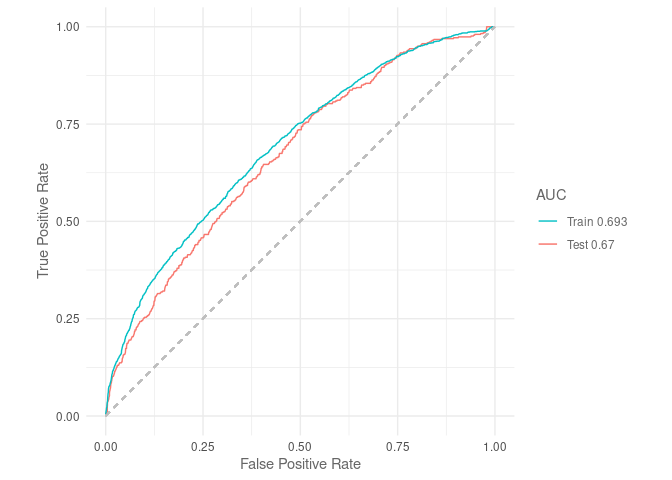
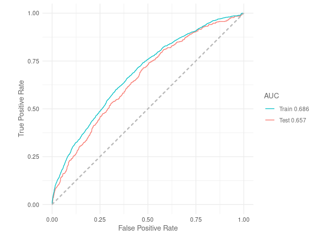
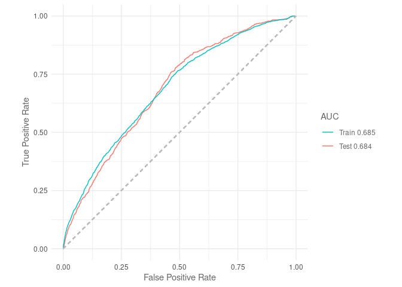

Testing_bg_points
================
Denisse Fierro Arcos
2023-08-30

- <a href="#testing-ideal-number-of-background-points"
  id="toc-testing-ideal-number-of-background-points">Testing ideal number
  of background points</a>
  - <a href="#loading-relevant-libraries"
    id="toc-loading-relevant-libraries">Loading relevant libraries</a>
  - <a href="#defining-useful-functions"
    id="toc-defining-useful-functions">Defining useful functions</a>
  - <a href="#loading-data" id="toc-loading-data">Loading data</a>
  - <a href="#prepping-data" id="toc-prepping-data">Prepping data</a>
  - <a href="#training-model-and-calculating-roc-curves"
    id="toc-training-model-and-calculating-roc-curves">Training model and
    calculating ROC curves</a>
    - <a href="#background-5x" id="toc-background-5x">Background 5x</a>
    - <a href="#background-10x" id="toc-background-10x">Background 10x</a>
    - <a href="#background-20x" id="toc-background-20x">Background 20x</a>
  - <a href="#conclusions" id="toc-conclusions">Conclusions</a>

# Testing ideal number of background points

Background points give us an idea of the environmental conditions
available to the species of interest within our study area. The number
of background points should be large enough to be representative of our
study area (i.e., represents all available environmental conditions).

Here, we will evaluate the effect of using three ratios of background
points to crabeater seals observations (5:1, 10:1 and 20:1) on model
predictive performance. We will resample our data and fit a MaxEnt model
5,000 times for each ratio assessed to capture the variability in model
performance. We use the area under the receiver operating characteristic
curve ($AUC_{ROC}$) as a measure of model performance following [Valavi
et al 2021](https://doi.org/10.1002/ecm.1486).

## Loading relevant libraries

We will use the `SDMtune` library to train and evaluate our MaxEnt
models.

``` r
library(tidyverse)
library(SDMtune)
library(rsample)
library(recipes)
```

## Defining useful functions

The first function, `prep_data` will split the original dataset into
training and testing datasets before scaling and centering the data.

``` r
#Defining function to prepare data for training and testing
prep_data <- function(da){
  #Setting seed for reproducible results
  set.seed(42)
  #Dividing dataset (training and testing)
  split <- initial_split(da, prop = 0.75, strata = "presence") 
  train <- training(split) %>% 
    arrange(desc(presence))
  test <- testing(split) %>% 
    arrange(desc(presence))
  #Creating recipe - steps to be followed when pre-processing data
  recipe_bg <- recipe(presence ~ ., train) %>%
    #Coordinates (xt_ocean and yt_ocean) are not pre-processed
    update_role(xt_ocean, new_role = "coords") %>% 
    update_role(yt_ocean, new_role = "coords") %>% 
    #Scaled and center all predictors - exclude coordinates
    step_center(all_predictors(), -has_role("coords")) %>% 
    step_scale(all_predictors(), -has_role("coords"))
  #Applying recipe to training data
  baked_train <- prep(recipe_bg, training = train) %>% 
    bake(new_data = train)
  #Applying recipe to testing data
  baked_test <- prep(recipe_bg, new_data = test) %>% 
    bake(new_data = test)
  #Creating a list with training and testing data
  out <- list(baked_train = baked_train,
              baked_test = baked_test)
  #Return list as a result
  return(out)
}
```

Our second function is called `sdm_format`, which will take the
pre-processed training and testing datasets we obtain from the
`prep_data` function above. The `sdm_format` function will apply a
`SDMtune` friendly format to run MaxEnt models with relative ease.

``` r
# Applying SDMtune formatting to training and testing datasets
sdm_format <- function(baked_list){
  #Create an empty list to store SDM formatted data
  out <- list(train = NULL, 
              test = NULL)
  #Loop through items in list
  for(i in 1:length(baked_list)){
    #Getting coordinate values from dataset
    coords <- baked_list[[i]] %>% 
      arrange(desc(presence)) %>% 
      select(xt_ocean, yt_ocean) %>% 
      #Renaming coordinates to meet SDM specifications
      rename("X" = "xt_ocean", "Y" = "yt_ocean")
    #Extract predictors from data 
    data <- baked_list[[i]] %>% 
      #We exclude presence and coordinates columns
      select(!c(presence, xt_ocean, yt_ocean))
    #We create an SWD object with information above
    sdmt_ready <- SWD(species = "Crabeater seals",
                      coords = coords,
                      data = data,
                      pa = baked_list[[i]]$presence)
    #Store data as training/testing based on original names
    if(str_detect(names(baked_list)[i], "train")){
      out$train <- sdmt_ready
    }else if(str_detect(names(baked_list)[i], "test")){
      out$test <- sdmt_ready
      #If train/test not included in names, an error is printed
      }else{print("testing/training not defined")}
  }
  #Return list with training/test data as SWD objects
  return(out)
}
```

## Loading data

We will load data that includes three different ratios of background
points to crabeater seal presences:  
1. 5:1 - That is 5 background points for every presence  
2. 10:1 - That is 10 background points for every presence  
3. 20:1 - That is 20 background points for every presence

We will start by providing the path to the folder our environmental data
from the ACCESS-OM2-01 model is stored.

``` r
#Getting list of all files available in data folder
list_files <- list.files("../../Environmental_Data/ACCESS-OM2-01", full.names = T)
#Printing results
list_files
```

    ## [1] "../../Environmental_Data/ACCESS-OM2-01/All_values_ACCESS-OM2-01_env_vars.csv"        
    ## [2] "../../Environmental_Data/ACCESS-OM2-01/Obs_BG_20x_Indian_weaning.csv"                
    ## [3] "../../Environmental_Data/ACCESS-OM2-01/Obs_BG_5x_Indian_weaning_LowVIF_match-obs.csv"
    ## [4] "../../Environmental_Data/ACCESS-OM2-01/Obs_BG_5x_Indian_weaning_LowVIF.csv"          
    ## [5] "../../Environmental_Data/ACCESS-OM2-01/unique_background_10x_obs_all_env.csv"        
    ## [6] "../../Environmental_Data/ACCESS-OM2-01/unique_background_20x_obs_all_env.csv"        
    ## [7] "../../Environmental_Data/ACCESS-OM2-01/unique_background_5x_obs_all_env.csv"         
    ## [8] "../../Environmental_Data/ACCESS-OM2-01/unique_crabeater_human-obs_static_env.csv"    
    ## [9] "../../Environmental_Data/ACCESS-OM2-01/unique_crabeater_obs_all_env.csv"

The `Obs_BG_5x_Indian_weaning_LowVIF_match-obs.csv` was produced after
performing an exploratory analysis of the environmental variables under
consideration. This dataset matches the environmental variables
available from observations and they have been checked for
multicollinearity. This dataset already contains background and presence
data. We will use this dataset to assess the influence of the number of
background points on model performance as it contains a small subset of
all variables under consideration.

We will load this dataset first to get the names of the variables that
we will use in this analysis.

``` r
#Background 5x (5 background pts for every presence)
bg5_file <- list_files[grepl("LowVIF_match", list_files)]

#Loading file
mod_bg_5 <- read_csv(bg5_file) %>% 
  #Removing rows with NA values
  drop_na() %>% 
  #Select variables of interest
  select(c(xt_ocean, yt_ocean, presence, bottom_slope_deg:dist_ice_edge_km))
```

    ## Rows: 12620 Columns: 17
    ## ── Column specification ────────────────────────────────────────────────────────
    ## Delimiter: ","
    ## chr  (4): season_year, life_stage, sector, zone
    ## dbl (13): year, month, yt_ocean, xt_ocean, decade, presence, bottom_slope_de...
    ## 
    ## ℹ Use `spec()` to retrieve the full column specification for this data.
    ## ℹ Specify the column types or set `show_col_types = FALSE` to quiet this message.

``` r
#Getting column names of variables to kept in other datasets
vars_int <- names(mod_bg_5)

#Checking data
mod_bg_5
```

    ## # A tibble: 12,610 × 10
    ##    xt_ocean yt_ocean presence bottom_slope_deg dist_shelf_km dist_coast_km
    ##       <dbl>    <dbl>    <dbl>            <dbl>         <dbl>         <dbl>
    ##  1     75.8    -69.1        1             89.9          492.         130. 
    ##  2     75.4    -69.0        1             89.7          481.         117. 
    ##  3     76.0    -69.0        1             90.0          479.         119. 
    ##  4     75.4    -68.6        1             89.7          435.          71.7
    ##  5     75.4    -68.4        1             89.7          411.          47.9
    ##  6     74.2    -68.2        1             89.8          387.          23.2
    ##  7     74.2    -68.1        1             89.8          382.          18.6
    ##  8     75.8    -68.1        1             89.7          380.          35.9
    ##  9     77.0    -67.8        1             89.4          350.          36.2
    ## 10     76.6    -67.6        1             89.5          331.          11.4
    ## # ℹ 12,600 more rows
    ## # ℹ 4 more variables: depth_m <dbl>, SIC <dbl>, lt_pack_ice <dbl>,
    ## #   dist_ice_edge_km <dbl>

We will now load presence data for crabeater seals
(`unique_crabeater_obs_all_env.csv`) and select data for the weaning
season in East Antarctica. We will then merge presences with 10x
background points (`unique_background_10x_obs_all_env.csv`) and 20x
background points (`unique_background_20x_obs_all_env.csv`) before
keeping the same environmental variables in the 5x background data
above.

``` r
#Loading crabeater presences
obs_file <- list_files[grepl("crabeater_obs_all", list_files)]
crabeaters <- read_csv(obs_file) %>% 
  #Selecting observations for the Indian sector during the weaning period
  filter(str_detect(sector, "Indian") & life_stage == "weaning") %>% 
  #Selecting variables of interest
  select(all_of(vars_int))
```

    ## Rows: 3240 Columns: 32
    ## ── Column specification ────────────────────────────────────────────────────────
    ## Delimiter: ","
    ## chr   (6): date, source, sector, zone, season_year, life_stage
    ## dbl  (25): latitude, longitude, year, yt_ocean, xt_ocean, month, decade, pre...
    ## dttm  (1): event_date
    ## 
    ## ℹ Use `spec()` to retrieve the full column specification for this data.
    ## ℹ Specify the column types or set `show_col_types = FALSE` to quiet this message.

``` r
#Loading background 10x
file_10x <- list_files[grepl("10x", list_files)]
mod_bg_10 <- read_csv(file_10x) %>% 
  #Selecting variables of interest
  select(all_of(vars_int)) %>% 
  #Joining data with observations
  bind_rows(crabeaters) %>% 
  drop_na()
```

    ## Rows: 20117 Columns: 29
    ## ── Column specification ────────────────────────────────────────────────────────
    ## Delimiter: ","
    ## chr  (5): date, season_year, life_stage, sector, zone
    ## dbl (24): year, month, longitude, latitude, xt_ocean, yt_ocean, decade, pres...
    ## 
    ## ℹ Use `spec()` to retrieve the full column specification for this data.
    ## ℹ Specify the column types or set `show_col_types = FALSE` to quiet this message.

``` r
#Loading background 20x
file_20x <- list_files[grepl("20x", list_files)]
mod_bg_20 <- read_csv(file_20x) %>% 
  #Selecting variables of interest
  select(all_of(vars_int)) %>% 
  #Joining data with observations
  bind_rows(crabeaters) %>% 
  drop_na()
```

    ## Rows: 110380 Columns: 30
    ## ── Column specification ────────────────────────────────────────────────────────
    ## Delimiter: ","
    ## chr  (5): date, season_year, life_stage, sector, zone
    ## dbl (25): year, month, longitude, latitude, xt_ocean, yt_ocean, decade, pres...
    ## 
    ## ℹ Use `spec()` to retrieve the full column specification for this data.
    ## ℹ Specify the column types or set `show_col_types = FALSE` to quiet this message.

``` r
#Removing variables not needed
rm(crabeaters, vars_int, list_files)
```

## Prepping data

We will now apply the functions we defined above to prepare data for
modelling.

``` r
#Dividing datasets into test and train sets, and applying SDM format
data_bg5 <- prep_data(mod_bg_5) %>% 
  sdm_format()
data_bg10 <- prep_data(mod_bg_10) %>% 
  sdm_format()
data_bg20 <- prep_data(mod_bg_20) %>% 
  sdm_format()
```

## Training model and calculating ROC curves

We will subset the training data and run the model 5,000 times to
capture variability in predictive capacity of the model at each ratio of
background and presence data.

### Background 5x

``` r
default_model_bg5 <- train(method = "Maxent", data = data_bg5$train, iter = 5000)
```

    ## Loading required namespace: rJava

``` r
plotROC(default_model_bg5, test = data_bg5$test)
```

    ## Warning: The following aesthetics were dropped during statistical transformation: m, d
    ## ℹ This can happen when ggplot fails to infer the correct grouping structure in
    ##   the data.
    ## ℹ Did you forget to specify a `group` aesthetic or to convert a numerical
    ##   variable into a factor?

<!-- -->

### Background 10x

``` r
default_model_bg10 <- train(method = "Maxent", data = data_bg10$train, iter = 5000)
plotROC(default_model_bg10, test = data_bg10$test)
```

    ## Warning: The following aesthetics were dropped during statistical transformation: m, d
    ## ℹ This can happen when ggplot fails to infer the correct grouping structure in
    ##   the data.
    ## ℹ Did you forget to specify a `group` aesthetic or to convert a numerical
    ##   variable into a factor?

<!-- -->

### Background 20x

``` r
default_model_bg20 <- train(method = "Maxent", data = data_bg20$train, iter = 5000)
plotROC(default_model_bg20, test = data_bg20$test)
```

    ## Warning: The following aesthetics were dropped during statistical transformation: m, d
    ## ℹ This can happen when ggplot fails to infer the correct grouping structure in
    ##   the data.
    ## ℹ Did you forget to specify a `group` aesthetic or to convert a numerical
    ##   variable into a factor?

<!-- -->

## Conclusions

Based on $AUC_{ROC}$ values calculated from both the training and
testing datasets, we conclude that the higher background to observations
ratio (20:1) will result in the best predictive performance.
