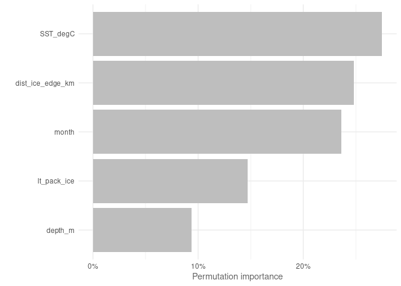
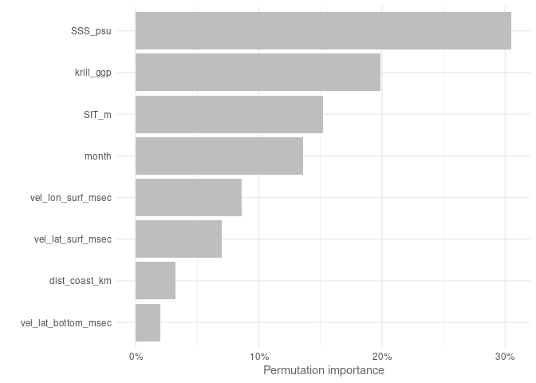
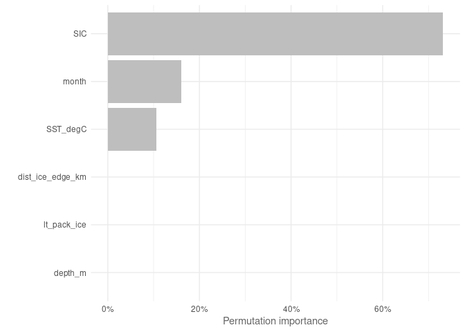

Generalised Additive Model
================
Denisse Fierro Arcos
2023-09-22

- <a href="#generalised-additive-model-gam"
  id="toc-generalised-additive-model-gam">Generalised Additive Model
  (GAM)</a>
  - <a href="#loading-libraries" id="toc-loading-libraries">Loading
    libraries</a>
  - <a href="#setting-up-notebook" id="toc-setting-up-notebook">Setting up
    notebook</a>
  - <a
    href="#loading-environmental-data-from-access-om2-01-and-setting-up-variables"
    id="toc-loading-environmental-data-from-access-om2-01-and-setting-up-variables">Loading
    environmental data from ACCESS-OM2-01 and setting up variables</a>
  - <a href="#environmental-variables-matching-observations"
    id="toc-environmental-variables-matching-observations">Environmental
    variables matching observations</a>
  - <a href="#loading-mean-environmental-conditions-from-access-om2-01"
    id="toc-loading-mean-environmental-conditions-from-access-om2-01">Loading
    mean environmental conditions from ACCESS-OM2-01</a>
  - <a href="#loading-mean-environmental-conditions-from-observations"
    id="toc-loading-mean-environmental-conditions-from-observations">Loading
    mean environmental conditions from observations</a>
  - <a href="#loading-layers-for-plotting"
    id="toc-loading-layers-for-plotting">Loading layers for plotting</a>
    - <a href="#building-gam-formula" id="toc-building-gam-formula">Building
      GAM formula</a>
    - <a href="#splitting-data-into-testing-and-training"
      id="toc-splitting-data-into-testing-and-training">Splitting data into
      testing and training</a>
    - <a href="#modelling" id="toc-modelling">Modelling</a>
    - <a href="#comparing-models" id="toc-comparing-models">Comparing
      models</a>
    - <a href="#performance-metrics" id="toc-performance-metrics">Performance
      metrics</a>
    - <a href="#calculating-variable-importance"
      id="toc-calculating-variable-importance">Calculating variable
      importance</a>
    - <a href="#saving-marginal-gam-plots"
      id="toc-saving-marginal-gam-plots">Saving marginal GAM plots</a>
    - <a href="#predictions" id="toc-predictions">Predictions</a>
  - <a href="#all-environmental-variables-available-in-access-om2-01"
    id="toc-all-environmental-variables-available-in-access-om2-01">All
    environmental variables available in ACCESS-OM2-01</a>
    - <a href="#building-gam-formula-1"
      id="toc-building-gam-formula-1">Building GAM formula</a>
    - <a href="#splitting-data-into-testing-and-training-1"
      id="toc-splitting-data-into-testing-and-training-1">Splitting data into
      testing and training</a>
    - <a href="#modelling-1" id="toc-modelling-1">Modelling</a>
    - <a href="#comparing-models-1" id="toc-comparing-models-1">Comparing
      models</a>
    - <a href="#performance-metrics-1"
      id="toc-performance-metrics-1">Performance metrics</a>
    - <a href="#calculating-variable-importance-1"
      id="toc-calculating-variable-importance-1">Calculating variable
      importance</a>
    - <a href="#saving-marginal-gam-plots-1"
      id="toc-saving-marginal-gam-plots-1">Saving marginal GAM plots</a>
    - <a href="#predictions-1" id="toc-predictions-1">Predictions</a>
  - <a href="#environmental-variables-from-observations"
    id="toc-environmental-variables-from-observations">Environmental
    variables from observations</a>
    - <a href="#building-gam-formula-2"
      id="toc-building-gam-formula-2">Building GAM formula</a>
    - <a href="#splitting-data-into-testing-and-training-2"
      id="toc-splitting-data-into-testing-and-training-2">Splitting data into
      testing and training</a>
    - <a href="#modelling-2" id="toc-modelling-2">Modelling</a>
    - <a href="#comparing-models-2" id="toc-comparing-models-2">Comparing
      models</a>
    - <a href="#performance-metrics-2"
      id="toc-performance-metrics-2">Performance metrics</a>
    - <a href="#calculating-variable-importance-2"
      id="toc-calculating-variable-importance-2">Calculating variable
      importance</a>
    - <a href="#saving-marginal-gam-plots-2"
      id="toc-saving-marginal-gam-plots-2">Saving marginal GAM plots</a>
    - <a href="#predictions-2" id="toc-predictions-2">Predictions</a>

# Generalised Additive Model (GAM)

GAMs are commonly used in species distribution modelling because of
their flexibility. GAMs use smoothing functions to capture non-linear
relationships between the dependent variable and the predictors (i.e.,
independent variables).

In this project, we will use GAMs as one of the models to be considered
in our Species Distribution Model ensemble to estimate the distribution
of crabeater seals in the recent past.

## Loading libraries

``` r
library(tidyverse)
library(mgcv)
library(stars)
library(cmocean)
library(cowplot)
library(prg)
library(pROC)
source("useful_functions.R")
```

## Setting up notebook

Selecting an output folder for GAM results exists and getting a list of
data files.

``` r
#Location of folder for outputs
out_folder <- "../../SDM_outputs/GAM/Mod_match_obs"
#If folder does not exist, create one
if(!dir.exists(out_folder)){
  dir.create(out_folder, recursive = T)
}

#Get path to files containing data
file_list <- list.files("../../Environmental_Data/", pattern = "Indian",
                        full.names = T)
```

## Loading environmental data from ACCESS-OM2-01 and setting up variables

We will use the datasets created in the notebook
`02_Merging_background_presence_data.Rmd` located within the
`Scripts/05_SDMs` folder. These datasets include the crabeater seal
observations, background points, and environmental data.

We will also define categorical and continuous explanatory variables.

## Environmental variables matching observations

First, we will look only at the variables with no multicollinearity.
This means that sea surface temperature (`SST`) is excluded even though
this variable is available in the observational dataset.

The variable `month` will be included as an ordinal factor in our
analysis.

``` r
#Loading data
mod_match_obs <- read_csv(str_subset(file_list, "match.*VIF")) %>% 
  select(!c(sector, zone, season_year:decade)) %>% 
  #Setting month as factor and ordered factor
  mutate(month = factor(month)) %>% 
  drop_na()
```

    ## Rows: 32512 Columns: 16
    ## ── Column specification ────────────────────────────────────────────────────────
    ## Delimiter: ","
    ## chr  (4): sector, zone, season_year, life_stage
    ## dbl (12): year, yt_ocean, xt_ocean, month, decade, presence, bottom_slope_de...
    ## 
    ## ℹ Use `spec()` to retrieve the full column specification for this data.
    ## ℹ Specify the column types or set `show_col_types = FALSE` to quiet this message.

``` r
#List of covariates
covars <- str_subset(names(mod_match_obs), "presence|_ocean", negate = T)
```

## Loading mean environmental conditions from ACCESS-OM2-01

This dataset includes the mean environmental conditions per month
(November and December) over the entire period of study (1981 to 2013).

``` r
mean_model <- read_csv("../../Environmental_Data/ACCESS-OM2-01/All_values_month_ACCESS-OM2-01_env_vars.csv") %>% 
  mutate(month = factor(month)) %>% 
  #Drop variables with high multicollinearity
  select(ends_with("_ocean")|any_of(covars))
```

    ## Rows: 730244 Columns: 21
    ## ── Column specification ────────────────────────────────────────────────────────
    ## Delimiter: ","
    ## dbl (21): yt_ocean, xt_ocean, bottom_slope_deg, dist_shelf_km, dist_coast_km...
    ## 
    ## ℹ Use `spec()` to retrieve the full column specification for this data.
    ## ℹ Specify the column types or set `show_col_types = FALSE` to quiet this message.

``` r
#List of categorical variables
cat_vars <- c("month")

mean_model_baked <- prep_pred(mean_model, cat_vars)
```

## Loading mean environmental conditions from observations

This dataset includes the mean environmental conditions per month
(November and December) over the entire period of study (1981 to 2013).

``` r
mean_obs <- read_csv("../../Environmental_Data/Env_obs/All_values_month_Obs_env_vars.csv") %>% 
  mutate(month = factor(month))
```

    ## Rows: 730244 Columns: 11
    ## ── Column specification ────────────────────────────────────────────────────────
    ## Delimiter: ","
    ## dbl (11): yt_ocean, xt_ocean, bottom_slope_deg, dist_shelf_km, dist_coast_km...
    ## 
    ## ℹ Use `spec()` to retrieve the full column specification for this data.
    ## ℹ Specify the column types or set `show_col_types = FALSE` to quiet this message.

``` r
mean_obs_baked <- prep_pred(mean_obs, cat_vars)
```

## Loading layers for plotting

We will extract this layer from the `rnaturalearth` package. We will
then reproject this layer to South Polar Stereographic (`EPSG 3976`).

``` r
#Loading layer
antarctica <- rnaturalearth::ne_countries(continent = "Antarctica",
                                          returnclass = "sf") %>% 
  #Transforming to South Polar Stereographic
  st_transform(3976)
```

### Building GAM formula

We will run an initial GAM using all available covariates. Sea ice
related variables will be fitted individually to each `month` as we
expect sea ice to vary in extent between November and December because
sea ice should be retreating during this time.

``` r
# Most complex model
full_model <- presence ~ month + s(bottom_slope_deg) + s(dist_coast_km) + s(depth_m) + s(SST_degC, by = month) + s(lt_pack_ice, by = month) + s(dist_ice_edge_km, by = month)
```

### Splitting data into testing and training

The `prep_data` function in the `useful_functions` script will be used
to split our data and to apply all necessary transformations.

``` r
#Getting training data
mod_match_obs_split <- prep_data(mod_match_obs, cat_vars)

#Selecting model data
model_data <- mod_match_obs_split$baked_train %>%
  select(all_of(covars) | "presence")
```

### Modelling

Background data (`presence` == `0`) will be down-weighted because they
do not truly represent absences. The down-weighting applied represents
the proportion of presence to background points. In this way, the sum of
the weighted background points will be the same as the total of
presences.

We will run the GAM using all covariates available and we will
downweight background points so they have the same effect as all
presences.

``` r
#Calculating downweights
weights <- down_weights(model_data)

#Full model
full_model_gam <- gam(formula = as.formula(full_model),
    data = model_data,
    family = binomial(link = "cloglog"),
    weights = weights,
    method = "REML", select = T)

#Print summary
summary(full_model_gam)
```

    ## 
    ## Family: binomial 
    ## Link function: cloglog 
    ## 
    ## Formula:
    ## presence ~ month + s(bottom_slope_deg) + s(dist_coast_km) + s(depth_m) + 
    ##     s(SST_degC, by = month) + s(lt_pack_ice, by = month) + s(dist_ice_edge_km, 
    ##     by = month)
    ## 
    ## Parametric coefficients:
    ##             Estimate Std. Error z value Pr(>|z|)  
    ## (Intercept)  -0.9664     0.4681  -2.064    0.039 *
    ## month12       0.5146     0.4716   1.091    0.275  
    ## ---
    ## Signif. codes:  0 '***' 0.001 '**' 0.01 '*' 0.05 '.' 0.1 ' ' 1
    ## 
    ## Approximate significance of smooth terms:
    ##                                   edf Ref.df Chi.sq  p-value    
    ## s(bottom_slope_deg)         0.0002556      9  0.000 0.566747    
    ## s(dist_coast_km)            0.5685574      9  1.302 0.123134    
    ## s(depth_m)                  0.8964980      9  8.430 0.001449 ** 
    ## s(SST_degC):month11         2.2818980      9  6.290 0.028632 *  
    ## s(SST_degC):month12         5.0813703      9 37.758  < 2e-16 ***
    ## s(lt_pack_ice):month11      2.5952901      9 15.746 5.61e-05 ***
    ## s(lt_pack_ice):month12      0.0001572      9  0.000 0.950933    
    ## s(dist_ice_edge_km):month11 1.8392704      9 11.395 0.000402 ***
    ## s(dist_ice_edge_km):month12 4.9294904      9 26.835 6.79e-06 ***
    ## ---
    ## Signif. codes:  0 '***' 0.001 '**' 0.01 '*' 0.05 '.' 0.1 ' ' 1
    ## 
    ## R-sq.(adj) =  0.0384   Deviance explained = 3.78%
    ## -REML =   1861  Scale est. = 1         n = 24276

Removing variables with effects reduced to near zero (`edf` \< 0.001) or
that are non-significant: `bottom_slope_deg` (seafloor slope), and
`dist_coast_km` (distance to coastline in km).

``` r
#Defining new formula without non-significant covariates
significant_only <-  presence ~ month + s(depth_m) + s(SST_degC, by = month) + s(lt_pack_ice, by = month) + s(dist_ice_edge_km, by = month)

#Applying new formula
significant_only_gam <- gam(formula = as.formula(significant_only),
    data = model_data,
    family = binomial(link = "cloglog"),
    weights = weights,
    method = "REML", select = T)

summary(significant_only_gam)
```

    ## 
    ## Family: binomial 
    ## Link function: cloglog 
    ## 
    ## Formula:
    ## presence ~ month + s(depth_m) + s(SST_degC, by = month) + s(lt_pack_ice, 
    ##     by = month) + s(dist_ice_edge_km, by = month)
    ## 
    ## Parametric coefficients:
    ##             Estimate Std. Error z value Pr(>|z|)  
    ## (Intercept)  -0.9837     0.4765  -2.065    0.039 *
    ## month12       0.5360     0.4796   1.118    0.264  
    ## ---
    ## Signif. codes:  0 '***' 0.001 '**' 0.01 '*' 0.05 '.' 0.1 ' ' 1
    ## 
    ## Approximate significance of smooth terms:
    ##                                   edf Ref.df Chi.sq  p-value    
    ## s(depth_m)                  8.945e-01      9  8.213 0.001640 ** 
    ## s(SST_degC):month11         2.321e+00      9  6.647 0.024300 *  
    ## s(SST_degC):month12         5.082e+00      9 38.326  < 2e-16 ***
    ## s(lt_pack_ice):month11      2.713e+00      9 17.436 2.50e-05 ***
    ## s(lt_pack_ice):month12      8.727e-05      9  0.000 0.948668    
    ## s(dist_ice_edge_km):month11 1.854e+00      9 11.196 0.000488 ***
    ## s(dist_ice_edge_km):month12 4.909e+00      9 27.111 5.17e-06 ***
    ## ---
    ## Signif. codes:  0 '***' 0.001 '**' 0.01 '*' 0.05 '.' 0.1 ' ' 1
    ## 
    ## R-sq.(adj) =  0.0379   Deviance explained = 3.75%
    ## -REML = 1861.3  Scale est. = 1         n = 24276

### Comparing models

The Akaike’s Information Criterion (AIC) will be calculated to assess
model performance. We will also check the $r^{2}$ values for both
models.

``` r
#Putting everything in a data frame
sum_gam <- data.frame(model = c("full_model", "significant_only"),
                      AIC = c(AIC(full_model_gam), AIC(significant_only_gam)),
                      rsq = c(summary(full_model_gam)$r.sq, summary(significant_only_gam)$r.sq))
#Checking results
sum_gam
```

    ##              model      AIC        rsq
    ## 1       full_model 1854.832 0.03837790
    ## 2 significant_only 1854.361 0.03793751

These models performed almost the same, we will check if their results
are significantly different.

``` r
anova(full_model_gam, significant_only_gam, test = "Chisq")
```

    ## Analysis of Deviance Table
    ## 
    ## Model 1: presence ~ month + s(bottom_slope_deg) + s(dist_coast_km) + s(depth_m) + 
    ##     s(SST_degC, by = month) + s(lt_pack_ice, by = month) + s(dist_ice_edge_km, 
    ##     by = month)
    ## Model 2: presence ~ month + s(depth_m) + s(SST_degC, by = month) + s(lt_pack_ice, 
    ##     by = month) + s(dist_ice_edge_km, by = month)
    ##   Resid. Df Resid. Dev       Df Deviance Pr(>Chi)
    ## 1     24247     3641.6                           
    ## 2     24248     3642.8 -0.79272  -1.2634   0.2023

The models are not significantly different, but we will keep the most
parsimonious model (i.e., `significant_only`), which has a slightly
lower AIC and slightly higher $r^{2}$.

### Performance metrics

To be able to compare the performance of this model with the three other
SDM algorithms to be used in the SDM ensemble, we will calculate three
metrics: area under the receiver operating curve ($AUC_{ROC}$), area
under the precisison-recall gain curve ($AUC_{PRG}$) and the Pearson
correlation between the model predictions and the testing dataset.

``` r
#Predicting values using testing dataset
pred <- predict(significant_only_gam, mod_match_obs_split$baked_test, 
                type = "response")

#AUC ROC
auc_roc <- roc(mod_match_obs_split$baked_test$presence, pred) %>% 
  auc() %>% 
  as.numeric()

#AUC PRG
auc_prg <- create_prg_curve(mod_match_obs_split$baked_test$presence, pred) %>% 
  calc_auprg()

#Pearson correlation
cor <- cor(pred, mod_match_obs_split$baked_test$presence)

#Save in data frame for ensemble weighting
model_eval <- data.frame(model = "GAM", env_trained = "mod_match_obs", 
                         auc_roc = auc_roc, auc_prg = auc_prg, pear_cor = cor)
```

### Calculating variable importance

``` r
#Define variables included in best performing model
vars <- c("month", "depth_m", "lt_pack_ice", "dist_ice_edge_km", "SST_degC")

#Calculate variable importance
varimp_mod_match_obs <- compute_permutation_gam(significant_only_gam, 
                                                auc_roc, vars, model_data)

#Plot variable importance
p <- varimp_mod_match_obs %>% 
  plotVarImp_gam()

saveRDS(p, "../../SDM_outputs/GAM/GAM_var_imp_mod_match_obs.rds")
```

<!-- -->

### Saving marginal GAM plots

``` r
#Marginal plots where variables are not nested within another variable
unnested <- c("depth_m", "month")

for(v in vars){
  fname <- file.path(out_folder, paste0(v, "_marginal.png"))
  if(v %in% unnested){
    plot <- plotResponse_gam(significant_only_gam, 
                             model_data[,c(vars, "presence")], v)
  }else{
    plot <- plotResponse_gam(significant_only_gam, 
                             model_data[,c(vars, "presence")], v, 
                             nested_by = "month")
  }
  ggsave(filename = fname, plot = plot, device = "png")
  }
```

### Predictions

We will use the best performing model to predict crabeater seal
distribution using mean monthly environmental conditions obtained from
ACCESS-OM2-01.

``` r
#Prediction monthly crabeater seal distribution
mean_pred_match_obs <- mean_model_baked %>% 
  mutate(pred = as.vector(predict(significant_only_gam, 
                                  mean_model_baked, 
                                  type = "response")))

#Converting from data frame to raster
mean_pred_match_obs_ras <- mean_pred_match_obs %>%
  #Select relevant variables only
  select(xt_ocean, yt_ocean, pred, month) %>% 
  #Set dimensions
  st_as_stars(dims = c("xt_ocean", "yt_ocean", "month")) %>% 
  #Ensuring month dimension is shown correctly
  st_set_dimensions("month", values = c(11, 12)) %>%
  #Set CRS
  st_set_crs(4326) %>% 
  #Transform to South Pole stereographic
  st_transform(crs = st_crs(3976))

#Saving outputs
#Data frame
mean_pred_match_obs %>% 
  write_csv(file.path(out_folder, "mean_pred_match_obs.csv"))
#Saving as R dataset so it can be easily open with readRDS
saveRDS(mean_pred_match_obs_ras,
        file.path(out_folder, "mean_pred_match_obs_raster.rds"))
```

Now that we have predicted the mean distribution of crabeaters based
with our select model, we can plot results for comparison later.

``` r
#Plotting November distribution
#Prepping data
nov <- mean_pred_match_obs_ras %>% 
  slice(index = 1, along = "month") 

#Plotting
nov_plot <- ggplot()+
  geom_stars(data = nov)+
  geom_sf(data = antarctica)+
  lims(x = c(0, 4000000))+
  #Set colour palette
  scale_fill_cmocean(name = "haline", direction = -1, 
                     guide = guide_colorbar(barwidth = 1, barheight = 10, 
                                            ticks = FALSE, nbin = 1000, 
                                            frame.colour = "black"), 
                     limits = c(0, 1)) +
  theme_linedraw() +
  theme(panel.background = element_blank(),
        panel.grid.major = element_blank(),
        panel.grid.minor = element_blank(), 
        legend.position = "none",
        plot.title = element_text(hjust = 0.5)) +
  labs(title = "November",
       x = "Longitude",
       y = "Latitude")

dec <- mean_pred_match_obs_ras %>% 
  slice(index = 2, along = "month") 

dec_plot <- ggplot() +
  geom_stars(data = dec) +
  geom_sf(data = antarctica)+
  lims(x = c(0, 4000000))+
  scale_fill_cmocean(name = "haline", direction = -1, 
                     guide = guide_colorbar(barwidth = 1, barheight = 10, 
                                            ticks = FALSE, nbin = 1000, 
                                            frame.colour = "black"), 
                     limits = c(0, 1)) +
  theme_linedraw() +
  theme(panel.background = element_blank(),
        panel.grid.major = element_blank(),
        panel.grid.minor = element_blank(), 
        plot.title = element_text(hjust = 0.5)) +
  labs(title = "December",
       x = "Longitude",
       y = " ",
       fill = "Probability")

#Get legend
legend <- get_legend(dec_plot)
```

    ## Warning in get_plot_component(plot, "guide-box"): Multiple components found;
    ## returning the first one. To return all, use `return_all = TRUE`.

``` r
#Remove legend from December plot
dec_plot <- dec_plot + theme(legend.position = 'none')

#Plotting together
plot_match_obs <- plot_grid(nov_plot, dec_plot, legend, ncol = 3, nrow = 1,
                            rel_widths = c(1, 1, 0.3))

#Add title
title <- ggdraw()+
  draw_label("Mean crabeater seal distribution\n(ACCESS-OM2-01 - simplified)",
             fontface = "bold", hjust = 0.5)+
  theme(plot.margin = margin(0, 0, 0, 0))

#Putting everything together
final <- plot_grid(title, plot_match_obs, ncol = 1, 
                   rel_heights = c(0.1, 1))

#Saving graph
ggsave(file.path(out_folder, "map_mean_pred_match_obs.png"), 
       plot = final, device = "png", bg = "white", width = 8.75, height = 7)
```

## All environmental variables available in ACCESS-OM2-01

We will now use the full range of covariates available in the
ACCESS-OM2-01 model. We will test if the inclusion of additional
environmental variables improve predictive ability. We will follow the
same approach as we did before, first we will test a model with all
covariates and exclude any with non-significant effects.

We tested this dataset for multicollinearity, so we will get the names
of variables with low VIF plus SST as this was found to be an important
covariate before.

``` r
#Location of folder for outputs
out_folder <- "../../SDM_outputs/GAM/Mod_full/"
#If folder does not exist, create one
if(!dir.exists(out_folder)){
  dir.create(out_folder, recursive = T)
}

#Loading data
full_mod <- read_csv(str_subset(file_list, "model_env_pres.*VIF")) %>% 
  select(!c(sector, zone, season_year:decade)) %>% 
  #Setting month as factor and ordered factor
  mutate(month = factor(month)) %>% 
  drop_na()
```

    ## Rows: 32512 Columns: 21
    ## ── Column specification ────────────────────────────────────────────────────────
    ## Delimiter: ","
    ## chr  (4): sector, zone, season_year, life_stage
    ## dbl (17): year, yt_ocean, xt_ocean, month, decade, presence, bottom_slope_de...
    ## 
    ## ℹ Use `spec()` to retrieve the full column specification for this data.
    ## ℹ Specify the column types or set `show_col_types = FALSE` to quiet this message.

``` r
#List of environmental covariates to be used in model
covars <- str_subset(names(full_mod), "presence|_ocean", negate = T)

#Getting full variables for mean conditions
mean_model <- read_csv("../../Environmental_Data/ACCESS-OM2-01/All_values_month_ACCESS-OM2-01_env_vars.csv") %>% 
  mutate(month = factor(month)) %>% 
  #Drop variables with high multicollinearity
  select(ends_with("_ocean")|any_of(covars))
```

    ## Rows: 730244 Columns: 21
    ## ── Column specification ────────────────────────────────────────────────────────
    ## Delimiter: ","
    ## dbl (21): yt_ocean, xt_ocean, bottom_slope_deg, dist_shelf_km, dist_coast_km...
    ## 
    ## ℹ Use `spec()` to retrieve the full column specification for this data.
    ## ℹ Specify the column types or set `show_col_types = FALSE` to quiet this message.

``` r
mean_model_baked <- prep_pred(mean_model, cat_vars)
```

### Building GAM formula

We will run an initial GAM using all available covariates. Non-static
variables (i.e., variables that vary with time) will be fitted
individually to each `month` as we expect them to vary between November
and December as we move from spring to summer.

``` r
# Most complex model
full_model <- presence ~ month + s(bottom_slope_deg) + s(dist_coast_km) + s(depth_m) + s(SIT_m, by = month) + s(bottom_temp_degC, by = month) + s(SSS_psu, by = month) + s(vel_lat_surf_msec, by = month) + s(vel_lat_bottom_msec, by = month) + s(vel_lon_surf_msec, by = month) + s(vel_lon_bottom_msec, by = month) + s(krill_ggp, by = month)
```

### Splitting data into testing and training

The `prep_data` function in the `useful_functions` script will be used
to split our data and to apply all necessary transformations.

``` r
#Getting training data
full_mod_split <- prep_data(full_mod, cat_vars)

#Selecting model data
model_data <- full_mod_split$baked_train %>%
  select(all_of(covars) | "presence")
```

### Modelling

Background data will be down-weighted and then we will run the GAM using
all covariates available.

``` r
#Calculating downweights
weights <- down_weights(model_data)

#Full model
full_model_gam <- gam(formula = as.formula(full_model),
    data = model_data,
    family = binomial(link = "cloglog"),
    weights = weights,
    method = "REML", select = T)

#Print summary
summary(full_model_gam)
```

    ## 
    ## Family: binomial 
    ## Link function: cloglog 
    ## 
    ## Formula:
    ## presence ~ month + s(bottom_slope_deg) + s(dist_coast_km) + s(depth_m) + 
    ##     s(SIT_m, by = month) + s(bottom_temp_degC, by = month) + 
    ##     s(SSS_psu, by = month) + s(vel_lat_surf_msec, by = month) + 
    ##     s(vel_lat_bottom_msec, by = month) + s(vel_lon_surf_msec, 
    ##     by = month) + s(vel_lon_bottom_msec, by = month) + s(krill_ggp, 
    ##     by = month)
    ## 
    ## Parametric coefficients:
    ##             Estimate Std. Error z value Pr(>|z|)    
    ## (Intercept)  -1.0431     0.1814  -5.750 8.95e-09 ***
    ## month12       0.5879     0.1902   3.091  0.00199 ** 
    ## ---
    ## Signif. codes:  0 '***' 0.001 '**' 0.01 '*' 0.05 '.' 0.1 ' ' 1
    ## 
    ## Approximate significance of smooth terms:
    ##                                      edf Ref.df Chi.sq  p-value    
    ## s(bottom_slope_deg)            4.713e-05      9  0.000  0.89974    
    ## s(dist_coast_km)               1.501e+00      9  7.077  0.00614 ** 
    ## s(depth_m)                     4.165e-01      9  0.695  0.18453    
    ## s(SIT_m):month11               6.322e+00      9 34.995  < 2e-16 ***
    ## s(SIT_m):month12               5.344e+00      9 32.154  < 2e-16 ***
    ## s(bottom_temp_degC):month11    6.792e-01      9  1.965  0.07760 .  
    ## s(bottom_temp_degC):month12    6.957e-05      9  0.000  0.61131    
    ## s(SSS_psu):month11             6.171e-01      9  1.676  0.07602 .  
    ## s(SSS_psu):month12             4.946e+00      9 40.347  < 2e-16 ***
    ## s(vel_lat_surf_msec):month11   4.446e+00      9 21.344 9.75e-05 ***
    ## s(vel_lat_surf_msec):month12   1.031e+00      9  2.388  0.09107 .  
    ## s(vel_lat_bottom_msec):month11 8.820e-01      9  7.422  0.00346 ** 
    ## s(vel_lat_bottom_msec):month12 4.259e-05      9  0.000  0.64809    
    ## s(vel_lon_surf_msec):month11   8.852e-01      9  7.565  0.00271 ** 
    ## s(vel_lon_surf_msec):month12   4.305e+00      9 15.708  0.00158 ** 
    ## s(vel_lon_bottom_msec):month11 7.097e-05      9  0.000  0.65476    
    ## s(vel_lon_bottom_msec):month12 6.002e-05      9  0.000  0.76121    
    ## s(krill_ggp):month11           2.656e+00      9 18.588 2.91e-05 ***
    ## s(krill_ggp):month12           9.421e-01      9 16.202 1.64e-05 ***
    ## ---
    ## Signif. codes:  0 '***' 0.001 '**' 0.01 '*' 0.05 '.' 0.1 ' ' 1
    ## 
    ## R-sq.(adj) =  0.0695   Deviance explained = 6.75%
    ## -REML = 1839.4  Scale est. = 1         n = 24274

This model explains more of the variability in our data than the model
that uses variables for which we also have observations. We will remove
the variables with a low contribution (`edf` $\sim 0.001$) and
non-significance: bottom slope (`bottom_slope_deg`), depth (`depth_m`),
temperature at the bottom of the water column (`bottom_temp_degC`), and
meridional velocity of the water at the bottom of the water columns
(`vel_lon_bottom_msec`).

We will defined this simplified model and test it below.

``` r
# Simplified model
simpler_model <- presence ~ month + s(dist_coast_km) + s(SIT_m, by = month) + s(SSS_psu, by = month) + s(vel_lat_surf_msec, by = month) + s(vel_lat_bottom_msec, by = month) + s(vel_lon_surf_msec, by = month) + s(krill_ggp, by = month)

#Applying new simplified formula
simpler_model_gam <- gam(formula = as.formula(simpler_model),
    data = model_data,
    family = binomial(link = "cloglog"),
    weights = weights,
    method = "REML", select = T)

#Print summary
summary(simpler_model_gam)
```

    ## 
    ## Family: binomial 
    ## Link function: cloglog 
    ## 
    ## Formula:
    ## presence ~ month + s(dist_coast_km) + s(SIT_m, by = month) + 
    ##     s(SSS_psu, by = month) + s(vel_lat_surf_msec, by = month) + 
    ##     s(vel_lat_bottom_msec, by = month) + s(vel_lon_surf_msec, 
    ##     by = month) + s(krill_ggp, by = month)
    ## 
    ## Parametric coefficients:
    ##             Estimate Std. Error z value Pr(>|z|)    
    ## (Intercept)  -0.7747     0.1560  -4.966 6.82e-07 ***
    ## month12       0.3083     0.1635   1.885   0.0594 .  
    ## ---
    ## Signif. codes:  0 '***' 0.001 '**' 0.01 '*' 0.05 '.' 0.1 ' ' 1
    ## 
    ## Approximate significance of smooth terms:
    ##                                      edf Ref.df Chi.sq  p-value    
    ## s(dist_coast_km)               1.6598791      9  7.349 0.007120 ** 
    ## s(SIT_m):month11               1.7446891      9  6.142 0.016298 *  
    ## s(SIT_m):month12               5.3190908      9 31.638  < 2e-16 ***
    ## s(SSS_psu):month11             0.7977149      9  3.997 0.017123 *  
    ## s(SSS_psu):month12             4.8903391      9 40.515  < 2e-16 ***
    ## s(vel_lat_surf_msec):month11   4.6406240      9 25.009 1.55e-05 ***
    ## s(vel_lat_surf_msec):month12   0.9948324      9  2.252 0.096597 .  
    ## s(vel_lat_bottom_msec):month11 0.8832685      9  7.567 0.003254 ** 
    ## s(vel_lat_bottom_msec):month12 0.0003026      9  0.000 0.626428    
    ## s(vel_lon_surf_msec):month11   0.8885580      9  6.619 0.005084 ** 
    ## s(vel_lon_surf_msec):month12   4.3234485      9 16.669 0.001008 ** 
    ## s(krill_ggp):month11           1.9757519      9 11.692 0.000298 ***
    ## s(krill_ggp):month12           0.9389440      9 15.263 3.97e-05 ***
    ## ---
    ## Signif. codes:  0 '***' 0.001 '**' 0.01 '*' 0.05 '.' 0.1 ' ' 1
    ## 
    ## R-sq.(adj) =  0.0598   Deviance explained = 5.83%
    ## -REML = 1842.7  Scale est. = 1         n = 24274

We will calculate the Akaike Information Criterion (AIC) for all models
to compare performance across all models fitted to the full suite of
relevant environmental variables in the ACCESS-OM2-01 model.

### Comparing models

Once again, we will calculate AIC for each model and obtain the
coefficient of determination ($r^{2}$) to assess model performance.

``` r
full_sum_gam <- data.frame(model = c("full_model", "simpler_model"),
                           AIC = c(AIC(full_model_gam), AIC(simpler_model_gam)),
                           rsq = c(summary(full_model_gam)$r.sq,
                                   summary(simpler_model_gam)$r.sq))

#Arranging models from lowest to highest AIC
full_sum_gam %>% 
  arrange(AIC)
```

    ##           model      AIC        rsq
    ## 1    full_model 1830.919 0.06951074
    ## 2 simpler_model 1837.181 0.05980734

We can see that this simplified model explains almost 1% less
variability than the models that includes all available variables. We
will check if these models significantly differ from one another.

``` r
anova(full_model_gam, simpler_model_gam, test = "Chisq")
```

    ## Analysis of Deviance Table
    ## 
    ## Model 1: presence ~ month + s(bottom_slope_deg) + s(dist_coast_km) + s(depth_m) + 
    ##     s(SIT_m, by = month) + s(bottom_temp_degC, by = month) + 
    ##     s(SSS_psu, by = month) + s(vel_lat_surf_msec, by = month) + 
    ##     s(vel_lat_bottom_msec, by = month) + s(vel_lon_surf_msec, 
    ##     by = month) + s(vel_lon_bottom_msec, by = month) + s(krill_ggp, 
    ##     by = month)
    ## Model 2: presence ~ month + s(dist_coast_km) + s(SIT_m, by = month) + 
    ##     s(SSS_psu, by = month) + s(vel_lat_surf_msec, by = month) + 
    ##     s(vel_lat_bottom_msec, by = month) + s(vel_lon_surf_msec, 
    ##     by = month) + s(krill_ggp, by = month)
    ##   Resid. Df Resid. Dev      Df Deviance  Pr(>Chi)    
    ## 1     24221     3529.1                               
    ## 2     24229     3563.9 -7.8457  -34.779 2.577e-05 ***
    ## ---
    ## Signif. codes:  0 '***' 0.001 '**' 0.01 '*' 0.05 '.' 0.1 ' ' 1

These models are significantly different, so we will keep the most
parsimonious model to estimate the distribution of crabeaters.

### Performance metrics

To be able to compare the performance of this model with the three other
SDM algorithms to be used in the SDM ensemble, we will calculate three
metrics: area under the receiver operating curve ($AUC_{ROC}$), area
under the precisison-recall gain curve ($AUC_{PRG}$) and the Pearson
correlation between the model predictions and the testing dataset.

``` r
#Predicting values using testing dataset
pred <- predict(simpler_model_gam, full_mod_split$baked_test, 
                type = "response")

#AUC ROC
auc_roc <- roc(full_mod_split$baked_test$presence, pred) %>% 
  auc() %>% 
  as.numeric()

#AUC PRG
auc_prg <- create_prg_curve(full_mod_split$baked_test$presence, pred) %>% 
  calc_auprg()

#Pearson correlation
cor <- cor(pred, full_mod_split$baked_test$presence)

#Save to data frame
model_eval <- model_eval %>% 
  bind_rows(data.frame(model = "GAM", env_trained = "full_access",
                       auc_roc = auc_roc, auc_prg = auc_prg, pear_cor = cor))
```

### Calculating variable importance

``` r
#Define variables included in best performing model
vars <- c("month", "dist_coast_km", "SIT_m", "SSS_psu", "vel_lat_surf_msec", 
          "vel_lat_bottom_msec", "vel_lon_surf_msec", "krill_ggp")

#Calculate variable importance
varimp_mod_full <- compute_permutation_gam(simpler_model_gam, auc_roc, vars, 
                                           model_data)

#Plot variable importance
p <- varimp_mod_full %>% 
  plotVarImp_gam()

saveRDS(p, "../../SDM_outputs/GAM/GAM_var_imp_mod_full.rds")
```

<!-- -->

### Saving marginal GAM plots

``` r
#Marginal plots where variables are not nested within another variable
unnested <- c("month", "dist_coast_km")

for(v in vars){
  fname <- file.path(out_folder, paste0(v, "_marginal.png"))
  if(v %in% unnested){
    plot <- plotResponse_gam(simpler_model_gam, 
                             model_data[,c(vars, "presence")], v)
  }else{
    plot <- plotResponse_gam(simpler_model_gam, 
                             model_data[,c(vars, "presence")], v, 
                             nested_by = "month")
  }
  ggsave(filename = fname, plot = plot, device = "png")
}
```

### Predictions

We will use the best performing model to predict crabeater seal
distribution using mean monthly environmental conditions obtained from
ACCESS-OM2-01.

``` r
#Prediction monthly crabeater seal distribution
mean_pred_mod <- mean_model_baked %>% 
  mutate(pred = as.vector(predict(simpler_model_gam, 
                                  mean_model_baked, 
                                  type = "response")))

#Converting from data frame to raster
mean_pred_mod_ras <- mean_pred_mod %>%
  #Select relevant variables only
  select(xt_ocean, yt_ocean, pred, month) %>% 
  #Set dimensions
  st_as_stars(dims = c("xt_ocean", "yt_ocean", "month")) %>% 
  #Ensuring month dimension is shown correctly
  st_set_dimensions("month", values = c(11, 12)) %>%
  #Set CRS
  st_set_crs(4326) %>% 
  #Transform to South Pole stereographic
  st_transform(crs = st_crs(3976))

#Saving outputs
#Data frame
mean_pred_mod %>% 
  write_csv(file.path(out_folder, "mean_pred_mod.csv"))
#Saving as R dataset so it can be easily open with readRDS
saveRDS(mean_pred_mod_ras,
        file.path(out_folder, "mean_pred_mod_raster.rds"))
```

Now that we have predicted the mean distribution of crabeaters based
with our select model, we can plot results for comparison later.

``` r
#Plotting November distribution
#Prepping data
nov <- mean_pred_mod_ras %>% 
  slice(index = 1, along = "month") 

#Plotting
nov_plot <- ggplot()+
  geom_stars(data = nov)+
  geom_sf(data = antarctica)+
  lims(x = c(0, 4000000))+
  #Set colour palette
  scale_fill_cmocean(name = "haline", direction = -1, 
                     guide = guide_colorbar(barwidth = 1, barheight = 10, 
                                            ticks = FALSE, nbin = 1000, 
                                            frame.colour = "black"), 
                     limits = c(0, 1)) +
  theme_linedraw() +
  theme(panel.background = element_blank(),
        panel.grid.major = element_blank(),
        panel.grid.minor = element_blank(), 
        legend.position = "none",
        plot.title = element_text(hjust = 0.5)) +
  labs(title = "November",
       x = "Longitude",
       y = "Latitude")

dec <- mean_pred_mod_ras %>% 
  slice(index = 2, along = "month") 

dec_plot <- ggplot() +
  geom_stars(data = dec) +
  geom_sf(data = antarctica)+
  lims(x = c(0, 4000000))+
  scale_fill_cmocean(name = "haline", direction = -1, 
                     guide = guide_colorbar(barwidth = 1, barheight = 10, 
                                            ticks = FALSE, nbin = 1000, 
                                            frame.colour = "black"), 
                     limits = c(0, 1)) +
  theme_linedraw() +
  theme(panel.background = element_blank(),
        panel.grid.major = element_blank(),
        panel.grid.minor = element_blank(), 
        plot.title = element_text(hjust = 0.5)) +
  labs(title = "December",
       x = "Longitude",
       y = " ",
       fill = "Probability")

#Get legend
legend <- get_legend(dec_plot)
```

    ## Warning in get_plot_component(plot, "guide-box"): Multiple components found;
    ## returning the first one. To return all, use `return_all = TRUE`.

``` r
#Remove legend from December plot
dec_plot <- dec_plot + theme(legend.position = 'none')

#Plotting together
plot_mod <- plot_grid(nov_plot, dec_plot, legend, ncol = 3, nrow = 1,
                            rel_widths = c(1, 1, 0.3))

#Add title
title <- ggdraw()+
  draw_label("Mean crabeater seal distribution\n(ACCESS-OM2-01 - all variables)",
             fontface = "bold", hjust = 0.5)+
  theme(plot.margin = margin(0, 0, 0, 0))

#Putting everything together
final <- plot_grid(title, plot_mod, ncol = 1, 
          rel_heights = c(0.1, 1))

#Saving graph
ggsave(file.path(out_folder, "map_mean_pred_mod.png"), plot = final, 
       device = "png", bg = "white", width = 8.75, height = 7)
```

## Environmental variables from observations

Finally, we will create a model using all environmental data obtained
from observations.

``` r
#Location of folder for outputs
out_folder <- "../../SDM_outputs/GAM/Obs/"
#If folder does not exist, create one
if(!dir.exists(out_folder)){
  dir.create(out_folder, recursive = T)
}

#Loading data
obs_env_data <- read_csv(str_subset(file_list, "/obs.*VIF")) %>% 
  select(!c(sector, zone, season_year:decade)) %>% 
  #Setting month as factor and ordered factor
  mutate(month = factor(month)) %>% 
  drop_na()
```

    ## Rows: 32512 Columns: 17
    ## ── Column specification ────────────────────────────────────────────────────────
    ## Delimiter: ","
    ## chr  (4): sector, zone, season_year, life_stage
    ## dbl (13): year, yt_ocean, xt_ocean, month, decade, presence, bottom_slope_de...
    ## 
    ## ℹ Use `spec()` to retrieve the full column specification for this data.
    ## ℹ Specify the column types or set `show_col_types = FALSE` to quiet this message.

``` r
#List of covariates
covars <- str_subset(names(obs_env_data), "presence|_ocean", negate = T)
```

### Building GAM formula

We will run an initial GAM using all available covariates. Sea ice
related variables will be fitted individually to each `month` as we
expect sea ice to vary in extent between November and December because
sea ice should be retreating during this time.

``` r
# Most complex model
full_model <- presence ~ month + s(bottom_slope_deg) + s(dist_coast_km) + s(depth_m) + s(SIC, by = month) + s(SST_degC, by = month) + s(lt_pack_ice, by = month) + s(dist_ice_edge_km, by = month)
```

### Splitting data into testing and training

The `prep_data` function in the `useful_functions` script will be used
to split our data and to apply all necessary transformations.

``` r
#Getting training data
obs_data_split <- prep_data(obs_env_data, cat_vars)

#Selecting model data
model_data <- obs_data_split$baked_train %>%
  select(all_of(covars) | "presence")
```

### Modelling

Background data will be down-weighted and then we will run the GAM using
all covariates available.

``` r
#Calculating downweights
weights <- down_weights(model_data)

#Full model
full_model_gam <- gam(formula = as.formula(full_model),
    data = model_data,
    family = binomial(link = "cloglog"),
    weights = weights,
    method = "REML", select = T)

#Print summary
summary(full_model_gam)
```

    ## 
    ## Family: binomial 
    ## Link function: cloglog 
    ## 
    ## Formula:
    ## presence ~ month + s(bottom_slope_deg) + s(dist_coast_km) + s(depth_m) + 
    ##     s(SIC, by = month) + s(SST_degC, by = month) + s(lt_pack_ice, 
    ##     by = month) + s(dist_ice_edge_km, by = month)
    ## 
    ## Parametric coefficients:
    ##             Estimate Std. Error z value Pr(>|z|)    
    ## (Intercept)  -0.8595     0.2064  -4.163 3.13e-05 ***
    ## month12       0.3498     0.2157   1.622    0.105    
    ## ---
    ## Signif. codes:  0 '***' 0.001 '**' 0.01 '*' 0.05 '.' 0.1 ' ' 1
    ## 
    ## Approximate significance of smooth terms:
    ##                                   edf Ref.df Chi.sq  p-value    
    ## s(bottom_slope_deg)         0.0003888      9  0.000 0.713268    
    ## s(dist_coast_km)            0.6639569      9  2.009 0.078322 .  
    ## s(depth_m)                  0.8121412      9  3.907 0.023763 *  
    ## s(SIC):month11              0.0305082      9  0.030 0.268984    
    ## s(SIC):month12              6.2643676      9 88.382  < 2e-16 ***
    ## s(SST_degC):month11         1.4943412      9  2.774 0.126125    
    ## s(SST_degC):month12         5.2702421      9 21.801 0.000155 ***
    ## s(lt_pack_ice):month11      0.0006241      9  0.000 0.544115    
    ## s(lt_pack_ice):month12      1.9810448      9 10.698 0.001610 ** 
    ## s(dist_ice_edge_km):month11 0.7218069      9  2.520 0.055315 .  
    ## s(dist_ice_edge_km):month12 0.8531789      9  5.379 0.009757 ** 
    ## ---
    ## Signif. codes:  0 '***' 0.001 '**' 0.01 '*' 0.05 '.' 0.1 ' ' 1
    ## 
    ## R-sq.(adj) =  0.0587   Deviance explained = 6.35%
    ## -REML = 1800.8  Scale est. = 1         n = 23709

This model has a similar performance to the GAMs trained with the full
set of ACCESS-OM2-01. As we have done before, we will remove any
variables that do not contribute much to the model because of their
non-significance: bottom slope (`bottom_slope_deg`) and distance to the
coast (`dist_coast_km`).

``` r
# Simplified model
simple_obs_model <- presence ~ month + s(depth_m) + s(SIC, by = month) + s(SST_degC, by = month)+ s(lt_pack_ice, by = month) + s(dist_ice_edge_km, by = month)

#Fitting model
simple_obs_model_gam <- gam(formula = as.formula(simple_obs_model),
    data = model_data,
    family = binomial(link = "cloglog"),
    weights = weights,
    method = "REML", select = T)

#Print summary
summary(simple_obs_model_gam)
```

    ## 
    ## Family: binomial 
    ## Link function: cloglog 
    ## 
    ## Formula:
    ## presence ~ month + s(depth_m) + s(SIC, by = month) + s(SST_degC, 
    ##     by = month) + s(lt_pack_ice, by = month) + s(dist_ice_edge_km, 
    ##     by = month)
    ## 
    ## Parametric coefficients:
    ##             Estimate Std. Error z value Pr(>|z|)    
    ## (Intercept)  -0.8114     0.2079  -3.902 9.53e-05 ***
    ## month12       0.3008     0.2163   1.390    0.164    
    ## ---
    ## Signif. codes:  0 '***' 0.001 '**' 0.01 '*' 0.05 '.' 0.1 ' ' 1
    ## 
    ## Approximate significance of smooth terms:
    ##                                   edf Ref.df Chi.sq  p-value    
    ## s(depth_m)                  8.190e-01      9  4.348  0.01794 *  
    ## s(SIC):month11              3.209e-02      9  0.033  0.26262    
    ## s(SIC):month12              6.209e+00      9 85.894  < 2e-16 ***
    ## s(SST_degC):month11         1.572e+00      9  2.699  0.14945    
    ## s(SST_degC):month12         5.395e+00      9 23.144 8.61e-05 ***
    ## s(lt_pack_ice):month11      6.047e-05      9  0.000  0.63817    
    ## s(lt_pack_ice):month12      1.998e+00      9 11.087  0.00131 ** 
    ## s(dist_ice_edge_km):month11 6.687e-01      9  1.966  0.07917 .  
    ## s(dist_ice_edge_km):month12 8.152e-01      9  4.344  0.01849 *  
    ## ---
    ## Signif. codes:  0 '***' 0.001 '**' 0.01 '*' 0.05 '.' 0.1 ' ' 1
    ## 
    ## R-sq.(adj) =  0.0579   Deviance explained = 6.29%
    ## -REML = 1801.2  Scale est. = 1         n = 23709

This simplified model explains almost the same variance as the full
model.

### Comparing models

We will compare these models using AIC and $r^{2}$. We will summarise
everything in the table below.

``` r
obs_sum_gam <- data.frame(model = c("full_model", "simple_obs_model"),
                      AIC = c(AIC(full_model_gam), AIC(simple_obs_model_gam)),
                      rsq = c(summary(full_model_gam)$r.sq,
                              summary(simple_obs_model_gam)$r.sq))

#Rearraging data based on AIC
arrange(obs_sum_gam, AIC)
```

    ##              model      AIC        rsq
    ## 1 simple_obs_model 1783.726 0.05789765
    ## 2       full_model 1783.785 0.05868662

The simple model has the highest AIC, and its $r^{2}$, so we will use
this to predict crabeater distribution.

### Performance metrics

To be able to compare the performance of this model with the three other
SDM algorithms to be used in the SDM ensemble, we will calculate three
metrics: area under the receiver operating curve ($AUC_{ROC}$), area
under the precisison-recall gain curve ($AUC_{PRG}$) and the Pearson
correlation between the model predictions and the testing dataset.

``` r
#Predicting values using testing dataset
pred <- predict(simple_obs_model_gam, obs_data_split$baked_test, 
                type = "response")

#AUC ROC
auc_roc <- roc(obs_data_split$baked_test$presence, pred) %>% 
  auc() %>% 
  as.numeric()

#AUC PRG
auc_prg <- create_prg_curve(obs_data_split$baked_test$presence, pred) %>% 
  calc_auprg()

#Pearson correlation
cor <- cor(pred, obs_data_split$baked_test$presence)

#Save to data frame
model_eval <- model_eval %>% 
  bind_rows(data.frame(model = "GAM", env_trained = "observations", 
                       auc_roc = auc_roc, 
                       auc_prg = auc_prg, pear_cor = cor))
```

### Calculating variable importance

``` r
#Define variables included in best performing model
vars <- c("month", "depth_m", "SIC", "SST_degC", "lt_pack_ice",
          "dist_ice_edge_km")

#Calculate variable importance
varimp_obs <- compute_permutation_gam(simple_obs_model_gam, auc_roc, 
                                      vars, model_data)

#Plot variable importance
p <- varimp_obs %>% 
  plotVarImp_gam()

saveRDS(p, "../../SDM_outputs/GAM/GAM_var_imp_obs.rds")
```

<!-- -->

### Saving marginal GAM plots

``` r
#Marginal plots where variables are not nested within another variable
unnested <- c("depth_m", "month")

for(v in vars){
  fname <- file.path(out_folder, paste0(v, "_marginal.png"))
  if(v %in% unnested){
    plot <- plotResponse_gam(simple_obs_model_gam, 
                             model_data[,c(vars, "presence")], v)
  }else{
    plot <- plotResponse_gam(simple_obs_model_gam, 
                             model_data[,c(vars, "presence")], v, 
                             nested_by = "month")
  }
  ggsave(filename = fname, plot = plot, device = "png")
}
```

### Predictions

We will use the best performing model to predict crabeater seal
distribution using mean monthly environmental conditions obtained from
observations.

``` r
#Prediction monthly crabeater seal distribution
mean_pred_obs <- mean_obs_baked %>% 
  mutate(pred = as.vector(predict(simple_obs_model_gam, 
                                  mean_obs_baked, 
                                  type = "response")))

#Converting from data frame to raster
mean_pred_obs_ras <- mean_pred_obs %>%
  #Select relevant variables only
  select(xt_ocean, yt_ocean, pred, month) %>% 
  #Set dimensions
  st_as_stars(dims = c("xt_ocean", "yt_ocean", "month")) %>% 
  #Ensuring month dimension is shown correctly
  st_set_dimensions("month", values = c(11, 12)) %>%
  #Set CRS
  st_set_crs(4326) %>% 
  #Transform to South Pole stereographic
  st_transform(crs = st_crs(3976))

#Saving outputs
#Data frame
mean_pred_obs %>% 
  write_csv(file.path(out_folder, "mean_pred_obs.csv"))
#Saving as R dataset so it can be easily open with readRDS
saveRDS(mean_pred_obs_ras,
        file.path(out_folder, "mean_pred_obs_raster.rds"))
```

Now that we have predicted the mean distribution of crabeaters based
with our select model, we can plot results for comparison later.

``` r
#Plotting November distribution
#Prepping data
nov <- mean_pred_obs_ras %>% 
  slice(index = 1, along = "month") 

#Plotting
nov_plot <- ggplot()+
  geom_stars(data = nov)+
  geom_sf(data = antarctica)+
  lims(x = c(0, 4000000))+
  #Set colour palette
  scale_fill_cmocean(name = "haline", direction = -1, 
                     guide = guide_colorbar(barwidth = 1, barheight = 10, 
                                            ticks = FALSE, nbin = 1000, 
                                            frame.colour = "black"), 
                     limits = c(0, 1)) +
  theme_linedraw() +
  theme(panel.background = element_blank(),
        panel.grid.major = element_blank(),
        panel.grid.minor = element_blank(), 
        legend.position = "none",
        plot.title = element_text(hjust = 0.5)) +
  labs(title = "November",
       x = "Longitude",
       y = "Latitude")

dec <- mean_pred_obs_ras %>% 
  slice(index = 2, along = "month") 

dec_plot <- ggplot() +
  geom_stars(data = dec) +
  geom_sf(data = antarctica)+
  lims(x = c(0, 4000000))+
  scale_fill_cmocean(name = "haline", direction = -1, 
                     guide = guide_colorbar(barwidth = 1, barheight = 10, 
                                            ticks = FALSE, nbin = 1000, 
                                            frame.colour = "black"), 
                     limits = c(0, 1)) +
  theme_linedraw() +
  theme(panel.background = element_blank(),
        panel.grid.major = element_blank(),
        panel.grid.minor = element_blank(), 
        plot.title = element_text(hjust = 0.5)) +
  labs(title = "December",
       x = "Longitude",
       y = " ",
       fill = "Probability")

#Get legend
legend <- get_legend(dec_plot)
```

    ## Warning in get_plot_component(plot, "guide-box"): Multiple components found;
    ## returning the first one. To return all, use `return_all = TRUE`.

``` r
#Remove legend from December plot
dec_plot <- dec_plot + theme(legend.position = 'none')

#Plotting together
plot_obs <- plot_grid(nov_plot, dec_plot, legend, ncol = 3, nrow = 1,
                            rel_widths = c(1, 1, 0.3))

#Add title
title <- ggdraw()+
  draw_label("Mean crabeater seal distribution\n(Observations)",
             fontface = "bold", hjust = 0.5)+
  theme(plot.margin = margin(0, 0, 0, 0))

#Putting everything together
final <- plot_grid(title, plot_obs, ncol = 1, 
                      rel_heights = c(0.1, 1))

#Saving graph
ggsave(file.path(out_folder, "map_mean_pred_obs.png"), plot = final, 
       device = "png", bg = "white", width = 8.75, height = 7)
```
