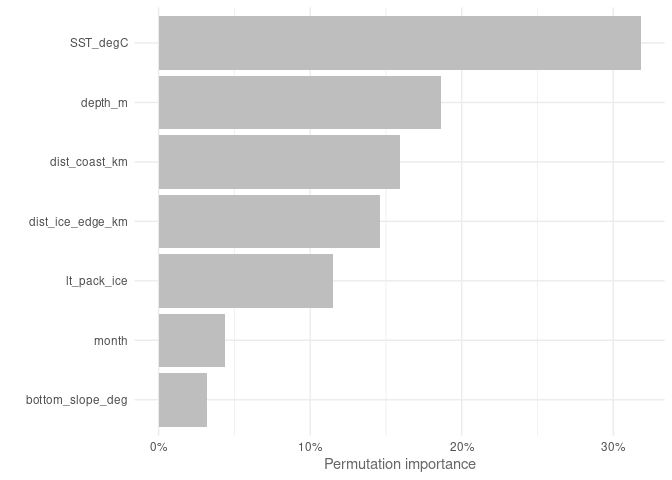
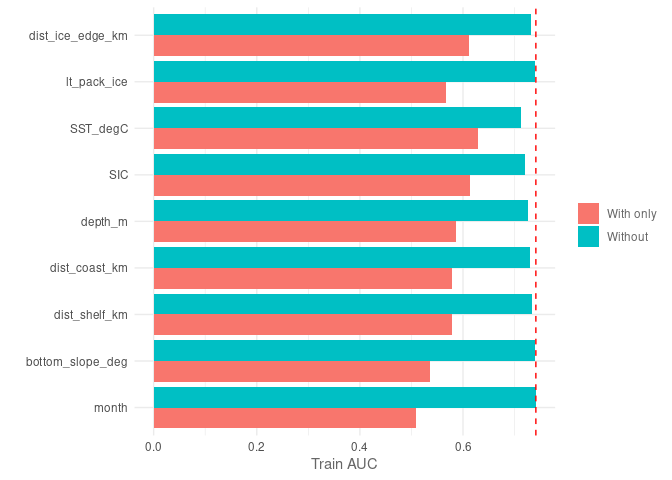
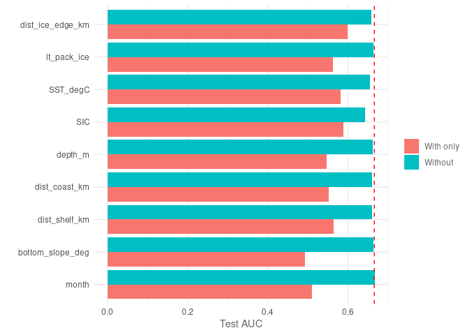
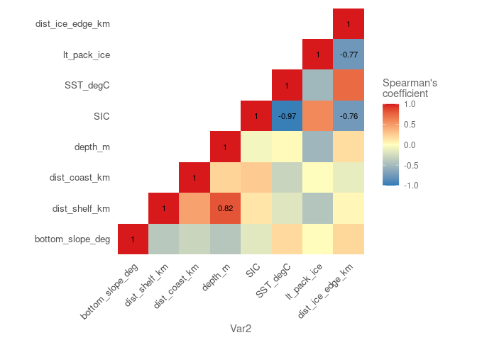
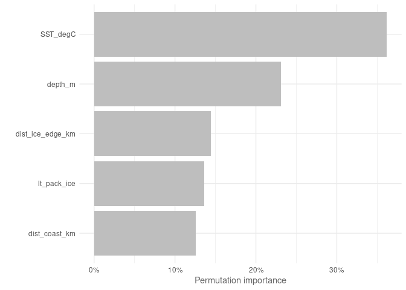
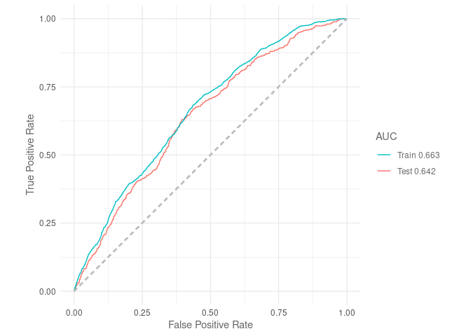

Maxent trained with simplified ACCESS-OM2-01 outputs
================
Denisse Fierro Arcos
2023-09-22

- <a href="#maxent-via-sdmtune" id="toc-maxent-via-sdmtune">Maxent via
  SDMtune</a>
  - <a href="#loading-libraries" id="toc-loading-libraries">Loading
    libraries</a>
  - <a href="#setting-up-notebook" id="toc-setting-up-notebook">Setting up
    notebook</a>
  - <a
    href="#loading-environmental-data-from-access-om2-01-and-setting-up-variables"
    id="toc-loading-environmental-data-from-access-om2-01-and-setting-up-variables">Loading
    environmental data from ACCESS-OM2-01 and setting up variables</a>
    - <a href="#splitting-data-into-testing-and-training"
      id="toc-splitting-data-into-testing-and-training">Splitting data into
      testing and training</a>
  - <a href="#loading-mean-environmental-conditions-from-access-om2-01"
    id="toc-loading-mean-environmental-conditions-from-access-om2-01">Loading
    mean environmental conditions from ACCESS-OM2-01</a>
  - <a href="#loading-layers-for-plotting"
    id="toc-loading-layers-for-plotting">Loading layers for plotting</a>
  - <a href="#modelling-and-tuning-initial-model"
    id="toc-modelling-and-tuning-initial-model">Modelling and tuning initial
    model</a>
  - <a href="#variable-importance" id="toc-variable-importance">Variable
    importance</a>
  - <a href="#jacknife-tests" id="toc-jacknife-tests">Jacknife tests</a>
    - <a href="#plotting-jacknife-results"
      id="toc-plotting-jacknife-results">Plotting Jacknife results</a>
  - <a href="#auc-curves" id="toc-auc-curves">AUC curves</a>
  - <a href="#true-skill-statistic-tss"
    id="toc-true-skill-statistic-tss">True Skill Statistic (TSS)</a>
  - <a href="#simplifying-model" id="toc-simplifying-model">Simplifying
    model</a>
  - <a href="#model-report" id="toc-model-report">Model report</a>
  - <a href="#training-and-tuning-model-with-reduced-variables"
    id="toc-training-and-tuning-model-with-reduced-variables">Training and
    tuning model with reduced variables</a>
  - <a href="#variable-importance-1" id="toc-variable-importance-1">Variable
    importance</a>
  - <a href="#reduced-model-report" id="toc-reduced-model-report">Reduced
    Model Report</a>
  - <a href="#performance-metrics" id="toc-performance-metrics">Performance
    metrics</a>
  - <a href="#predictions" id="toc-predictions">Predictions</a>
    - <a href="#plotting-predictions" id="toc-plotting-predictions">Plotting
      predictions</a>

# Maxent via SDMtune

MaxEnt is one of the most widely used species distribution model
algorithm.

In this project, we will use MaxEnt as one of the models to be
considered in our Species Distribution Model ensemble to estimate the
distribution of crabeater seals in the recent past.

## Loading libraries

``` r
library(tidyverse)
library(SDMtune)
library(stars)
library(sf)
library(cmocean)
library(cowplot)
library(prg)
library(rnaturalearth)
source("useful_functions.R")
```

## Setting up notebook

Selecting an output folder for GAM results exists and getting a list of
data files.

``` r
#Location of folder for outputs
out_folder <- "../../SDM_outputs/Maxent/Mod_match_obs"
#If folder does not exist, create one
if(!dir.exists(out_folder)){
  dir.create(out_folder, recursive = T)
}

#Get path to files containing data
file_list <- list.files("../../Environmental_Data/", pattern = "Indian", 
                        full.names = T)
```

## Loading environmental data from ACCESS-OM2-01 and setting up variables

We will use the datasets created in the notebook
`02_Merging_background_presence_data.Rmd` located within the
`Scripts/05_SDMs` folder. These datasets include the crabeater seal
observations, background points, and environmental data.

We will also define categorical and continuous explanatory variables.
The variable `month` will be included as an categorical factor in our
analysis.

``` r
#Loading data
mod_match_obs <- read_csv(str_subset(file_list, "match.*VIF")) %>% 
  select(!c(sector, zone, season_year:decade)) %>% 
  #Setting month as factor and ordered factor
  mutate(month = as.factor(month)) %>% 
  drop_na()
```

    ## Rows: 32512 Columns: 16
    ## ── Column specification ────────────────────────────────────────────────────────
    ## Delimiter: ","
    ## chr  (4): sector, zone, season_year, life_stage
    ## dbl (12): year, yt_ocean, xt_ocean, month, decade, presence, bottom_slope_de...
    ## 
    ## ℹ Use `spec()` to retrieve the full column specification for this data.
    ## ℹ Specify the column types or set `show_col_types = FALSE` to quiet this message.

``` r
covars <- str_subset(names(mod_match_obs), "presence|_ocean", negate = T)
```

### Splitting data into testing and training

The `prep_data` function in the `useful_functions` script will be used
to split our data and to apply all necessary transformations. We will
then transform the data into SWD (“samples with data”) format, which is
the required format for inputs used in the `SDMtune` library.

``` r
#List of categorical variables
cat_vars <- "month"

#Getting training data
mod_match_obs <- prep_data(mod_match_obs, cat_vars, split = F)

#Applying SWD format to model data
model_data <- mod_match_obs %>% 
  select(!year) %>% 
  sdm_format() %>% 
  trainValTest(test = 0.25, only_presence = T, seed = 42)
```

## Loading mean environmental conditions from ACCESS-OM2-01

This dataset includes the mean environmental conditions per month
(November and December) over the entire period of study (1981 to 2013).

``` r
mean_model <- read_csv("../../Environmental_Data/ACCESS-OM2-01/All_values_month_ACCESS-OM2-01_env_vars.csv") %>% 
  mutate(month = as.factor(month)) %>% 
  #Drop variables with high multicollinearity
  select(ends_with("_ocean")|any_of(covars))
```

    ## Rows: 730244 Columns: 21
    ## ── Column specification ────────────────────────────────────────────────────────
    ## Delimiter: ","
    ## dbl (21): yt_ocean, xt_ocean, bottom_slope_deg, dist_shelf_km, dist_coast_km...
    ## 
    ## ℹ Use `spec()` to retrieve the full column specification for this data.
    ## ℹ Specify the column types or set `show_col_types = FALSE` to quiet this message.

``` r
mean_model_baked <- prep_pred(mean_model, cat_vars)
```

## Loading layers for plotting

We will extract this layer from the `rnaturalearth` package. We will
then reproject this layer to South Polar Stereographic (`EPSG 3976`).

``` r
#Loading layer
antarctica <- ne_countries(continent = "Antarctica", returnclass = "sf") %>% 
  #Transforming to South Polar Stereographic
  st_transform(3976)
```

## Modelling and tuning initial model

MaxEnt has different feature classes (`fc`, otherwise known as
restrictions) available for modelling. These `fc` include:  
- `l` - lineal,  
- `q` - quadratic,  
- `p` - product,  
- `t` - threshold,  
- `h` - hinge  
and any possible combination of these 5 features.

Regularisation (`reg`) refers to *L1 regularisation* also known as
*Lasso (Least Absolute Shrinkage and Selection Operator) regression*.
This involves adding an absolute value of magnitude as a penalty term to
the loss function. It is used to prevent overfitting. In MaxEnt a `reg`
value lower than 1 results in a outputs that fit closer to presence
data. The risk of using values that are too small is a model that
overfits and therefore does not generalised well. While, `reg` values
larger than 1 result in less localised predictions, producing smoother
or more diffuse distributions.

Here, we use the `SDMtune` library to test various value combinations
for regularisation, feature classes and number of iterations. We will
identify the “best model” using the `AUC` for the testing dataset.

``` r
#Train model
default_model <- train(method = "Maxent", data = model_data[[1]])

# Define the hyperparameters to test
hyp_parm <- list(reg = seq(0.5, 5, 0.5),
                 #Feature classes
                 fc = c("lq", "lh", "lqp", "lqph", "lqpht"),
                 #Number of iterations
                 iter = c(500, 1000, 1500))

# Test all the possible combinations with gridSearch
gs_mod_simp <- gridSearch(default_model, hypers = hyp_parm, metric = "auc", 
                          test = model_data[[2]])

#Check best performing models based on AUC
gs_mod_simp@results %>% 
  #Adding index as column to identify best model easily
  rownames_to_column("index") %>% 
  #Arranging results by AUC from testing data (descending order)
  arrange(-test_AUC) %>%
  #Showing only the top 5 models
  head(n = 5)

#Best model based on test AUC and smallest AUC difference between train and test
best_init_max_mod <- gs_mod_simp@models[[55]]

best_init_max_mod %>% 
  saveRDS(file.path(out_folder, 
                    "initial_Maxent_model/initial_maxent_model_grid.rds"))
```

We chose the best performing model based on the `AUC` value calculated
on the test dataset because we want the model to perform best when
applied outside the area where it was trained on.

## Variable importance

We can now check which environmental variables contributed the most
important to the model we chose. We can see that `SST` and `SIC` are the
two most important variables.

``` r
#Calculating variable contribution based on permutations
var_imp_best <- varImp(best_init_max_mod) 
```

    ## Variable importance  ■■■■■                             14% | ETA: 49s - 00:00:8…Variable importance  ■■■■■■■■■■                        29% | ETA: 37s - 00:00:1…Variable importance  ■■■■■■■■■■■■■■                    43% | ETA: 29s - 00:00:2…Variable importance  ■■■■■■■■■■■■■■■■■■                57% | ETA: 21s - 00:00:2…Variable importance  ■■■■■■■■■■■■■■■■■■■■■■            71% | ETA: 14s - 00:00:3…Variable importance  ■■■■■■■■■■■■■■■■■■■■■■■■■■■       86% | ETA:  7s - 00:00:4…Variable importance  ■■■■■■■■■■■■■■■■■■■■■■■■■■■■■■■  100% | ETA:  0s - 00:00:4…

``` r
#Plotting results
var_imp_best %>% 
  plotVarImp()
```

<!-- -->

## Jacknife tests

We will perform jacknife tests to assess the importance of removing a
variable from the model. This way we can identify which of these two
variables we could leave out from our final model.

``` r
jk_mod_match_obs <- doJk(best_init_max_mod, metric = "auc", 
                         test = model_data[[2]])
```

    ## Loading required namespace: rJava

    ## Jk Test  ■■■                                7% | ETA:  6m - 00:00:29Jk Test  ■■■■■                             14% | ETA:  3m - 00:00:30.2Jk Test  ■■■■■■■                           21% | ETA:  3m - 00:00:54.7Jk Test  ■■■■■■■■■■                        29% | ETA:  2m - 00:00:55.4Jk Test  ■■■■■■■■■■■■                      36% | ETA:  2m - 00:01:17  Jk Test  ■■■■■■■■■■■■■■                    43% | ETA:  2m - 00:01:21.5Jk Test  ■■■■■■■■■■■■■■■■                  50% | ETA:  2m - 00:01:41  Jk Test  ■■■■■■■■■■■■■■■■■■                57% | ETA:  1m - 00:01:42.8Jk Test  ■■■■■■■■■■■■■■■■■■■■              64% | ETA:  1m - 00:02:0.2 Jk Test  ■■■■■■■■■■■■■■■■■■■■■■            71% | ETA: 49s - 00:02:3.4Jk Test  ■■■■■■■■■■■■■■■■■■■■■■■■■         79% | ETA: 40s - 00:02:27.5Jk Test  ■■■■■■■■■■■■■■■■■■■■■■■■■■■       86% | ETA: 25s - 00:02:28.5Jk Test  ■■■■■■■■■■■■■■■■■■■■■■■■■■■■■     93% | ETA: 13s - 00:02:46  Jk Test  ■■■■■■■■■■■■■■■■■■■■■■■■■■■■■■■  100% | ETA:  0s - 00:02:49.6

``` r
jk_mod_match_obs
```

    ##           Variable Train_AUC_without Train_AUC_withonly Test_AUC_without
    ## 1            month         0.7153427          0.5091150        0.6421518
    ## 2 bottom_slope_deg         0.7113772          0.5363608        0.6386878
    ## 3    dist_coast_km         0.7017140          0.5790355        0.6263782
    ## 4          depth_m         0.7012276          0.5867251        0.6341387
    ## 5         SST_degC         0.6797265          0.6290092        0.6277142
    ## 6      lt_pack_ice         0.7093075          0.5679415        0.6369379
    ## 7 dist_ice_edge_km         0.6991635          0.6112631        0.6303963
    ##   Test_AUC_withonly
    ## 1         0.5104806
    ## 2         0.4929697
    ## 3         0.5517284
    ## 4         0.5466619
    ## 5         0.5814377
    ## 6         0.5638401
    ## 7         0.5995086

### Plotting Jacknife results

We can plot this information so we can compare the importance across all
variables included in the model. We can plot this information based on
the training dataset.

``` r
plotJk(jk_mod_match_obs, type = "train", ref = SDMtune::auc(best_init_max_mod))
```

<!-- -->

We can see that `SST` when used by itself has the highest accuracy gain,
followed by distance to the sea ice edge (`dist_ice_edge_km`). When
`SST` was removed, it resulted in the largest decrease in AUC. However,
removing `dist_ice_edge_km`, depth (`depth_m`) or distance to the coast
(`dist_coast_km`) had a similar impact on performance.

On the other hand, `month` by itself had the lowest contribution towards
model accuracy. Its removal had very little effect on model performance.

``` r
plotJk(jk_mod_match_obs, type = "test", 
       ref = SDMtune::auc(best_init_max_mod, test = model_data[[2]]))
```

<!-- -->

The results are slightly different from the testing dataset perspective.
Here, we see that the use of `dist_ice_edge_km` contribute the most to
model performance when used on its own, closely followed by `SST` and
long-term presence of pack ice (`lt_pack_ice`).

The slope of the sea floor (`bottom_slope_deg`) and the `month` of the
year are the two variables with the lowest contribution to accuracy.
Their removal almost had virtually no effect on model performance.

## AUC curves

We will calculate AUC curves, so we can compare to the simplified models
we will test.

``` r
plotROC(best_init_max_mod, test = model_data[[2]])
```

    ## Warning: The following aesthetics were dropped during statistical transformation: m and
    ## d.
    ## ℹ This can happen when ggplot fails to infer the correct grouping structure in
    ##   the data.
    ## ℹ Did you forget to specify a `group` aesthetic or to convert a numerical
    ##   variable into a factor?

<!-- -->

## True Skill Statistic (TSS)

This is a measure of predictive accuracy, which captures the proportion
of correctly classified cells as true absences (specificity) or true
presences (sensitivity). The TSS provides a normalised value of model
accuracy so that it can be compared to accuracy by chance alone.

TSS values between 0.4 and 0.7 indicate a good model performance. Below
this range, TSS indicates poor model performance, and above this range
are models with excellent performance.

``` r
tss(best_init_max_mod)
```

    ## [1] 0.3115913

This model does not have a good performance, which agrees with a rather
low AUC value of 0.64 for the testing dataset.

## Simplifying model

We will now remove the variables that contributed the least to the
model. The code below will remove one variable at a time, train the
model and recalculate AUC.

``` r
reduced_model <- reduceVar(best_init_max_mod, metric = "auc",
                           test = model_data[[2]], th = 5, permut = 10, 
                           use_jk = T)
```

    ## ✔ The variables month and bottom_slope_deg have been removed

``` r
reduced_model
```

    ## 

    ## ── Object of class: <SDMmodel> ──

    ## 

    ## Method: Maxent

    ## 

    ## ── Hyperparameters

    ## • fc: "lqpht"

    ## • reg: 0.5

    ## • iter: 1000

    ## 

    ## ── Info

    ## • Species: Crabeater seals

    ## • Presence locations: 1381

    ## • Absence locations: 30527

    ## 

    ## ── Variables

    ## • Continuous: "dist_coast_km", "depth_m", "SST_degC", "lt_pack_ice", and
    ## "dist_ice_edge_km"

    ## • Categorical: NA

By setting the parameter `use_jk` to `TRUE`, a variable is only removed
if it does not decrease the model performance. In this case, the three
variables we considered for removal have been removed without adversely
affecting our model.

We have identified three variables that we can remove without affecting
the predictive performance of the model: `month` and the slope of the
seafloor (`bottom_slope_deg`).

## Model report

Before moving onto testing a new model, we will save a report with the
information shown above.

``` r
out <- file.path(out_folder, "initial_Maxent_model")
#If folder does not exist, create one
if(!dir.exists(out)){
  dir.create(out, recursive = T)
}

#Produce report
modelReport(best_init_max_mod, type = "cloglog", folder = out, 
            test = model_data[[2]], response_curves = T, only_presence = T, 
            jk = T)
```

## Training and tuning model with reduced variables

``` r
#Select variables
model_data_simple <- mod_match_obs %>% 
  select(!c(year, month, bottom_slope_deg)) %>% 
  sdm_format() %>% 
  trainValTest(test = 0.25, only_presence = T, seed = 42)

#Train model
default_model <- train(method = "Maxent", data = model_data_simple[[1]])

# Test all the possible hyper parameter combinations with gridSearch
gs_mod <- gridSearch(default_model, hypers = hyp_parm, metric = "auc", 
                     test = model_data_simple[[2]])

#Check best performing models based on AUC
gs_mod@results %>% 
  #Adding index as column to identify best model easily
  rownames_to_column("index") %>% 
  #Arranging results by AUC from testing data (descending order)
  arrange(-test_AUC) %>% 
  #Showing only the top 5 models
  head(n = 5)

#Best model based on test AUC and smallest AUC difference between train and test
best_max_mod <- gs_mod@models[[65]]

best_max_mod %>% 
  saveRDS(file.path(out_folder, 
                    "reduced_Maxent_model/best_red_maxent_model.rds"))
```

## Variable importance

``` r
#Calculating variable contribution based on permutations
var_imp_best <- varImp(best_max_mod) 

#Plotting results
p <- var_imp_best %>% 
  plotVarImp()

saveRDS(p, "../../SDM_outputs/Maxent/Maxent_var_imp_mod_match_obs.rds")
```

<!-- -->

We will calculate TSS and the AUC curve to check the impact on
performance.

``` r
plotROC(best_max_mod, test = model_data_simple[[2]])
```

    ## Warning: The following aesthetics were dropped during statistical transformation: m and
    ## d.
    ## ℹ This can happen when ggplot fails to infer the correct grouping structure in
    ##   the data.
    ## ℹ Did you forget to specify a `group` aesthetic or to convert a numerical
    ##   variable into a factor?

<!-- -->

``` r
tss(best_max_mod)
```

    ## [1] 0.2474897

## Reduced Model Report

``` r
#Ensuring output folder exists
out <- file.path(out_folder, "reduced_Maxent_model")
#If folder does not exist, create one
if(!dir.exists(out)){
  dir.create(out, recursive = T)
}

modelReport(best_max_mod, type = "cloglog", folder = out, 
            test = model_data_simple[[2]], 
            response_curves = T, only_presence = T, jk = T)
```

## Performance metrics

To be able to compare the performance of this model with the three other
SDM algorithms to be used in the SDM ensemble, we will calculate three
metrics: area under the receiver operating curve ($AUC_{ROC}$), area
under the precision-recall gain curve ($AUC_{PRG}$) and the Pearson
correlation between the model predictions and the testing dataset.

``` r
#Predicting values using testing dataset
pred <- predict(best_max_mod, model_data_simple[[2]]@data, type = "cloglog")

#AUC ROC
auc_roc <- SDMtune::auc(best_max_mod, model_data_simple[[2]])

#AUC PRG
auc_prg <- create_prg_curve(model_data_simple[[2]]@pa, pred) %>% 
  calc_auprg()

#Pearson correlation
cor <- cor(pred, model_data_simple[[2]]@pa)

#Load model evaluation data frame and add results
model_eval_path <- "../../SDM_outputs/model_evaluation.csv"
model_eval <- read_csv(model_eval_path) %>% 
  bind_rows(data.frame(model = "Maxent", env_trained = "mod_match_obs", 
                       auc_roc = auc_roc, auc_prg = auc_prg, 
                       pear_cor = cor)) %>% 
  write_csv(model_eval_path)
```

## Predictions

Finally, we will use this reduced model to predict crabeater seals
distribution.

``` r
pred_mod_match_obs <- mean_model_baked %>% 
  drop_na() %>% 
  mutate(pred = as.vector(predict(best_max_mod,
                                  data = mean_model_baked,
                                  type = "cloglog")))

pred_mod_match_obs_ras <- pred_mod_match_obs %>% 
  #Select relevant variables only
  select(xt_ocean, yt_ocean, pred, month) %>% 
  right_join(mean_model_baked %>%
  #Select relevant variables only
  select(xt_ocean, yt_ocean, month)) %>% 
  #Set dimensions
  st_as_stars(dims = c("xt_ocean", "yt_ocean", "month")) %>% 
  #Ensuring month dimension is shown correctly
  st_set_dimensions("month", values = c(11, 12)) %>%
  #Set CRS
  st_set_crs(4326) %>% 
  #Transform to South Pole stereographic
  st_transform(crs = st_crs(3976))

#Saving outputs
#Data frame
pred_mod_match_obs %>% 
  write_csv(file.path(out_folder, 
                      "reduced_Maxent_model/mean_pred_match_obs.csv"))
#Saving as R dataset so it can be easily open with readRDS
saveRDS(pred_mod_match_obs_ras,
        file.path(out_folder, 
                  "reduced_Maxent_model/mean_pred_match_obs_raster.rds"))
```

### Plotting predictions

``` r
#Plotting November distribution
#Prepping data
nov <- pred_mod_match_obs_ras %>% 
  slice(index = 1, along = "month") 

#Plotting
nov_plot <- ggplot()+
  geom_stars(data = nov)+
  geom_sf(data = antarctica)+
  lims(x = c(0, 4000000))+
  #Set colour palette
  scale_fill_cmocean(name = "haline", direction = -1, 
                     guide = guide_colorbar(barwidth = 1, barheight = 10, 
                                            ticks = FALSE, nbin = 1000, 
                                            frame.colour = "black"), 
                     limits = c(0, 1)) +
  theme_linedraw() +
  theme(panel.background = element_blank(),
        panel.grid.major = element_blank(),
        panel.grid.minor = element_blank(), 
        legend.position = "none",
        plot.title = element_text(hjust = 0.5)) +
  labs(title = "November",
       x = "Longitude",
       y = "Latitude")

dec <- pred_mod_match_obs_ras %>% 
  slice(index = 2, along = "month") 

dec_plot <- ggplot() +
  geom_stars(data = dec) +
  geom_sf(data = antarctica)+
  lims(x = c(0, 4000000))+
  scale_fill_cmocean(name = "haline", direction = -1, 
                     guide = guide_colorbar(barwidth = 1, barheight = 10, 
                                            ticks = FALSE, nbin = 1000, 
                                            frame.colour = "black"), 
                     limits = c(0, 1)) +
  theme_linedraw() +
  theme(panel.background = element_blank(),
        panel.grid.major = element_blank(),
        panel.grid.minor = element_blank(), 
        plot.title = element_text(hjust = 0.5)) +
  labs(title = "December",
       x = "Longitude",
       y = " ",
       fill = "Probability")

#Get legend
legend <- get_legend(dec_plot)

#Remove legend from December plot
dec_plot <- dec_plot + theme(legend.position = 'none')

#Plotting together
plot_match_obs <- plot_grid(nov_plot, dec_plot, legend, ncol = 3, nrow = 1,
                            rel_widths = c(1, 1, 0.3))

#Add title
title <- ggdraw()+
  draw_label("Mean crabeater seal distribution\n(ACCESS-OM2-01 - simplified)",
             fontface = "bold", hjust = 0.5)+
  theme(plot.margin = margin(0, 0, 0, 0))

#Putting everything together
final <- plot_grid(title, plot_match_obs, ncol = 1, rel_heights = c(0.1, 1))

#Saving graph
ggsave(file.path(out_folder, "map_mean_pred_match_obs.png"), 
       plot = final, device = "png", bg = "white", width = 8.75, height = 7)
```