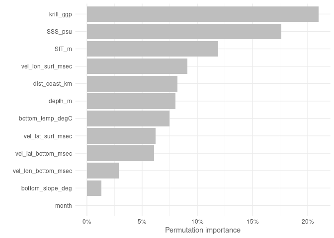

Maxent trained with ACCESS-OM2-01 outputs
================
Denisse Fierro Arcos
2023-11-02

- <a href="#maxent-via-sdmtune" id="toc-maxent-via-sdmtune">Maxent via
  SDMtune</a>
  - <a href="#loading-libraries" id="toc-loading-libraries">Loading
    libraries</a>
  - <a href="#setting-up-notebook" id="toc-setting-up-notebook">Setting up
    notebook</a>
  - <a
    href="#loading-environmental-data-from-access-om2-01-and-setting-up-variables"
    id="toc-loading-environmental-data-from-access-om2-01-and-setting-up-variables">Loading
    environmental data from ACCESS-OM2-01 and setting up variables</a>
    - <a href="#splitting-data-into-testing-and-training"
      id="toc-splitting-data-into-testing-and-training">Splitting data into
      testing and training</a>
    - <a href="#loading-mean-environmental-conditions-from-access-om2-01"
      id="toc-loading-mean-environmental-conditions-from-access-om2-01">Loading
      mean environmental conditions from ACCESS-OM2-01</a>
  - <a href="#loading-layers-for-plotting"
    id="toc-loading-layers-for-plotting">Loading layers for plotting</a>
    - <a href="#modelling" id="toc-modelling">Modelling</a>
  - <a href="#variable-importance" id="toc-variable-importance">Variable
    importance</a>
  - <a href="#jacknife-tests" id="toc-jacknife-tests">Jacknife tests</a>
    - <a href="#plotting-jacknife-results"
      id="toc-plotting-jacknife-results">Plotting Jacknife results</a>
  - <a href="#auc-curves" id="toc-auc-curves">AUC curves</a>
  - <a href="#true-skill-statistic-tss"
    id="toc-true-skill-statistic-tss">True Skill Statistic (TSS)</a>
  - <a href="#model-report" id="toc-model-report">Model report</a>
  - <a href="#reducing-model-variables"
    id="toc-reducing-model-variables">Reducing model variables</a>
  - <a href="#performance-metrics" id="toc-performance-metrics">Performance
    metrics</a>
  - <a href="#predictions" id="toc-predictions">Predictions</a>
    - <a href="#plotting-predictions" id="toc-plotting-predictions">Plotting
      predictions</a>

# Maxent via SDMtune

MaxEnt is one of the most widely used species distribution model
algorithm.

In this project, we will use MaxEnt as one of the models to be
considered in our Species Distribution Model ensemble to estimate the
distribution of crabeater seals in the recent past.

## Loading libraries

``` r
library(tidyverse)
library(SDMtune)
library(stars)
library(sf)
library(cmocean)
library(cowplot)
library(prg)
library(rnaturalearth)
source("useful_functions.R")
```

## Setting up notebook

Selecting an output folder for GAM results exists and getting a list of
data files.

``` r
#Location of folder for outputs
out_folder <- "../../SDM_outputs/Maxent/Mod_full"
#If folder does not exist, create one
if(!dir.exists(out_folder)){
  dir.create(out_folder, recursive = T)
}

#Get path to files containing data
file_list <- list.files("../../Environmental_Data/", pattern = "Indian", 
                        full.names = T)
```

## Loading environmental data from ACCESS-OM2-01 and setting up variables

We will use the datasets created in the notebook
`02_Merging_background_presence_data.Rmd` located within the
`Scripts/05_SDMs` folder. These datasets include the crabeater seal
observations, background points, and environmental data.

We will also define categorical and continuous explanatory variables.
The variable `month` will be included as an ordinal factor in our
analysis.

``` r
#Loading data
mod_data <- read_csv(str_subset(file_list, "model.*VIF")) %>% 
  select(!c(sector, zone, season_year:decade)) %>% 
  #Setting month as factor and ordered factor
  mutate(month = as.factor(month)) %>% 
 drop_na()
```

    ## Rows: 32512 Columns: 21
    ## ── Column specification ────────────────────────────────────────────────────────
    ## Delimiter: ","
    ## chr  (4): sector, zone, season_year, life_stage
    ## dbl (17): year, yt_ocean, xt_ocean, month, decade, presence, bottom_slope_de...
    ## 
    ## ℹ Use `spec()` to retrieve the full column specification for this data.
    ## ℹ Specify the column types or set `show_col_types = FALSE` to quiet this message.

``` r
covars <- str_subset(names(mod_data), "presence|_ocean", negate = T)
```

### Splitting data into testing and training

The `prep_data` function in the `useful_functions` script will be used
to split our data and to apply all necessary transformations. We will
then transform the data into SWD (“samples with data”) format, which is
the required format for inputs used in the `SDMtune` library.

``` r
#List of categorical variables
cat_vars <- "month"

#Getting training data
mod <- prep_data(mod_data, cat_vars, split = F)

#Applying SWD format to model data
model_data <- mod %>% 
  #Remove year
  select(!year) %>% 
  sdm_format() %>% 
  trainValTest(test = 0.25, only_presence = T, seed = 42)
```

### Loading mean environmental conditions from ACCESS-OM2-01

This dataset includes the mean environmental conditions per month
(November and December) over the entire period of study (1981 to 2013).

``` r
mean_model <- read_csv("../../Environmental_Data/ACCESS-OM2-01/All_values_month_ACCESS-OM2-01_env_vars.csv") %>% 
  mutate(month = as.factor(month)) %>% 
 #Drop variables with high multicollinearity
  select(ends_with("_ocean")|any_of(covars))
```

    ## Rows: 730244 Columns: 21
    ## ── Column specification ────────────────────────────────────────────────────────
    ## Delimiter: ","
    ## dbl (21): yt_ocean, xt_ocean, bottom_slope_deg, dist_shelf_km, dist_coast_km...
    ## 
    ## ℹ Use `spec()` to retrieve the full column specification for this data.
    ## ℹ Specify the column types or set `show_col_types = FALSE` to quiet this message.

``` r
mean_model_baked <- prep_pred(mean_model, cat_vars)
```

## Loading layers for plotting

We will extract this layer from the `rnaturalearth` package. We will
then reproject this layer to South Polar Stereographic (`EPSG 3976`).

``` r
#Loading layer
antarctica <- ne_countries(continent = "Antarctica",
                                          returnclass = "sf") %>% 
  #Transforming to South Polar Stereographic
  st_transform(3976)
```

### Modelling

MaxEnt has different feature classes (`fc`, otherwise known as
restrictions) available for modelling. These `fc` include:  
- `l` - lineal,  
- `q` - quadratic,  
- `p` - product,  
- `t` - threshold,  
- `h` - hinge  
and any possible combination of these 5 features.

Regularisation (`reg`) refers to *L1 regularisation* also known as
*Lasso (Least Absolute Shrinkage and Selection Operator) regression*.
This involves adding an absolute value of magnitude as a penalty term to
the loss function. It is used to prevent overfitting. In MaxEnt a `reg`
value lower than 1 results in a outputs that fit closer to presence
data. The risk of using values that are too small is a model that
overfits and therefore does not generalised well. While, `reg` values
larger than 1 result in less localised predictions, producing smoother
or more diffuse distributions.

Here, we use the `SDMtune` library to test various value combinations
for regularisation, feature classes and number of iterations. We will
identify the “best model” using the `AUC` for the testing dataset.

``` r
#Train model
default_model <- train(method = "Maxent", data = model_data[[1]])

# Define the hyperparameters to test
hyp_parm <- list(reg = seq(0.5, 5, 0.5),
                 #Feature classes
                 fc = c("lq", "lh", "lqp", "lqph", "lqpht"),
                 #Number of iterations
                 iter = c(500, 1000, 1500))

# Test all the possible combinations with gridSearch
gs_mod <- optimizeModel(default_model, hypers = hyp_parm, metric = "auc", 
                          test = model_data[[2]], seed = 42)

#Check best performing models based on AUC
gs_mod@results %>% 
  #Adding index as column to identify best model easily
  rownames_to_column("index") %>% 
  #Arranging results by AUC from testing data (descending order)
  arrange(-test_AUC) %>% 
  #Showing only the top 5 models
  head(n = 5)

#Best model based on test AUC and smallest AUC difference between train and test
best_max_mod <- gs_mod@models[[1]]

best_max_mod %>% 
  saveRDS(file.path(out_folder, 
                    "initial_Maxent_model/best_maxent_model_grid.rds"))
```

    ## 

    ## ── Object of class: <SDMmodel> ──

    ## 

    ## Method: Maxent

    ## 

    ## ── Hyperparameters

    ## • fc: "lqpht"

    ## • reg: 1

    ## • iter: 1500

    ## 

    ## ── Info

    ## • Species: Crabeater seals

    ## • Presence locations: 1381

    ## • Absence locations: 30525

    ## 

    ## ── Variables

    ## • Continuous: "bottom_slope_deg", "dist_coast_km", "depth_m", "SIT_m",
    ## "bottom_temp_degC", "SSS_psu", "vel_lat_surf_msec", "vel_lat_bottom_msec",
    ## "vel_lon_surf_msec", "vel_lon_bottom_msec", and "krill_ggp"

    ## • Categorical: "month"

## Variable importance

We can check the contribution of each environmental variable to model
performance.

``` r
var_imp_best <- varImp(best_max_mod) 

#Plotting results
p <- var_imp_best %>% 
  plotVarImp()

saveRDS(p, "../../SDM_outputs/Maxent/Maxent_var_imp_mod_full.rds")
```

<!-- -->

Krill habitat (`krill_ggp`) is the most important variable in this
model, followed closely by salinity at the surface `SSS_psu`.

## Jacknife tests

We can now check which environmental variables contributed the most to
the Maxent model. This will help us decide if we can remove variables
from the final model.

``` r
jk_mod <- doJk(best_max_mod, metric = "auc", test = model_data[[2]])
```

    ## Loading required namespace: rJava

    ## Jk Test  ■■                                 4% | ETA: 40m - 00:01:44Jk Test  ■■■                                8% | ETA: 19m - 00:01:44.6Jk Test  ■■■■■                             12% | ETA: 24m - 00:03:26.9Jk Test  ■■■■■■                            17% | ETA: 17m - 00:03:27.7Jk Test  ■■■■■■■                           21% | ETA: 19m - 00:05:04  Jk Test  ■■■■■■■■■                         25% | ETA: 15m - 00:05:4.9Jk Test  ■■■■■■■■■■                        29% | ETA: 16m - 00:06:36.3Jk Test  ■■■■■■■■■■■                       33% | ETA: 13m - 00:06:37.5Jk Test  ■■■■■■■■■■■■                      38% | ETA: 13m - 00:07:42.1Jk Test  ■■■■■■■■■■■■■                     42% | ETA: 11m - 00:07:46.3Jk Test  ■■■■■■■■■■■■■■■                   46% | ETA: 11m - 00:09:7.4 Jk Test  ■■■■■■■■■■■■■■■■                  50% | ETA:  9m - 00:09:8.5Jk Test  ■■■■■■■■■■■■■■■■■                 54% | ETA:  9m - 00:10:41.7Jk Test  ■■■■■■■■■■■■■■■■■■■               58% | ETA:  8m - 00:10:42.8Jk Test  ■■■■■■■■■■■■■■■■■■■■              62% | ETA:  7m - 00:12:13.8Jk Test  ■■■■■■■■■■■■■■■■■■■■■             67% | ETA:  6m - 00:12:16.1Jk Test  ■■■■■■■■■■■■■■■■■■■■■■            71% | ETA:  6m - 00:13:31.9Jk Test  ■■■■■■■■■■■■■■■■■■■■■■■           75% | ETA:  5m - 00:13:33.1Jk Test  ■■■■■■■■■■■■■■■■■■■■■■■■■         79% | ETA:  4m - 00:15:2.7 Jk Test  ■■■■■■■■■■■■■■■■■■■■■■■■■■        83% | ETA:  3m - 00:15:3.9Jk Test  ■■■■■■■■■■■■■■■■■■■■■■■■■■■       88% | ETA:  2m - 00:16:28.4Jk Test  ■■■■■■■■■■■■■■■■■■■■■■■■■■■■■     92% | ETA:  2m - 00:16:30.5Jk Test  ■■■■■■■■■■■■■■■■■■■■■■■■■■■■■■    96% | ETA: 47s - 00:17:53.2Jk Test  ■■■■■■■■■■■■■■■■■■■■■■■■■■■■■■■  100% | ETA:  0s - 00:17:55.2

``` r
jk_mod
```

    ##               Variable Train_AUC_without Train_AUC_withonly Test_AUC_without
    ## 1                month         0.7384938          0.5091231        0.6819535
    ## 2     bottom_slope_deg         0.7352937          0.5195459        0.6796225
    ## 3        dist_coast_km         0.7228477          0.5628710        0.6683614
    ## 4              depth_m         0.7303940          0.5662620        0.6761681
    ## 5                SIT_m         0.7200692          0.6092025        0.6711629
    ## 6     bottom_temp_degC         0.7305211          0.5758750        0.6759494
    ## 7              SSS_psu         0.7260356          0.5803078        0.6573880
    ## 8    vel_lat_surf_msec         0.7286122          0.5537535        0.6820028
    ## 9  vel_lat_bottom_msec         0.7282404          0.5320012        0.6733788
    ## 10   vel_lon_surf_msec         0.7228781          0.5596991        0.6746108
    ## 11 vel_lon_bottom_msec         0.7319894          0.5533624        0.6821322
    ## 12           krill_ggp         0.7266825          0.5849932        0.6692658
    ##    Test_AUC_withonly
    ## 1          0.5104887
    ## 2          0.4939021
    ## 3          0.5558439
    ## 4          0.5447752
    ## 5          0.5768837
    ## 6          0.5635239
    ## 7          0.5844733
    ## 8          0.5306839
    ## 9          0.5200995
    ## 10         0.5197654
    ## 11         0.5332368
    ## 12         0.5605521

### Plotting Jacknife results

We can plot this information so we can compare the importance across all
variables included in the model. We can plot this information based on
the training dataset.

``` r
plotJk(jk_mod, type = "train", ref = SDMtune::auc(best_max_mod))
```

<!-- -->

The thickness of sea ice (`SIT_m`), surface salinity (`SSS_psu`), bottom
temperature (`bottom_temp_degC`) and krill (`krill_ggp`) are the four
variables that contributed the most to model performance if used on
their own. The removal of `SIT_m` led to the highest drop in
performance. On the other hand, the slope of the sea floor
(`bottom_slope_deg`) and the `month` of the year are the two variables
with the lowest contribution to accuracy. Their removal almost has no
effect on model performance.

Now, we will consider the importance of variables calculated from the
testing dataset.

``` r
plotJk(jk_mod, type = "test", ref = SDMtune::auc(best_max_mod, 
       test = model_data[[2]]))
```

<!-- -->

The results are from the testing dataset perspectiveare similar to the
results above. The same variables used on its own contribute the most to
model performance (`SIT_m`, `SSS_psu`, `bottom_temp_degC` and
`krill_ggp`). The least contribution came from the same variables:
`bottom_slope_deg` and the `month` of the year. Based on this
information, we will check if we can simplify the model by removing the
`bottom_slope_deg` and `month` from the model.

## AUC curves

We will calculate AUC curves, so we can compare to the simplified models
we will test.

``` r
plotROC(best_max_mod, test = model_data[[2]])
```

    ## Warning: The following aesthetics were dropped during statistical transformation: m and
    ## d.
    ## ℹ This can happen when ggplot fails to infer the correct grouping structure in
    ##   the data.
    ## ℹ Did you forget to specify a `group` aesthetic or to convert a numerical
    ##   variable into a factor?

<!-- -->

This model performs better than the MaxEnt model trained by a subset of
the ACCESS-OM2-01 outputs.

## True Skill Statistic (TSS)

TSS is a measure of accuracy, with values between 0.4 and 0.7 indicate a
good model. Anything lower than this range is a poor model, and above is
an excellent model.

``` r
tss(best_max_mod)
```

    ## [1] 0.3507379

This model is not within the range of a good performing model.

## Model report

Before moving onto testing a new model, we will save a report with the
information shown above.

``` r
#Create a subfolder for initial model
out <- file.path(out_folder, "initial_Maxent_model")
#If folder does not exist, create one
if(!dir.exists(out)){
  dir.create(out, recursive = T)
}

modelReport(best_max_mod, type = "cloglog", folder = out, 
            test = model_data[[2]], response_curves = T, only_presence = T,
            jk = T)
```

## Reducing model variables

We will now remove the variables that contributed the least to the
model. The code below will remove one variable at a time, train the
model and recalculate AUC.

``` r
simple_model <- reduceVar(best_max_mod, metric = "auc", test = model_data[[2]],
                          th = 5, permut = 10, use_jk = T)

simple_model
```

We are unable to remove any of the variables used in this model without
negatively impacting model performance. We will use this model to
estimate crabeater distribution.

## Performance metrics

To be able to compare the performance of this model with the three other
SDM algorithms to be used in the SDM ensemble, we will calculate three
metrics: area under the receiver operating curve ($AUC_{ROC}$), area
under the precisison-recall gain curve ($AUC_{PRG}$) and the Pearson
correlation between the model predictions and the testing dataset.

``` r
#Predicting values using testing dataset
pred <- predict(best_max_mod, model_data[[2]]@data, type = "cloglog")

#AUC ROC
auc_roc <- SDMtune::auc(best_max_mod, model_data[[2]])

#AUC PRG
auc_prg <- create_prg_curve(model_data[[2]]@pa, pred) %>% 
  calc_auprg()

#Pearson correlation
cor <- cor(pred, model_data[[2]]@pa)

#Load model evaluation data frame and add results
model_eval_path <- "../../SDM_outputs/model_evaluation.csv"
read_csv(model_eval_path) %>% 
  bind_rows(data.frame(model = "Maxent", env_trained = "full_access", 
                       auc_roc = auc_roc, auc_prg = auc_prg, 
                       pear_cor = cor)) %>%
    write_csv(model_eval_path)

print(c(paste0("AUC ROC: ", round(auc_roc, 3)),
        paste0("AUC PRG: ", round(auc_prg, 3)),
        paste0("Pearson correlation: ", round(cor, 3))))
```

## Predictions

``` r
pred_mod <- mean_model_baked %>% 
  drop_na() %>% 
  mutate(pred = as.vector(predict(best_max_mod,
                                  data = mean_model_baked,
                                  type = "cloglog")))

pred_mod_ras <- pred_mod %>% 
  #Select relevant variables only
  select(xt_ocean, yt_ocean, pred, month) %>% 
  right_join(mean_model_baked %>%
  #Select relevant variables only
  select(xt_ocean, yt_ocean, month)) %>% 
  #Set dimensions
  st_as_stars(dims = c("xt_ocean", "yt_ocean", "month")) %>% 
  #Ensuring month dimension is shown correctly
  st_set_dimensions("month", values = c(11, 12)) %>%
  #Set CRS
  st_set_crs(4326) %>% 
  #Transform to South Pole stereographic
  st_transform(crs = st_crs(3976))

#Saving outputs
#Data frame
pred_mod %>% 
  write_csv(file.path(out_folder, "initial_Maxent_model/mean_pred_ACCESS.csv"))
#Saving as R dataset so it can be easily open with readRDS
pred_mod_ras %>% 
  saveRDS(file.path(out_folder, "initial_Maxent_model/mean_pred_ACCESS.rds"))
```

### Plotting predictions

``` r
#Plotting November distribution
#Prepping data
nov <- pred_mod_ras %>% 
  slice(index = 1, along = "month") 

#Plotting
nov_plot <- ggplot()+
  geom_stars(data = nov)+
  geom_sf(data = antarctica)+
  lims(x = c(0, 4000000))+
  #Set colour palette
  scale_fill_cmocean(name = "haline", direction = -1, 
                     guide = guide_colorbar(barwidth = 1, barheight = 10, 
                                            ticks = FALSE, nbin = 1000, 
                                            frame.colour = "black"), 
                     limits = c(0, 1)) +
  theme_linedraw() +
  theme(panel.background = element_blank(),
        panel.grid.major = element_blank(),
        panel.grid.minor = element_blank(), 
        legend.position = "none",
        plot.title = element_text(hjust = 0.5)) +
  labs(title = "November",
       x = "Longitude",
       y = "Latitude")

dec <- pred_mod_ras %>% 
  slice(index = 2, along = "month") 

dec_plot <- ggplot() +
  geom_stars(data = dec) +
  geom_sf(data = antarctica)+
  lims(x = c(0, 4000000))+
  scale_fill_cmocean(name = "haline", direction = -1, 
                     guide = guide_colorbar(barwidth = 1, barheight = 10, 
                                            ticks = FALSE, nbin = 1000, 
                                            frame.colour = "black"), 
                     limits = c(0, 1)) +
  theme_linedraw() +
  theme(panel.background = element_blank(),
        panel.grid.major = element_blank(),
        panel.grid.minor = element_blank(), 
        plot.title = element_text(hjust = 0.5)) +
  labs(title = "December",
       x = "Longitude",
       y = " ",
       fill = "Probability")

#Get legend
legend <- get_legend(dec_plot)

#Remove legend from December plot
dec_plot <- dec_plot + theme(legend.position = 'none')

#Plotting together
plot_match_obs <- plot_grid(nov_plot, dec_plot, legend, ncol = 3, nrow = 1,
                            rel_widths = c(1, 1, 0.3))

#Add title
title <- ggdraw()+
  draw_label("Mean crabeater seal distribution\n(ACCESS-OM2-01)",
             fontface = "bold", hjust = 0.5)+
  theme(plot.margin = margin(0, 0, 0, 0))

#Putting everything together
final <- plot_grid(title, plot_match_obs, ncol = 1, rel_heights = c(0.1, 1))

#Saving graph
ggsave(file.path(out_folder, "map_mean_pred_ACCESS.png"), 
       plot = final, device = "png", bg = "white", width = 8.75, height = 7)
```
