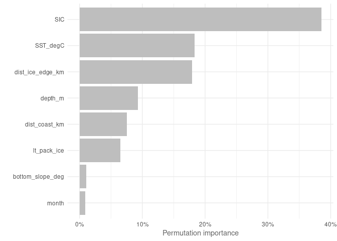
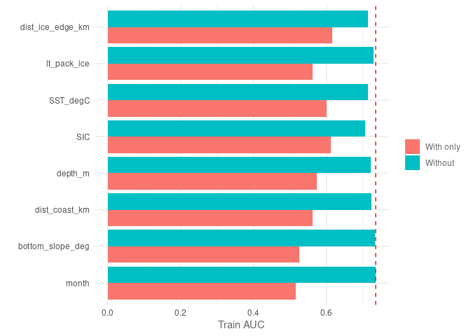
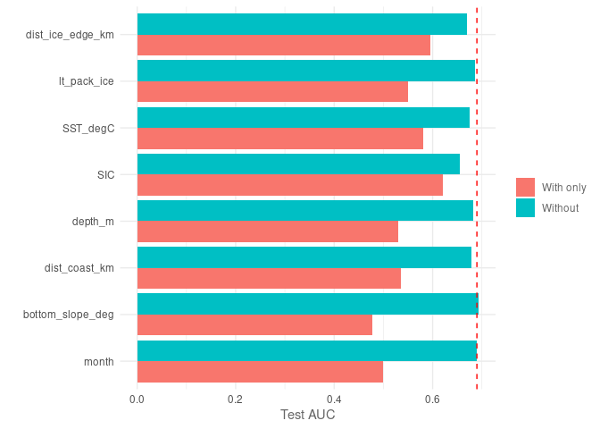
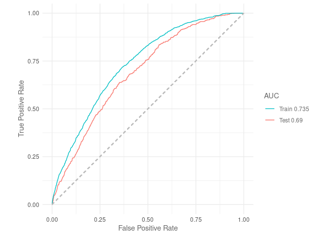
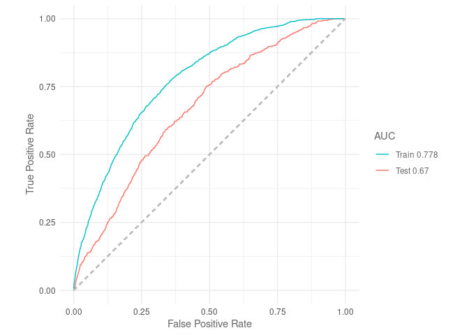
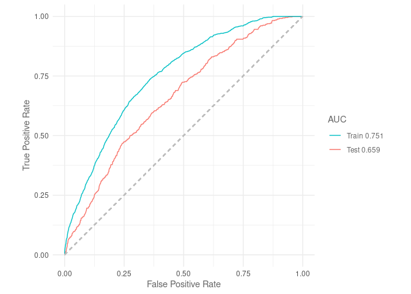
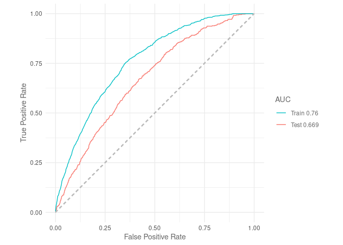
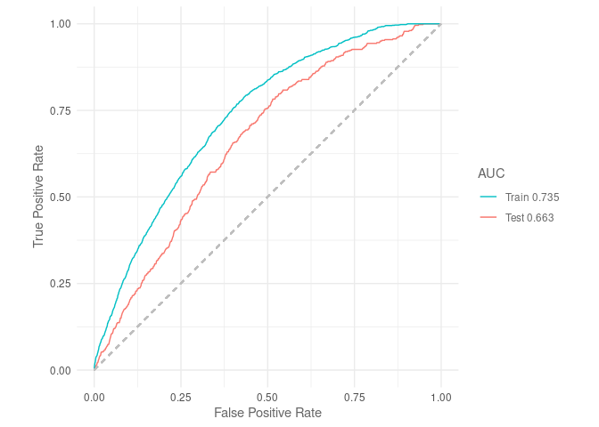
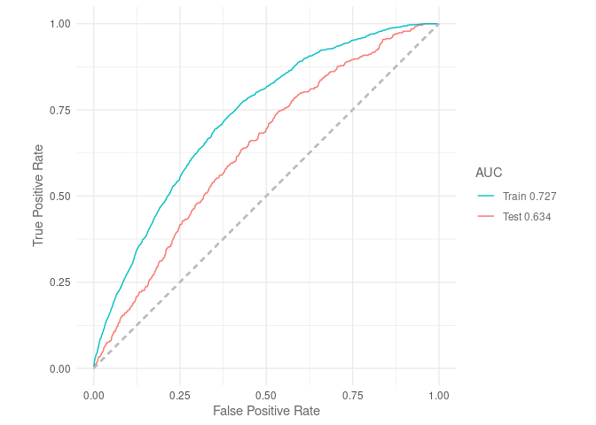
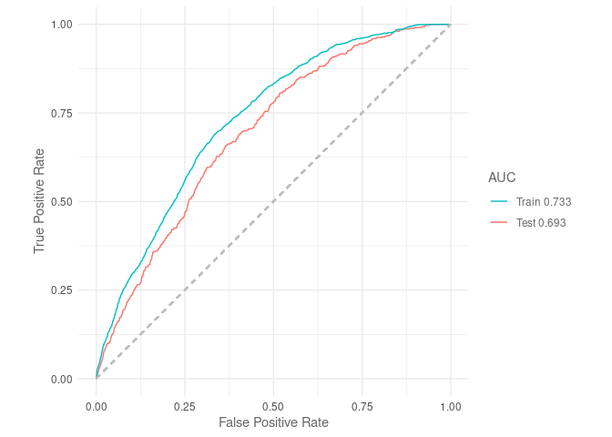

Maxent trained with observations
================
Denisse Fierro Arcos
2023-11-02

- <a href="#maxent-via-sdmtune" id="toc-maxent-via-sdmtune">Maxent via
  SDMtune</a>
  - <a href="#loading-libraries" id="toc-loading-libraries">Loading
    libraries</a>
  - <a href="#setting-up-notebook" id="toc-setting-up-notebook">Setting up
    notebook</a>
    - <a href="#loading-mean-environmental-conditions-from-observations"
      id="toc-loading-mean-environmental-conditions-from-observations">Loading
      mean environmental conditions from observations</a>
  - <a href="#loading-layers-for-plotting"
    id="toc-loading-layers-for-plotting">Loading layers for plotting</a>
  - <a href="#loading-environmental-data-from-observations"
    id="toc-loading-environmental-data-from-observations">Loading
    environmental data from observations</a>
  - <a href="#variable-importance" id="toc-variable-importance">Variable
    importance</a>
  - <a href="#jacknife-tests" id="toc-jacknife-tests">Jacknife tests</a>
    - <a href="#plotting-jacknife-results"
      id="toc-plotting-jacknife-results">Plotting Jacknife results</a>
  - <a href="#variable-correlation-multicollinearity"
    id="toc-variable-correlation-multicollinearity">Variable correlation
    (multicollinearity)</a>
  - <a href="#auc-curves" id="toc-auc-curves">AUC curves</a>
  - <a href="#true-skill-statistic-tss"
    id="toc-true-skill-statistic-tss">True Skill Statistic (TSS)</a>
  - <a href="#model-report" id="toc-model-report">Model report</a>
  - <a href="#reducing-model-variables"
    id="toc-reducing-model-variables">Reducing model variables</a>
  - <a href="#removing-highly-correlated-variables"
    id="toc-removing-highly-correlated-variables">Removing highly correlated
    variables</a>
  - <a href="#training-model-with-reduced-variables"
    id="toc-training-model-with-reduced-variables">Training model with
    reduced variables</a>
  - <a href="#model-report-1" id="toc-model-report-1">Model report</a>
  - <a href="#performance-metrics" id="toc-performance-metrics">Performance
    metrics</a>
  - <a href="#predictions" id="toc-predictions">Predictions</a>
  - <a href="#plotting-predictions" id="toc-plotting-predictions">Plotting
    predictions</a>

# Maxent via SDMtune

MaxEnt is one of the most widely used species distribution model
algorithm.

In this project, we will use MaxEnt as one of the models to be
considered in our Species Distribution Model ensemble to estimate the
distribution of crabeater seals in the recent past.

## Loading libraries

``` r
library(tidyverse)
library(SDMtune)
library(stars)
library(sf)
library(cmocean)
library(cowplot)
library(prg)
source("useful_functions.R")
```

## Setting up notebook

Selecting an output folder for GAM results exists and getting a list of
data files.

``` r
#Location of folder for outputs
out_folder <- "../../SDM_outputs/Maxent/Obs"
#If folder does not exist, create one
if(!dir.exists(out_folder)){
  dir.create(out_folder, recursive = T)
}

#Get path to files containing data
file_list <- list.files("../../Environmental_Data/", pattern = "Indian", full.names = T)
```

### Loading mean environmental conditions from observations

This dataset includes the mean environmental conditions per month
(November and December) over the entire period of study (1981 to 2013).

``` r
mean_obs <- read_csv("../../Environmental_Data/Env_obs/All_values_month_Obs_env_vars.csv") %>% 
  mutate(month = as.factor(month))
```

    ## Rows: 730244 Columns: 11
    ## ── Column specification ────────────────────────────────────────────────────────
    ## Delimiter: ","
    ## dbl (11): yt_ocean, xt_ocean, bottom_slope_deg, dist_shelf_km, dist_coast_km...
    ## 
    ## ℹ Use `spec()` to retrieve the full column specification for this data.
    ## ℹ Specify the column types or set `show_col_types = FALSE` to quiet this message.

``` r
mean_obs_baked <- prep_pred(mean_obs, "month")
```

## Loading layers for plotting

We will extract this layer from the `rnaturalearth` package. We will
then reproject this layer to South Polar Stereographic (`EPSG 3976`).

``` r
#Loading layer
antarctica <- rnaturalearth::ne_countries(continent = "Antarctica",
                                          returnclass = "sf") %>% 
  #Transforming to South Polar Stereographic
  st_transform(3976)
```

## Loading environmental data from observations

We will use the datasets created in the notebook
`02_Merging_background_presence_data.Rmd` located within the
`Scripts/05_SDMs` folder. These datasets include the crabeater seal
observations, background points, and environmental data.

We will also define categorical and continuous explanatory variables.

``` r
#Loading data
obs_data <- read_csv(str_subset(file_list, "/obs")) %>% 
  #Setting month as factor and ordered factor
  mutate(month = as.factor(month))
```

    ## Rows: 32033 Columns: 13
    ## ── Column specification ────────────────────────────────────────────────────────
    ## Delimiter: ","
    ## dbl (13): year, month, xt_ocean, yt_ocean, presence, bottom_slope_deg, dist_...
    ## 
    ## ℹ Use `spec()` to retrieve the full column specification for this data.
    ## ℹ Specify the column types or set `show_col_types = FALSE` to quiet this message.

#### Splitting data into testing and training

The `prep_data` function in the `useful_functions` script will be used
to split our data and to apply all necessary transformations. We will
then transform the data into SWD (“samples with data”) format, which is
the required format for inputs used in the `SDMtune` library.

``` r
#Getting training data
obs_data <- prep_data(obs_data, "month", split = F)

#Applying SWD format to model data
model_data <- obs_data %>% 
  select(!year) %>% 
  sdm_format() %>% 
  trainValTest(test = 0.25, only_presence = T, seed = 42)
```

#### Modelling

MaxEnt has different feature classes (`fc`, otherwise known as
restrictions) available for modelling. These `fc` include:  
- `l` - lineal,  
- `q` - quadratic,  
- `p` - product,  
- `t` - threshold,  
- `h` - hinge  
and any possible combination of these 5 features.

Regularisation (`reg`) refers to *L1 regularisation* also known as
*Lasso (Least Absolute Shrinkage and Selection Operator) regression*.
This involves adding an absolute value of magnitude as a penalty term to
the loss function. It is used to prevent overfitting. In MaxEnt a `reg`
value lower than 1 results in a outputs that fit closer to presence
data. The risk of using values that are too small is a model that
overfits and therefore does not generalised well. While, `reg` values
larger than 1 result in less localised predictions, producing smoother
or more diffuse distributions.

Here, we use the `SDMtune` library to test various value combinations
for regularisation, feature classes and number of iterations. We will
identify the “best model” using the `AUC` for the testing dataset.

``` r
#Train model
default_model <- train(method = "Maxent", data = model_data[[1]])

# Define the hyperparameters to test
hyp_parm <- list(reg = seq(0.5, 5, 0.5),
                 #Feature classes
                 fc = c("lq", "lh", "lqp", "lqph", "lqpht"),
                 #Number of iterations
                 iter = c(500, 1000, 1500))

# Test all the possible combinations with gridSearch
gs_obs <- gridSearch(default_model, hypers = hyp_parm, metric = "auc", 
                     test = model_data[[2]])

#Check best performing models based on AUC
gs_obs@results %>% 
  #Adding index as column to identify best model easily
  rownames_to_column("index") %>% 
  #Arranging results by AUC from testing data (descending order)
  arrange(-test_AUC) %>% 
  #Showing only the top 5 models
  head(n = 5)

#Best model based on test AUC and smallest AUC difference between train and test
best_max_obs <- gs_obs@models[[55]]

out <- file.path(out_folder, "initial_Maxent_model")
#If folder does not exist, create one
if(!dir.exists(out_folder)){
  dir.create(out_folder, recursive = T)
}

#Save best performing model to disk to avoid having to tune model again
best_max_obs %>% 
  saveRDS(file.path(out, "best_maxent_obs_grid.rds"))
```

## Variable importance

We will check the contribution of each environmental variable to the
model performance.

``` r
#Calculating importance
var_imp_best <- varImp(best_max_obs) 
```

    ## Variable importance  ■■■■                              11% | ETA:  2m - 00:00:1…Variable importance  ■■■■■■■■                          22% | ETA:  1m - 00:00:2…Variable importance  ■■■■■■■■■■■                       33% | ETA:  1m - 00:00:3…Variable importance  ■■■■■■■■■■■■■■                    44% | ETA:  1m - 00:00:4…Variable importance  ■■■■■■■■■■■■■■■■■■                56% | ETA: 43s - 00:00:5…Variable importance  ■■■■■■■■■■■■■■■■■■■■■             67% | ETA: 32s - 00:01:3…Variable importance  ■■■■■■■■■■■■■■■■■■■■■■■■          78% | ETA: 21s - 00:01:1…Variable importance  ■■■■■■■■■■■■■■■■■■■■■■■■■■■■      89% | ETA: 10s - 00:01:2…Variable importance  ■■■■■■■■■■■■■■■■■■■■■■■■■■■■■■■  100% | ETA:  0s - 00:01:3…

``` r
#Plotting results
var_imp_best %>% 
  plotVarImp()
```

<!-- -->

Sea ice concentration (`SIC`) is the variable with the highest
importance in this model, and its about twice as important as the `SST`,
which was the third most important variable. `SST` identified as the
most important variable in the ACCESS-OM2-01 trained MaxEnt.

Both `month`, the slope of the seafloor (`bottom_slope_deg`) and
long-term presence of pack ice (`lt_pack_ice`) contribute less than 5%
each to the model, so we may be able to drop these without affecting
overall model performance.

## Jacknife tests

We can now check which variables contributed the most to this model.
This information becomes relevant if we detect multicollinearity among
variables.

``` r
jk_obs <- doJk(best_max_obs, metric = "auc", test = model_data[[2]])
```

    ## Loading required namespace: rJava

    ## Jk Test  ■■■                                6% | ETA: 13m - 00:00:46Jk Test  ■■■■                              11% | ETA:  6m - 00:00:46.5Jk Test  ■■■■■■                            17% | ETA:  8m - 00:01:32.8Jk Test  ■■■■■■■■                          22% | ETA:  5m - 00:01:33.7Jk Test  ■■■■■■■■■                         28% | ETA:  6m - 00:02:18.7Jk Test  ■■■■■■■■■■■                       33% | ETA:  5m - 00:02:20.9Jk Test  ■■■■■■■■■■■■■                     39% | ETA:  5m - 00:03:2.4 Jk Test  ■■■■■■■■■■■■■■                    44% | ETA:  4m - 00:03:8.3Jk Test  ■■■■■■■■■■■■■■■■                  50% | ETA:  4m - 00:03:49 Jk Test  ■■■■■■■■■■■■■■■■■■                56% | ETA:  3m - 00:03:51.6Jk Test  ■■■■■■■■■■■■■■■■■■■               61% | ETA:  3m - 00:04:30.3Jk Test  ■■■■■■■■■■■■■■■■■■■■■             67% | ETA:  2m - 00:04:34.1Jk Test  ■■■■■■■■■■■■■■■■■■■■■■■           72% | ETA:  2m - 00:05:10  Jk Test  ■■■■■■■■■■■■■■■■■■■■■■■■          78% | ETA:  1m - 00:05:13.9Jk Test  ■■■■■■■■■■■■■■■■■■■■■■■■■■        83% | ETA:  1m - 00:06:1.1 Jk Test  ■■■■■■■■■■■■■■■■■■■■■■■■■■■■      89% | ETA: 45s - 00:06:1.8Jk Test  ■■■■■■■■■■■■■■■■■■■■■■■■■■■■■     94% | ETA: 24s - 00:06:45.2Jk Test  ■■■■■■■■■■■■■■■■■■■■■■■■■■■■■■■  100% | ETA:  0s - 00:06:49.7

``` r
jk_obs
```

    ##           Variable Train_AUC_without Train_AUC_withonly Test_AUC_without
    ## 1            month         0.7788508          0.5094678        0.6682547
    ## 2 bottom_slope_deg         0.7731052          0.5488381        0.6726492
    ## 3    dist_shelf_km         0.7675310          0.5888165        0.6642926
    ## 4    dist_coast_km         0.7695800          0.5737701        0.6627806
    ## 5          depth_m         0.7611309          0.5840660        0.6586687
    ## 6              SIC         0.7463272          0.6285161        0.6379547
    ## 7         SST_degC         0.7543304          0.6220545        0.6615938
    ## 8      lt_pack_ice         0.7692776          0.5766166        0.6648597
    ## 9 dist_ice_edge_km         0.7559170          0.6300011        0.6574473
    ##   Test_AUC_withonly
    ## 1         0.5134533
    ## 2         0.4716583
    ## 3         0.5407421
    ## 4         0.5365077
    ## 5         0.5390164
    ## 6         0.6072259
    ## 7         0.5608459
    ## 8         0.5427252
    ## 9         0.5905529

### Plotting Jacknife results

``` r
plotJk(jk_obs, type = "train", ref = auc(best_max_obs))
```

<!-- -->

When used by itself, `SIC` results in the best performance, but only
slightly more than using `SST` by itself. We can also see that removing
the least important variable identified in the previous step: `month`
does not change the model performance.

``` r
plotJk(jk_obs, type = "test", ref = auc(best_max_obs, test = model_data[[2]]))
```

<!-- -->

When AUC is calculated against the testing data, `SIC` continues to be
the variable contributing the most to model performance, and in fact it
is more important in the testing dataset. Now we can also see that the
slope of the seafloor (`bottom_slope_deg`) may not contribute
information that is not already captured by the other variables.

## Variable correlation (multicollinearity)

Although, we tested for multicollinearity already, we will run a
correlation test again.

``` r
plotCor(model_data[[1]], method = "spearman", cor_th = 0.75)
```

<!-- -->

Although, we did not detected it during the exploratory analysis, `SIC`
and `SST` are highly correlated, as well as `depth` and distance to the
continental shelf (`dist_shelf_km`). We will calculate the AUC for this
model, so we can assess the impact of removing at least one of these two
correlated variables.

## AUC curves

We will calculate AUC curves, so we can compare to the simplified models
we will test.

``` r
plotROC(best_max_obs, test = model_data[[2]])
```

    ## Warning: The following aesthetics were dropped during statistical transformation: m, d
    ## ℹ This can happen when ggplot fails to infer the correct grouping structure in
    ##   the data.
    ## ℹ Did you forget to specify a `group` aesthetic or to convert a numerical
    ##   variable into a factor?

<!-- -->

## True Skill Statistic (TSS)

``` r
tss(best_max_obs)
```

    ## [1] 0.4173192

This model can be classified as performing well.

## Model report

Before moving onto testing a new model, we will save a report with the
information shown above.

``` r
modelReport(best_max_obs, type = "cloglog", folder = file.path(out_folder, "initial_Maxent_model"),
            test = model_data[[2]], response_curves = T, only_presence = T, jk = T)
```

## Reducing model variables

As discussed above, there are some variables that do not contribute much
to the model performance, such as `month` and the slope of the seafloor
(`bottom_slope_deg`). We will check here if we are able to exclude them
without negatively impacting performance.

We will use 10% as a threshold, but we will only exclude variables if
they do not decrease model performance.

``` r
simple_model <- reduceVar(best_max_obs, metric = "auc", test = model_data[[2]],
                          th = 10, permut = 10, use_jk = T)
```

    ## ✔ The variables bottom_slope_deg, month, and lt_pack_ice have been removed

``` r
simple_model
```

    ## 

    ## ── Object of class: <SDMmodel> ──

    ## 

    ## Method: Maxent

    ## 

    ## ── Hyperparameters

    ## • fc: "lqpht"

    ## • reg: 0.5

    ## • iter: 1000

    ## 

    ## ── Info

    ## • Species: Crabeater seals

    ## • Presence locations: 1380

    ## • Absence locations: 30193

    ## 

    ## ── Variables

    ## • Continuous: "dist_shelf_km", "dist_coast_km", "depth_m", "SIC", "SST_degC",
    ## and "dist_ice_edge_km"

    ## • Categorical: NA

As suspected, `month` and the slope of the seafloor (`bottom_slope_deg`)
can be excluded from our model. Additionally, removing long term sea ice
presence (`lt_pack_ice`) without any impact on model performance. Now,
we will check which of the two sets of highly correlated variables can
be excluded from our final model.

## Removing highly correlated variables

We will now test the effect of removing the highly correlated variables.
Their contributions to the model look very similar. But since `depth`
was identified as having higher importance between them, its removal may
result in a bigger decline in AUC values. All parameters used in the
initial model will be kept the same.

``` r
#Dataset for training and testing - excluding low contribution variables and depth
model_data_nodepth <- obs_data %>% 
  select(!c(year, bottom_slope_deg, month, lt_pack_ice, depth_m)) %>% 
  sdm_format() %>% 
  trainValTest(test = 0.25, only_presence = T, seed = 42)

#Train model
simple_model_nodepth <- train(method = "Maxent", fc = "lqpht", reg = 0.5, iter = 1500,
                               data = model_data_nodepth[[1]])

#Plot ROC curves
plotROC(simple_model_nodepth, test = model_data_nodepth[[2]])
```

    ## Warning: The following aesthetics were dropped during statistical transformation: m, d
    ## ℹ This can happen when ggplot fails to infer the correct grouping structure in
    ##   the data.
    ## ℹ Did you forget to specify a `group` aesthetic or to convert a numerical
    ##   variable into a factor?

<!-- -->

For reference, the AUC from the original model we are testing against
was `0.67` (against testing dataset). Removing `depth` has reduced
performance slightly.

``` r
#Dataset for training and testing - excluding low contribution variables and distance to the shelf
model_data_noshelf <- obs_data %>% 
  select(!c(year, bottom_slope_deg, month, lt_pack_ice, dist_shelf_km)) %>% 
  sdm_format() %>% 
  trainValTest(test = 0.25, only_presence = T, seed = 42)

#Train model
simple_model_noshelf <- train(method = "Maxent", fc = "lqpht", reg = 0.5, iter = 1500,
                               data = model_data_noshelf[[1]])

#Plot ROC curves
plotROC(simple_model_noshelf, test = model_data_noshelf[[2]])
```

    ## Warning: The following aesthetics were dropped during statistical transformation: m, d
    ## ℹ This can happen when ggplot fails to infer the correct grouping structure in
    ##   the data.
    ## ℹ Did you forget to specify a `group` aesthetic or to convert a numerical
    ##   variable into a factor?

<!-- -->

Given that AUC declines slightly less when distance to continental shelf
(`dist_shelf_km`) is removed, we will removed it from the final model.
Now, we will test the last set of highly correlated variables: `SST` and
`SIC`.

``` r
#Dataset for training and testing - excluding low contribution variables and depth
model_data_noSST <- obs_data %>% 
  select(!c(year, bottom_slope_deg, month, lt_pack_ice, dist_shelf_km, SST_degC)) %>% 
  sdm_format() %>% 
  trainValTest(test = 0.25, only_presence = T, seed = 42)

#Train model
simple_model_noSST <- train(method = "Maxent", fc = "lqpht", reg = 0.5, iter = 1500,
                               data = model_data_noSST[[1]])

#Plot ROC curves
plotROC(simple_model_noSST, test = model_data_noSST[[2]])
```

    ## Warning: The following aesthetics were dropped during statistical transformation: m, d
    ## ℹ This can happen when ggplot fails to infer the correct grouping structure in
    ##   the data.
    ## ℹ Did you forget to specify a `group` aesthetic or to convert a numerical
    ##   variable into a factor?

<!-- -->

``` r
#Dataset for training and testing - excluding low contribution variables and depth
model_data_noSIC <- obs_data %>% 
  select(!c(year, bottom_slope_deg, month, lt_pack_ice, dist_shelf_km, SIC)) %>% 
  sdm_format() %>% 
  trainValTest(test = 0.25, only_presence = T, seed = 42)

#Train model
simple_model_noSIC <- train(method = "Maxent", fc = "lqpht", reg = 0.5, iter = 1500,
                               data = model_data_noSIC[[1]])

#Plot ROC curves
plotROC(simple_model_noSIC, test = model_data_noSIC[[2]])
```

    ## Warning: The following aesthetics were dropped during statistical transformation: m, d
    ## ℹ This can happen when ggplot fails to infer the correct grouping structure in
    ##   the data.
    ## ℹ Did you forget to specify a `group` aesthetic or to convert a numerical
    ##   variable into a factor?

<!-- -->

The removal of `SST` had a smaller decrease in AUC. For this reason, we
will remove it from our final models.. We will check once more that no
multicollinearity exists in our data.

``` r
plotCor(model_data_noSST[[1]], method = "spearman", cor_th = 0.75)
```

<!-- -->

Since we updated the environmental data used in the model, we will check
if the hyperparameters need updating to maximise model perfomance.

## Training model with reduced variables

``` r
#Train model
default_model <- train(method = "Maxent", data = model_data_noSST[[1]])

# Test all the possible hyper parameter combinations with gridSearch
gs_mod <- gridSearch(default_model, hypers = hyp_parm, metric = "auc", 
                     test = model_data_noSST[[2]])

#Check best performing models based on AUC
gs_mod@results %>% 
  #Adding index as column to identify best model easily
  rownames_to_column("index") %>% 
  #Arranging results by AUC from testing data (descending order)
  arrange(-test_AUC) %>% 
  #Showing only the top 5 models
  head(n = 5)

#Best model based on test AUC and smallest AUC difference between train and test
best_max_mod <- gs_mod@models[[5]]

out <- file.path(out_folder, "reduced_Maxent_model")
#If folder does not exist, create one
if(!dir.exists(out_folder)){
  dir.create(out_folder, recursive = T)
}

best_max_mod %>% 
  saveRDS(file.path(out, "best_red_maxent_model.rds"))
```

The only hyperparameter changed was the number of iterations. We will
save a report for this model.

## Model report

``` r
#Produce report
modelReport(best_max_mod, type = "cloglog", folder = out, test = model_data_noSST[[2]], 
            response_curves = T, only_presence = T, jk = T)
```

## Performance metrics

To be able to compare the performance of this model with the three other
SDM algorithms to be used in the SDM ensemble, we will calculate three
metrics: area under the receiver operating curve ($AUC_{ROC}$), area
under the precisison-recall gain curve ($AUC_{PRG}$) and the Pearson
correlation between the model predictions and the testing dataset.

``` r
#Predicting values using testing dataset
pred <- predict(best_max_mod, model_data[[2]]@data, type = "cloglog")

#AUC ROC
auc_roc <- auc(best_max_mod, model_data[[2]])

#AUC PRG
auc_prg <- create_prg_curve(model_data[[2]]@pa, pred) %>% 
  calc_auprg()

#Pearson correlation
cor <- cor(pred, model_data[[2]]@pa)

#Load model evaluation data frame and add results
model_eval_path <- "../../SDM_outputs/model_evaluation.csv"
read_csv(model_eval_path) %>% 
  bind_rows(data.frame(model = "Maxent", env_trained = "observations", auc_roc = auc_roc, 
                       auc_prg = auc_prg, pear_cor = cor)) %>% 
  write_csv(model_eval_path)
```

    ## Rows: 10 Columns: 5
    ## ── Column specification ────────────────────────────────────────────────────────
    ## Delimiter: ","
    ## chr (2): model, env_trained
    ## dbl (3): auc_roc, auc_prg, pear_cor
    ## 
    ## ℹ Use `spec()` to retrieve the full column specification for this data.
    ## ℹ Specify the column types or set `show_col_types = FALSE` to quiet this message.

``` r
print(c(paste0("AUC ROC: ", round(auc_roc, 3)),
        paste0("AUC PRG: ", round(auc_prg, 3)),
        paste0("Pearson correlation: ", round(cor, 3))))
```

    ## [1] "AUC ROC: 0.663"             "AUC PRG: 0.541"            
    ## [3] "Pearson correlation: 0.067"

## Predictions

We will use this reduced Maxent model to predict the distribution of
crabeater seals.

``` r
pred_obs <- mean_obs_baked %>% 
  drop_na() %>% 
  mutate(pred = as.vector(predict(best_max_mod,
                                  data = drop_na(mean_obs_baked),
                                  type = "cloglog")))

pred_obs_ras <- pred_obs %>% 
  #Select relevant variables only
  select(xt_ocean, yt_ocean, pred, month) %>% 
  right_join(mean_obs_baked %>%
  #Select relevant variables only
  select(xt_ocean, yt_ocean, month)) %>% 
  #Set dimensions
  st_as_stars(dims = c("xt_ocean", "yt_ocean", "month")) %>% 
  #Ensuring month dimension is shown correctly
  st_set_dimensions("month", values = c(11, 12)) %>%
  #Set CRS
  st_set_crs(4326) %>% 
  #Transform to South Pole stereographic
  st_transform(crs = st_crs(3976))

#Saving outputs
#Data frame
pred_obs %>% 
  write_csv(file.path(out, "mean_pred_obs.csv"))
#Saving as R dataset so it can be easily open with readRDS
saveRDS(pred_obs_ras,
        file.path(out, "mean_pred_obs_raster.rds"))
```

## Plotting predictions

``` r
#Plotting November distribution
#Prepping data
nov <- pred_obs_ras %>% 
  slice(index = 1, along = "month") 

#Plotting
nov_plot <- ggplot()+
  geom_stars(data = nov)+
  geom_sf(data = antarctica)+
  lims(x = c(0, 4000000))+
  #Set colour palette
  scale_fill_cmocean(name = "haline", direction = -1, 
                     guide = guide_colorbar(barwidth = 1, barheight = 10, 
                                            ticks = FALSE, nbin = 1000, 
                                            frame.colour = "black"), 
                     limits = c(0, 1)) +
  theme_linedraw() +
  theme(panel.background = element_blank(),
        panel.grid.major = element_blank(),
        panel.grid.minor = element_blank(), 
        legend.position = "none",
        plot.title = element_text(hjust = 0.5)) +
  labs(title = "November",
       x = "Longitude",
       y = "Latitude")

dec <- pred_obs_ras %>% 
  slice(index = 2, along = "month") 

dec_plot <- ggplot() +
  geom_stars(data = dec) +
  geom_sf(data = antarctica)+
  lims(x = c(0, 4000000))+
  scale_fill_cmocean(name = "haline", direction = -1, 
                     guide = guide_colorbar(barwidth = 1, barheight = 10, 
                                            ticks = FALSE, nbin = 1000, 
                                            frame.colour = "black"), 
                     limits = c(0, 1)) +
  theme_linedraw() +
  theme(panel.background = element_blank(),
        panel.grid.major = element_blank(),
        panel.grid.minor = element_blank(), 
        plot.title = element_text(hjust = 0.5)) +
  labs(title = "December",
       x = "Longitude",
       y = " ",
       fill = "Probability")

#Get legend
legend <- get_legend(dec_plot)

#Remove legend from December plot
dec_plot <- dec_plot + theme(legend.position = 'none')

#Plotting together
plot_obs <- plot_grid(nov_plot, dec_plot, legend, ncol = 3, nrow = 1,
                            rel_widths = c(1, 1, 0.3))

#Add title
title <- ggdraw()+
  draw_label("Mean crabeater seal distribution\n(observations)",
             fontface = "bold", hjust = 0.5)+
  theme(plot.margin = margin(0, 0, 0, 0))

#Putting everything together
final <- plot_grid(title, plot_obs, ncol = 1, 
          rel_heights = c(0.1, 1))

#Saving graph
ggsave(file.path(out_folder, "map_mean_pred_obs.png"), plot = final, 
       device = "png", bg = "white", width = 8.75, height = 7)
```
