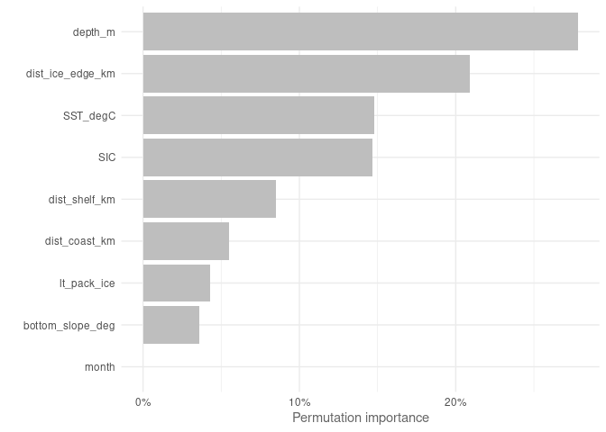
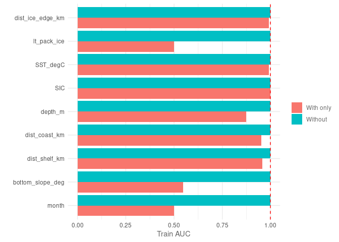
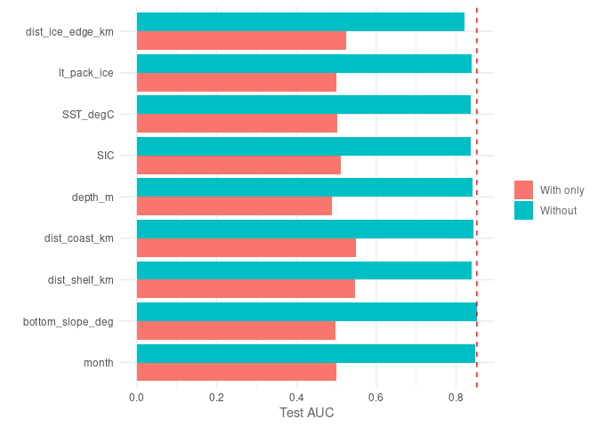
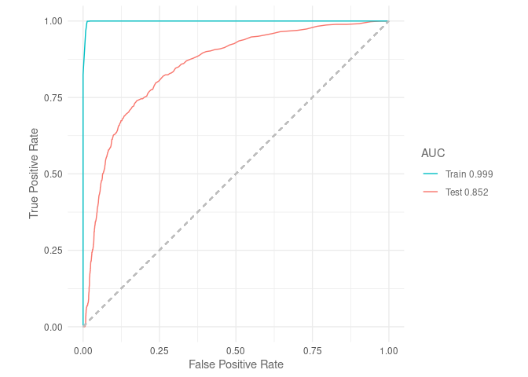
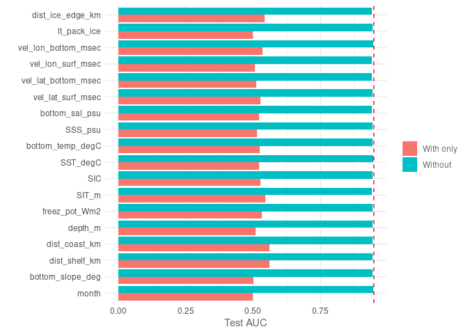
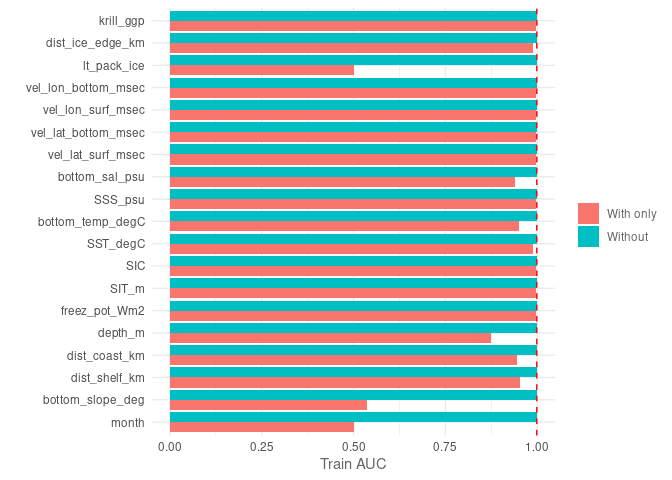
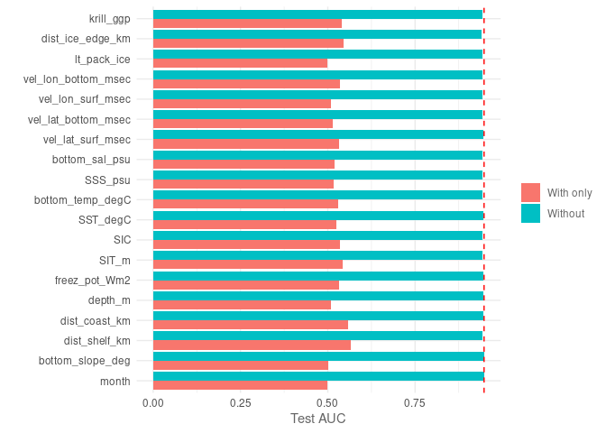
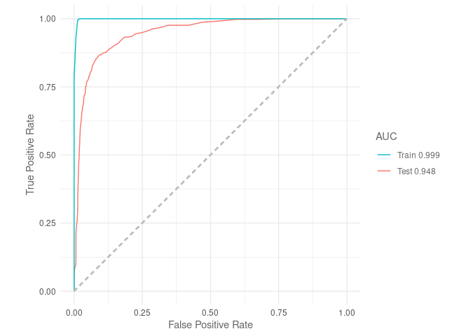
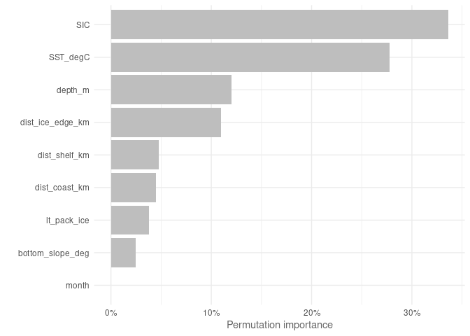
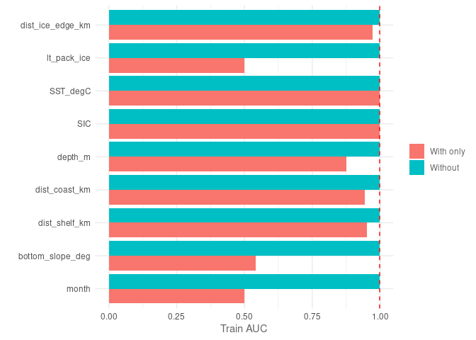

Random Forests
================
Denisse Fierro Arcos
2023-11-15

- <a href="#random-forests-via-sdmtune"
  id="toc-random-forests-via-sdmtune">Random Forests via
  <code>SDMtune</code></a>
  - <a href="#loading-libraries" id="toc-loading-libraries">Loading
    libraries</a>
  - <a href="#setting-up-notebook" id="toc-setting-up-notebook">Setting up
    notebook</a>
  - <a href="#loading-mean-environmental-conditions-from-access-om2-01"
    id="toc-loading-mean-environmental-conditions-from-access-om2-01">Loading
    mean environmental conditions from ACCESS-OM2-01</a>
  - <a href="#loading-layers-for-plotting"
    id="toc-loading-layers-for-plotting">Loading layers for plotting</a>
  - <a
    href="#loading-environmental-data-from-access-om2-01-and-setting-up-variables"
    id="toc-loading-environmental-data-from-access-om2-01-and-setting-up-variables">Loading
    environmental data from ACCESS-OM2-01 and setting up variables</a>
  - <a href="#environmental-variables-matching-observations"
    id="toc-environmental-variables-matching-observations">Environmental
    variables matching observations</a>
    - <a href="#splitting-data-into-testing-and-training"
      id="toc-splitting-data-into-testing-and-training">Splitting data into
      testing and training</a>
  - <a href="#modelling" id="toc-modelling">Modelling</a>
  - <a href="#variable-importance" id="toc-variable-importance">Variable
    importance</a>
  - <a href="#jacknife-test" id="toc-jacknife-test">Jacknife test</a>
    - <a href="#plotting-jacknife-results"
      id="toc-plotting-jacknife-results">Plotting Jacknife results</a>
  - <a href="#roc-curves" id="toc-roc-curves">ROC curves</a>
  - <a href="#tss" id="toc-tss">TSS</a>
  - <a href="#simplifying-model" id="toc-simplifying-model">Simplifying
    model</a>
  - <a href="#model-report" id="toc-model-report">Model report</a>
  - <a href="#performance-metrics" id="toc-performance-metrics">Performance
    metrics</a>
  - <a href="#predictions" id="toc-predictions">Predictions</a>
    - <a href="#plotting-predictions" id="toc-plotting-predictions">Plotting
      predictions</a>
  - <a href="#access-om2-01---all-variables"
    id="toc-access-om2-01---all-variables">ACCESS-OM2-01 - All variables</a>
  - <a href="#training-rf-full-suite-of-access-om2-01-variables"
    id="toc-training-rf-full-suite-of-access-om2-01-variables">Training RF
    (full suite of ACCESS-OM2-01 variables)</a>
  - <a href="#variable-importance-1" id="toc-variable-importance-1">Variable
    importance</a>
  - <a href="#jacknife-test-1" id="toc-jacknife-test-1">Jacknife test</a>
    - <a href="#plotting-jacknife-results-1"
      id="toc-plotting-jacknife-results-1">Plotting Jacknife results</a>
  - <a href="#roc-curves-1" id="toc-roc-curves-1">ROC curves</a>
  - <a href="#tss-1" id="toc-tss-1">TSS</a>
  - <a href="#simplifying-model-1" id="toc-simplifying-model-1">Simplifying
    model</a>
  - <a href="#model-report-1" id="toc-model-report-1">Model report</a>
  - <a href="#performance-metrics-1"
    id="toc-performance-metrics-1">Performance metrics</a>
  - <a href="#predictions-1" id="toc-predictions-1">Predictions</a>
    - <a href="#plotting-predictions-1"
      id="toc-plotting-predictions-1">Plotting predictions</a>
  - <a href="#observations-remotely-sensed-environmental-variables"
    id="toc-observations-remotely-sensed-environmental-variables">Observations
    (remotely sensed environmental variables)</a>
  - <a href="#training-rf-observations"
    id="toc-training-rf-observations">Training RF (observations)</a>
  - <a href="#variable-importance-2" id="toc-variable-importance-2">Variable
    importance</a>
  - <a href="#jacknife-test-2" id="toc-jacknife-test-2">Jacknife test</a>
    - <a href="#plotting-jacknife-results-2"
      id="toc-plotting-jacknife-results-2">Plotting Jacknife results</a>
  - <a href="#roc-curves-2" id="toc-roc-curves-2">ROC curves</a>
  - <a href="#tss-2" id="toc-tss-2">TSS</a>
  - <a href="#simplifying-model-2" id="toc-simplifying-model-2">Simplifying
    model</a>
  - <a href="#model-report-2" id="toc-model-report-2">Model report</a>
  - <a href="#performance-metrics-2"
    id="toc-performance-metrics-2">Performance metrics</a>
  - <a href="#predictions-2" id="toc-predictions-2">Predictions</a>
    - <a href="#plotting-predictions-2"
      id="toc-plotting-predictions-2">Plotting predictions</a>

# Random Forests via `SDMtune`

Random Forest (RF) is a modified version of bagged decision trees. It
builds multiple, de-correlated decision trees, then aggregates the
predictions across all trees. The aggregation of results leads to a
reduction of variance and overall improved predictive performance.
Random Forests tend to perform well even with little hyperparameter
tuning.

Due to their good predictive performance and relatively easy
implementation, RFs are widely used in a wide range of regression and
classification problems, including in species distribution. We will use
a modified version of Random Forests called *Balanced* or *Down-sampled*
Random Forests, which uses the same number of background and presence
points in each of the trees included in this model. This approach has
been shown to improve predictive performance of RFs trained on
“presence-background” data as we are doing here.

In this project, we will use Down-sampled Random Forests as one of the
model algorithms that form part of our Species Distribution Model
ensemble to estimate the distribution of crabeater seals in the recent
past in East Antarctica.

## Loading libraries

``` r
library(tidyverse)
library(SDMtune)
library(randomForest)
library(stars)
library(sf)
library(cmocean)
library(cowplot)
library(prg)
source("useful_functions.R")
```

## Setting up notebook

Selecting (or creating) an output folder for Random Forest results.

``` r
#Location of folder for outputs
out_folder <- "../../SDM_outputs/RandomForest/Mod_match_obs"
#If folder does not exist, create one
if(!dir.exists(out_folder)){
  dir.create(out_folder, recursive = T)
}

#Get path to files containing data
file_list <- list.files("../../Environmental_Data/", pattern = "Indian", full.names = T)
```

## Loading mean environmental conditions from ACCESS-OM2-01

This dataset includes the mean environmental conditions per month
(November and December) over the entire period of study (1981 to 2013).
Since random forest is not affected my multicollinearity, we will
include all variables available in the model.

``` r
mean_model <- read_csv("../../Environmental_Data/ACCESS-OM2-01/All_values_month_ACCESS-OM2-01_env_vars.csv") %>% 
  mutate(month = as.factor(month))
```

    ## Rows: 730244 Columns: 21
    ## ── Column specification ────────────────────────────────────────────────────────
    ## Delimiter: ","
    ## dbl (21): yt_ocean, xt_ocean, bottom_slope_deg, dist_shelf_km, dist_coast_km...
    ## 
    ## ℹ Use `spec()` to retrieve the full column specification for this data.
    ## ℹ Specify the column types or set `show_col_types = FALSE` to quiet this message.

``` r
#List of categorical variables
cat_vars <- "month"

mean_model_baked <- prep_pred(mean_model, cat_vars)
```

## Loading layers for plotting

We will extract this layer from the `rnaturalearth` package. We will
then reproject this layer to South Polar Stereographic (`EPSG 3976`).

``` r
#Loading layer
antarctica <- rnaturalearth::ne_countries(continent = "Antarctica",
                                          returnclass = "sf") %>% 
  #Transforming to South Polar Stereographic
  st_transform(3976)
```

## Loading environmental data from ACCESS-OM2-01 and setting up variables

We will use the datasets created in the notebook
`02_Merging_background_presence_data.Rmd` located within the
`Scripts/05_SDMs` folder. These datasets include the crabeater seal
observations, background points, and environmental data.

We will also define categorical and continuous explanatory variables.

## Environmental variables matching observations

Since multicollinearity is not an issue for Random Forest, we will
include all ACCESS-OM2-01 outputs that match the environmental variables
available in observational datasets.

The variable `month` will be included as an ordinal factor in our
analysis.

``` r
#Loading data
mod_match_obs <- read_csv(str_subset(file_list, "match")) %>% 
  #Setting month as factor and ordered factor
  mutate(month = as.factor(month))
```

    ## Rows: 32368 Columns: 13
    ## ── Column specification ────────────────────────────────────────────────────────
    ## Delimiter: ","
    ## dbl (13): year, month, xt_ocean, yt_ocean, presence, bottom_slope_deg, dist_...
    ## 
    ## ℹ Use `spec()` to retrieve the full column specification for this data.
    ## ℹ Specify the column types or set `show_col_types = FALSE` to quiet this message.

### Splitting data into testing and training

The `prep_data` function in the `useful_functions` script will be used
to split our data and to apply all necessary transformations. We will
then transform the data into SWD (“samples with data”) format, which is
the required format for inputs used in the `SDMtune` library.

``` r
#Getting training data
mod_match_obs <- prep_data(mod_match_obs, cat_vars, split = F)

#Applying SWD format to model data
model_data <- mod_match_obs %>% 
  select(!year) %>% 
  sdm_format() %>% 
  trainValTest(test = 0.25, only_presence = F, seed = 42)
```

## Modelling

Random Forest has three hyperparameters that can be adjusted to improve
model performance:  
1. `mtry`, which refers to the number of variables randomly sampled as
candidates at each split  
2. `ntree` is the number of trees that will be grown  
3. `nodesize` is the minimum size of the terminal nodes

To implement the *down-sampling* version of RFs, we will have to the set
the `sampsize` parameter when training RFs. Through `sampsize` we can
provide the amount of data available for presence and background data
and the model will sample the data in a stratified way. This means the
data sampled to create each tree will have a similar number of points
for presence and background of crabeaters.

Here, we use the `optimizeModel` function from the `SDMtune` library to
test various values combinations for these three hyperparameters. This
function will a list of models tested ranked by their performance, so we
will keep the first model returned.

``` r
#Calculating number of presences/absence included in training data
pr_bg <- model_data[[1]]@pa %>% 
  table()
sampsize <- c("0" = pr_bg[["0"]], "1" = pr_bg[["1"]])

#Train model
default_model <- train(method = "RF", data = model_data[[1]], sampsize = sampsize)

#Find number of predictors/features used
n_features <- ncol(model_data[[1]]@data)

# Define the hyperparameters to test
hyp_parm <- list(mtry = seq(2, n_features, 2),
                 #number of trees
                 ntree = seq(n_features*10, n_features*100, length.out = 10),
                 #minimum node size
                 nodesize = 1:5)

# Genetic algorithm that searches for best model parameters
optimised_model <- optimizeModel(default_model, hypers = hyp_parm, metric = "auc", 
                                 test = model_data[[2]], seed = 42)

#We will keep the best performing models based on AUC
best_mod_match_obs <- optimised_model@models[[1]]

#Save model
best_mod_match_obs %>% 
  saveRDS(file.path(out_folder, "best_RF_mod_match_obs.rds"))

#Check model parameters
best_mod_match_obs
```

    ## 

    ## ── Object of class: <SDMmodel> ──

    ## 

    ## Method: Random Forest

    ## 

    ## ── Hyperparameters

    ## • mtry: 2

    ## • ntree: 810

    ## • nodesize: 3

    ## 

    ## ── Info

    ## • Species: Crabeater seals

    ## • Presence locations: 1381

    ## • Absence locations: 22895

    ## 

    ## ── Variables

    ## • Continuous: "bottom_slope_deg", "dist_shelf_km", "dist_coast_km", "depth_m",
    ## "SIC", "SST_degC", "lt_pack_ice", and "dist_ice_edge_km"

    ## • Categorical: "month"

## Variable importance

``` r
#Calculating importance
var_imp_mod_match_obs <- varImp(best_mod_match_obs)
```

    ## Variable importance  ■■■■                              11% | ETA:  3m - 00:00:26Variable importance  ■■■■■■■■                          22% | ETA:  3m - 00:00:4…Variable importance  ■■■■■■■■■■■                       33% | ETA:  2m - 00:01:1…Variable importance  ■■■■■■■■■■■■■■                    44% | ETA:  2m - 00:01:3…Variable importance  ■■■■■■■■■■■■■■■■■■                56% | ETA:  2m - 00:01:5…Variable importance  ■■■■■■■■■■■■■■■■■■■■■             67% | ETA:  1m - 00:02:1…Variable importance  ■■■■■■■■■■■■■■■■■■■■■■■■          78% | ETA: 45s - 00:02:3…Variable importance  ■■■■■■■■■■■■■■■■■■■■■■■■■■■■      89% | ETA: 22s - 00:02:5…Variable importance  ■■■■■■■■■■■■■■■■■■■■■■■■■■■■■■■  100% | ETA:  0s - 00:03:2…

``` r
#Plotting results
plotVarImp(var_imp_mod_match_obs)
```

<!-- -->

Unlike MaxEnt, `SST` and `SIC` are not the most important variables
identified in the model. However, both MaxEnt and Random Forest coincide
that `month` is not a key variable. We can check model performance by
plotting ROC curves and TSS value.

## Jacknife test

We can check which environment variable contributes the most/least to
the Random Forest results when testing against the training and testing
datasets.

``` r
jk_mod_match_obs <- doJk(best_mod_match_obs, metric = "auc", test = model_data[[2]])
```

    ## Jk Test ■■■ 6% | ETA: 8m - 00:00:29.5

    ## Warning in randomForest.default(x = x, y = as.factor(p), mtry = mtry, ntree =
    ## ntree): invalid mtry: reset to within valid range

    ## Jk Test ■■■■ 11% | ETA: 5m - 00:00:35 Jk Test ■■■■■■ 17% | ETA: 5m - 00:01:1.3

    ## Warning in randomForest.default(x = x, y = as.factor(p), mtry = mtry, ntree =
    ## ntree): invalid mtry: reset to within valid range

    ## Jk Test ■■■■■■■■ 22% | ETA: 4m - 00:01:13.8Jk Test ■■■■■■■■■ 28% | ETA: 4m -
    ## 00:01:39

    ## Warning in randomForest.default(x = x, y = as.factor(p), mtry = mtry, ntree =
    ## ntree): invalid mtry: reset to within valid range

    ## Jk Test ■■■■■■■■■■■ 33% | ETA: 4m - 00:01:57.6Jk Test ■■■■■■■■■■■■■ 39% | ETA:
    ## 4m - 00:02:22.3

    ## Warning in randomForest.default(x = x, y = as.factor(p), mtry = mtry, ntree =
    ## ntree): invalid mtry: reset to within valid range

    ## Jk Test ■■■■■■■■■■■■■■ 44% | ETA: 3m - 00:02:41 Jk Test ■■■■■■■■■■■■■■■■ 50% |
    ## ETA: 3m - 00:03:11.8

    ## Warning in randomForest.default(x = x, y = as.factor(p), mtry = mtry, ntree =
    ## ntree): invalid mtry: reset to within valid range

    ## Jk Test ■■■■■■■■■■■■■■■■■■ 56% | ETA: 3m - 00:03:29 Jk Test ■■■■■■■■■■■■■■■■■■■
    ## 61% | ETA: 2m - 00:03:55.3

    ## Warning in randomForest.default(x = x, y = as.factor(p), mtry = mtry, ntree =
    ## ntree): invalid mtry: reset to within valid range

    ## Jk Test ■■■■■■■■■■■■■■■■■■■■■ 67% | ETA: 2m - 00:04:12.7Jk Test
    ## ■■■■■■■■■■■■■■■■■■■■■■■ 72% | ETA: 2m - 00:04:39

    ## Warning in randomForest.default(x = x, y = as.factor(p), mtry = mtry, ntree =
    ## ntree): invalid mtry: reset to within valid range

    ## Jk Test ■■■■■■■■■■■■■■■■■■■■■■■■ 78% | ETA: 1m - 00:04:56.9Jk Test
    ## ■■■■■■■■■■■■■■■■■■■■■■■■■■ 83% | ETA: 1m - 00:05:23.2

    ## Warning in randomForest.default(x = x, y = as.factor(p), mtry = mtry, ntree =
    ## ntree): invalid mtry: reset to within valid range

    ## Jk Test ■■■■■■■■■■■■■■■■■■■■■■■■■■■■ 89% | ETA: 42s - 00:05:32.3Jk Test
    ## ■■■■■■■■■■■■■■■■■■■■■■■■■■■■■ 94% | ETA: 21s - 00:05:58.7

    ## Warning in randomForest.default(x = x, y = as.factor(p), mtry = mtry, ntree =
    ## ntree): invalid mtry: reset to within valid range

    ## Jk Test  ■■■■■■■■■■■■■■■■■■■■■■■■■■■■■■■  100% | ETA:  0s - 00:06:15.5

``` r
jk_mod_match_obs
```

    ##           Variable Train_AUC_without Train_AUC_withonly Test_AUC_without
    ## 1            month         0.9990185          0.5000000        0.8478492
    ## 2 bottom_slope_deg         0.9989976          0.5474304        0.8525315
    ## 3    dist_shelf_km         0.9990145          0.9584386        0.8386347
    ## 4    dist_coast_km         0.9990171          0.9532627        0.8427636
    ## 5          depth_m         0.9990100          0.8725840        0.8423839
    ## 6              SIC         0.9990175          0.9983293        0.8368909
    ## 7         SST_degC         0.9990182          0.9902843        0.8360005
    ## 8      lt_pack_ice         0.9990199          0.5000000        0.8385578
    ## 9 dist_ice_edge_km         0.9990157          0.9905543        0.8209158
    ##   Test_AUC_withonly
    ## 1         0.5000000
    ## 2         0.4983852
    ## 3         0.5477834
    ## 4         0.5499584
    ## 5         0.4882725
    ## 6         0.5117690
    ## 7         0.5022040
    ## 8         0.5000000
    ## 9         0.5240731

### Plotting Jacknife results

Results calculated from training dataset.

``` r
plotJk(jk_mod_match_obs, type = "train", ref = auc(best_mod_match_obs))
```

<!-- -->

The `month`, long-term presence of pack ice (`lt_pack_ice`) and the
slope of the seafloor (`bottom_slope_deg`) are the three variables that
contribute the least when used by themselves, which coincides with
results from the variable importance. On the other hand, `SIC`, `SST`
and distance to the sea ice edge (`dist_ice_edge_km`) are the variables
that contribute the most of themselves. It appears that removing any of
variables included in the model will not negatively affect model
performance.

We can now check results from the testing dataset.

``` r
plotJk(jk_mod_match_obs, type = "test", ref = auc(best_mod_match_obs, test = model_data[[2]]))
```

<!-- -->

The `month` and the slope of the seafloor (`bottom_slope_deg`) continue
to be the two variable that contribute the least to the model. However,
the most important contributors when used by itself are distance to the
coastline (`dist_coast_km`) and to the continental shelf
(`dist_shelf_km`). Now the removal of distance to the sea ice edge
(`dist_ice_edge_km`) will result in the largest decline in model
performance.

## ROC curves

Based on AUC values, Random Forest performs better than the MaxEnt
model, which had an AUC value of 0.65.

``` r
plotROC(best_mod_match_obs, test = model_data[[2]])
```

    ## Warning: The following aesthetics were dropped during statistical transformation: m, d
    ## ℹ This can happen when ggplot fails to infer the correct grouping structure in
    ##   the data.
    ## ℹ Did you forget to specify a `group` aesthetic or to convert a numerical
    ##   variable into a factor?

<!-- -->

## TSS

This is a measure of predictive accuracy, which captures the proportion
of correctly classified cells as true absences (specificity) or true
presences (sensitivity). The TSS provides a normalised value of model
accuracy so that it can be compared to accuracy by chance alone.

TSS values between 0.4 and 0.7 indicate a good model performance. Below
this range, TSS indicates poor model performance, and above this range
are models with excellent performance.

``` r
tss(best_mod_match_obs)
```

    ## [1] 0.9855611

TSS is about three times higher than the one obtained in MaxEnt. This is
considered to be an excellent model.

## Simplifying model

We will now check if we can remove the variables that contributed the
least to the model (5% or less). The code below will remove one variable
at a time, train the model and recalculate AUC. A variable will only be
removed if it has no negative effect on predictive performance (using
AUC).

``` r
reduced_model <- reduceVar(best_mod_match_obs, metric = "auc", test = model_data[[2]],
                          th = 5, permut = 10, use_jk = T)

#Saving model
reduced_model %>% 
  saveRDS(file.path(out_folder, "reduced_RF_mod_match_obs.rds"))

reduced_model
```

    ## 

    ## ── Object of class: <SDMmodel> ──

    ## 

    ## Method: Random Forest

    ## 

    ## ── Hyperparameters

    ## • mtry: 2

    ## • ntree: 810

    ## • nodesize: 3

    ## 

    ## ── Info

    ## • Species: Crabeater seals

    ## • Presence locations: 1381

    ## • Absence locations: 22895

    ## 

    ## ── Variables

    ## • Continuous: "dist_shelf_km", "dist_coast_km", "depth_m", "SIC", "SST_degC",
    ## "lt_pack_ice", and "dist_ice_edge_km"

    ## • Categorical: "month"

We can remove the slope of the seafloor (`bottom_slope_deg`) without
compromising model performance. We will produce a final report for this
model and finally predict crabeater distribution.

## Model report

Before moving onto testing a new model, we will save a report with the
information shown above.

``` r
modelReport(reduced_model, folder = out_folder, test = model_data[[2]], 
            response_curves = T, only_presence = T, jk = T)
```

## Performance metrics

To be able to compare the performance of this model with the three other
SDM algorithms to be used in the SDM ensemble, we will calculate three
metrics: area under the receiver operating curve ($AUC_{ROC}$), area
under the precisison-recall gain curve ($AUC_{PRG}$) and the Pearson
correlation between the model predictions and the testing dataset.

``` r
#Predicting values using testing dataset
pred <- predict(reduced_model, model_data[[2]]@data, type = "response")

#AUC ROC
auc_roc <- auc(reduced_model, model_data[[2]])

#AUC PRG
auc_prg <- create_prg_curve(model_data[[2]]@pa, pred) %>% 
  calc_auprg()

#Pearson correlation
cor <- cor(pred, model_data[[2]]@pa)

print(c(paste0("AUC ROC: ", round(auc_roc, 3)),
        paste0("AUC PRG: ", round(auc_prg, 3)),
        paste0("Pearson correlation: ", round(cor, 3))))
```

    ## [1] "AUC ROC: 0.853"             "AUC PRG: 0.853"            
    ## [3] "Pearson correlation: 0.324"

Saving model evaluation results.

``` r
#Load model evaluation data frame and add results
model_eval_path <- "../../SDM_outputs/model_evaluation.csv"
read_csv(model_eval_path) %>% 
  bind_rows(data.frame(model = "RandomForest", env_trained = "mod_match_obs", auc_roc = auc_roc, 
                       auc_prg = auc_prg, pear_cor = cor)) %>% 
  write_csv(model_eval_path)
```

## Predictions

We will use the reduced model to predict crabeater seals distribution.

``` r
pred_mod_match_obs <- mean_model_baked %>% 
  drop_na() %>% 
  mutate(pred = as.vector(predict(reduced_model,
                                  data = drop_na(mean_model_baked),
                                  type = "response")))

pred_mod_match_obs_ras <- pred_mod_match_obs %>% 
  #Select relevant variables only
  select(xt_ocean, yt_ocean, pred, month) %>% 
  right_join(mean_model_baked %>%
  #Select relevant variables only
  select(xt_ocean, yt_ocean, month)) %>% 
  #Set dimensions
  st_as_stars(dims = c("xt_ocean", "yt_ocean", "month")) %>% 
  #Ensuring month dimension is shown correctly
  st_set_dimensions("month", values = c(11, 12)) %>%
  #Set CRS
  st_set_crs(4326) %>% 
  #Transform to South Pole stereographic
  st_transform(crs = st_crs(3976))
```

    ## Joining with `by = join_by(xt_ocean, yt_ocean, month)`

``` r
#Saving outputs
#Data frame
pred_mod_match_obs %>% 
  write_csv(file.path(out_folder, "mean_pred_match_obs.csv"))
#Saving as R dataset so it can be easily open with readRDS
saveRDS(pred_mod_match_obs_ras,
        file.path(out_folder, "mean_pred_match_obs_raster.rds"))
```

### Plotting predictions

``` r
#Plotting November distribution
#Prepping data
nov <- pred_mod_match_obs_ras %>% 
  slice(index = 1, along = "month") 

#Plotting
nov_plot <- ggplot()+
  geom_stars(data = nov)+
  geom_sf(data = antarctica)+
  lims(x = c(0, 4000000))+
  #Set colour palette
  scale_fill_cmocean(name = "haline", direction = -1, 
                     guide = guide_colorbar(barwidth = 1, barheight = 10, 
                                            ticks = FALSE, nbin = 1000, 
                                            frame.colour = "black"), 
                     limits = c(0, 1)) +
  theme_linedraw() +
  theme(panel.background = element_blank(),
        panel.grid.major = element_blank(),
        panel.grid.minor = element_blank(), 
        legend.position = "none",
        plot.title = element_text(hjust = 0.5)) +
  labs(title = "November",
       x = "Longitude",
       y = "Latitude")

dec <- pred_mod_match_obs_ras %>% 
  slice(index = 2, along = "month") 

dec_plot <- ggplot() +
  geom_stars(data = dec) +
  geom_sf(data = antarctica)+
  lims(x = c(0, 4000000))+
  scale_fill_cmocean(name = "haline", direction = -1, 
                     guide = guide_colorbar(barwidth = 1, barheight = 10, 
                                            ticks = FALSE, nbin = 1000, 
                                            frame.colour = "black"), 
                     limits = c(0, 1)) +
  theme_linedraw() +
  theme(panel.background = element_blank(),
        panel.grid.major = element_blank(),
        panel.grid.minor = element_blank(), 
        plot.title = element_text(hjust = 0.5)) +
  labs(title = "December",
       x = "Longitude",
       y = " ",
       fill = "Probability")

#Get legend
legend <- get_legend(dec_plot)

#Remove legend from December plot
dec_plot <- dec_plot + theme(legend.position = "none")

#Plotting together
plot_match_obs <- plot_grid(nov_plot, dec_plot, legend, ncol = 3, nrow = 1,
                            rel_widths = c(1, 1, 0.3))

#Add title
title <- ggdraw()+
  draw_label("Mean crabeater seal distribution\n(ACCESS-OM2-01 - simplified)",
             fontface = "bold", hjust = 0.5)+
  theme(plot.margin = ggplot2::margin(0, 0, 0, 0))

#Putting everything together
final <- plot_grid(title, plot_match_obs, ncol = 1, rel_heights = c(0.1, 1))

#Saving graph
ggsave(file.path(out_folder, "map_mean_pred_match_obs.png"), plot = final, 
       device = "png", bg = "white", width = 8.75, height = 7)
```

## ACCESS-OM2-01 - All variables

We will set up the output folder and load the ACCESS-OM2-01 data. Since
random forests are not affected by multicollinearity, we will use all
variables available.

``` r
#Location of folder for outputs
out_folder <- "../../SDM_outputs/RandomForest/Mod_full"
#If folder does not exist, create one
if(!dir.exists(out_folder)){
  dir.create(out_folder, recursive = T)
}

#Loading data
mod_data <- read_csv(str_subset(file_list, "model")) %>% 
  select(!krill_growth_rate) %>% 
  #Setting month as factor and ordered factor
  mutate(month = as.factor(month))
```

    ## Rows: 32368 Columns: 24
    ## ── Column specification ────────────────────────────────────────────────────────
    ## Delimiter: ","
    ## dbl (24): year, month, xt_ocean, yt_ocean, presence, bottom_slope_deg, dist_...
    ## 
    ## ℹ Use `spec()` to retrieve the full column specification for this data.
    ## ℹ Specify the column types or set `show_col_types = FALSE` to quiet this message.

``` r
# Splitting into testing and training
mod <- prep_data(mod_data, cat_vars, split = F)

#Applying SWD format to model data
model_data <- mod %>% 
  select(!year) %>% 
  drop_na(krill_ggp) %>% 
  sdm_format() %>% 
  trainValTest(test = 0.25, only_presence = T, seed = 42)
```

## Training RF (full suite of ACCESS-OM2-01 variables)

``` r
#Calculating number of presences/absence included in training data
pr_bg <- model_data[[1]]@pa %>% 
  table()
sampsize <- c("0" = pr_bg[["0"]], "1" = pr_bg[["1"]])

#Train model
default_model <- train(method = "RF", data = model_data[[1]], sampsize = sampsize)

#Find number of predictors/features used
n_features <- ncol(model_data[[1]]@data)

# Define the hyperparameters to test
hyp_parm <- list(mtry = seq(2, n_features, 2),
                 #number of trees
                 ntree = seq(n_features*10, n_features*100, length.out = 10),
                 #minimum node size
                 nodesize = 1:5)

# Genetic algorithm that searches for best model parameters
optimised_model <- optimizeModel(default_model, hypers = hyp_parm, metric = "auc", 
                                 test = model_data[[2]], seed = 42)

#We will keep the best performing models based on AUC
best_mod <- optimised_model@models[[1]]

#Save model
best_mod %>% 
  saveRDS(file.path(out_folder, "best_RF_ACCESS.rds"))

#Check model parameters
best_mod
```

    ## 

    ## ── Object of class: <SDMmodel> ──

    ## 

    ## Method: Random Forest

    ## 

    ## ── Hyperparameters

    ## • mtry: 4

    ## • ntree: 1330

    ## • nodesize: 2

    ## 

    ## ── Info

    ## • Species: Crabeater seals

    ## • Presence locations: 1381

    ## • Absence locations: 30525

    ## 

    ## ── Variables

    ## • Continuous: "bottom_slope_deg", "dist_shelf_km", "dist_coast_km", "depth_m",
    ## "freez_pot_Wm2", "SIT_m", "SIC", "SST_degC", "bottom_temp_degC", "SSS_psu",
    ## "bottom_sal_psu", "vel_lat_surf_msec", "vel_lat_bottom_msec",
    ## "vel_lon_surf_msec", "vel_lon_bottom_msec", "lt_pack_ice", "dist_ice_edge_km",
    ## and "krill_ggp"

    ## • Categorical: "month"

## Variable importance

``` r
#Calculating importance
var_imp_mod <- varImp(best_mod)
```

    ## Variable importance  ■■■                                5% | ETA: 13m - 00:00:4…Variable importance  ■■■■                              11% | ETA: 12m - 00:01:2…Variable importance  ■■■■■■                            16% | ETA: 11m - 00:02:5…Variable importance  ■■■■■■■                           21% | ETA: 10m - 00:02:4…Variable importance  ■■■■■■■■■                         26% | ETA: 10m - 00:03:2…Variable importance  ■■■■■■■■■■                        32% | ETA:  9m - 00:04:02Variable importance  ■■■■■■■■■■■■                      37% | ETA:  8m - 00:04:4…Variable importance  ■■■■■■■■■■■■■■                    42% | ETA:  8m - 00:05:4…Variable importance  ■■■■■■■■■■■■■■■                   47% | ETA:  7m - 00:06:2…Variable importance  ■■■■■■■■■■■■■■■■■                 53% | ETA:  6m - 00:06:5…Variable importance  ■■■■■■■■■■■■■■■■■■                58% | ETA:  6m - 00:07:3…Variable importance  ■■■■■■■■■■■■■■■■■■■■              63% | ETA:  5m - 00:08:3…Variable importance  ■■■■■■■■■■■■■■■■■■■■■■            68% | ETA:  4m - 00:09:3…Variable importance  ■■■■■■■■■■■■■■■■■■■■■■■           74% | ETA:  4m - 00:10:3…Variable importance  ■■■■■■■■■■■■■■■■■■■■■■■■■         79% | ETA:  3m - 00:11:1…Variable importance  ■■■■■■■■■■■■■■■■■■■■■■■■■■        84% | ETA:  2m - 00:11:5…Variable importance  ■■■■■■■■■■■■■■■■■■■■■■■■■■■■      89% | ETA:  1m - 00:12:27Variable importance  ■■■■■■■■■■■■■■■■■■■■■■■■■■■■■     95% | ETA: 43s - 00:13:2…Variable importance  ■■■■■■■■■■■■■■■■■■■■■■■■■■■■■■■  100% | ETA:  0s - 00:13:3…

``` r
#Plotting results
plotVarImp(var_imp_mod)
```

<!-- -->

Once again, neither `SST` nor `SIC` were the most important variables
identified in the model. However, two sea ice related variables were
among the top 4 most important variables: sea ice thickness (`SIT_m`)
and distance to the sea ice edge (`dist_ice_edge_km`). The other 15
variables included in the model contributed little (5% or less). Next,
we will check performance by plotting ROC curves and TSS value.

## Jacknife test

We can check which environment variable contributes the most/least to
the Random Forest results when testing against the training and testing
datasets.

``` r
jk_mod <- doJk(best_mod, metric = "auc", test = model_data[[2]])
```

    ## Jk Test ■■ 3% | ETA: 1h - 00:01:50

    ## Warning in randomForest.default(x = x, y = as.factor(p), mtry = mtry, ntree =
    ## ntree): invalid mtry: reset to within valid range

    ## Jk Test ■■■ 5% | ETA: 36m - 00:01:59.9Jk Test ■■■ 8% | ETA: 43m - 00:03:40.4

    ## Warning in randomForest.default(x = x, y = as.factor(p), mtry = mtry, ntree =
    ## ntree): invalid mtry: reset to within valid range

    ## Jk Test ■■■■ 11% | ETA: 35m - 00:04:7.5 Jk Test ■■■■■ 13% | ETA: 38m -
    ## 00:05:46.7

    ## Warning in randomForest.default(x = x, y = as.factor(p), mtry = mtry, ntree =
    ## ntree): invalid mtry: reset to within valid range

    ## Jk Test ■■■■■■ 16% | ETA: 34m - 00:06:22.2Jk Test ■■■■■■■ 18% | ETA: 36m -
    ## 00:08:2.5

    ## Warning in randomForest.default(x = x, y = as.factor(p), mtry = mtry, ntree =
    ## ntree): invalid mtry: reset to within valid range

    ## Jk Test ■■■■■■■ 21% | ETA: 32m - 00:08:38.1Jk Test ■■■■■■■■ 24% | ETA: 33m -
    ## 00:10:20.4

    ## Warning in randomForest.default(x = x, y = as.factor(p), mtry = mtry, ntree =
    ## ntree): invalid mtry: reset to within valid range

    ## Jk Test ■■■■■■■■■ 26% | ETA: 30m - 00:10:52.8Jk Test ■■■■■■■■■■ 29% | ETA: 31m
    ## - 00:12:43

    ## Warning in randomForest.default(x = x, y = as.factor(p), mtry = mtry, ntree =
    ## ntree): invalid mtry: reset to within valid range

    ## Jk Test ■■■■■■■■■■ 32% | ETA: 29m - 00:13:18.3Jk Test ■■■■■■■■■■■ 34% | ETA:
    ## 29m - 00:14:58.5

    ## Warning in randomForest.default(x = x, y = as.factor(p), mtry = mtry, ntree =
    ## ntree): invalid mtry: reset to within valid range

    ## Jk Test ■■■■■■■■■■■■ 37% | ETA: 27m - 00:15:48.5Jk Test ■■■■■■■■■■■■■ 39% |
    ## ETA: 27m - 00:17:30.9

    ## Warning in randomForest.default(x = x, y = as.factor(p), mtry = mtry, ntree =
    ## ntree): invalid mtry: reset to within valid range

    ## Jk Test ■■■■■■■■■■■■■■ 42% | ETA: 25m - 00:18:5.9 Jk Test ■■■■■■■■■■■■■■ 45% |
    ## ETA: 24m - 00:19:48

    ## Warning in randomForest.default(x = x, y = as.factor(p), mtry = mtry, ntree =
    ## ntree): invalid mtry: reset to within valid range

    ## Jk Test ■■■■■■■■■■■■■■■ 47% | ETA: 23m - 00:20:30.8Jk Test ■■■■■■■■■■■■■■■■ 50%
    ## | ETA: 22m - 00:22:8.1

    ## Warning in randomForest.default(x = x, y = as.factor(p), mtry = mtry, ntree =
    ## ntree): invalid mtry: reset to within valid range

    ## Jk Test ■■■■■■■■■■■■■■■■■ 53% | ETA: 20m - 00:22:45.4Jk Test ■■■■■■■■■■■■■■■■■■
    ## 55% | ETA: 20m - 00:24:28.1

    ## Warning in randomForest.default(x = x, y = as.factor(p), mtry = mtry, ntree =
    ## ntree): invalid mtry: reset to within valid range

    ## Jk Test ■■■■■■■■■■■■■■■■■■ 58% | ETA: 18m - 00:25:5.6 Jk Test
    ## ■■■■■■■■■■■■■■■■■■■ 61% | ETA: 17m - 00:26:46.5

    ## Warning in randomForest.default(x = x, y = as.factor(p), mtry = mtry, ntree =
    ## ntree): invalid mtry: reset to within valid range

    ## Jk Test ■■■■■■■■■■■■■■■■■■■■ 63% | ETA: 16m - 00:27:21.6Jk Test
    ## ■■■■■■■■■■■■■■■■■■■■■ 66% | ETA: 15m - 00:29:0.8

    ## Warning in randomForest.default(x = x, y = as.factor(p), mtry = mtry, ntree =
    ## ntree): invalid mtry: reset to within valid range

    ## Jk Test ■■■■■■■■■■■■■■■■■■■■■■ 68% | ETA: 14m - 00:29:40.6Jk Test
    ## ■■■■■■■■■■■■■■■■■■■■■■ 71% | ETA: 13m - 00:31:19.1

    ## Warning in randomForest.default(x = x, y = as.factor(p), mtry = mtry, ntree =
    ## ntree): invalid mtry: reset to within valid range

    ## Jk Test ■■■■■■■■■■■■■■■■■■■■■■■ 74% | ETA: 11m - 00:32:2.4 Jk Test
    ## ■■■■■■■■■■■■■■■■■■■■■■■■ 76% | ETA: 10m - 00:33:40.7

    ## Warning in randomForest.default(x = x, y = as.factor(p), mtry = mtry, ntree =
    ## ntree): invalid mtry: reset to within valid range

    ## Jk Test ■■■■■■■■■■■■■■■■■■■■■■■■■ 79% | ETA: 9m - 00:34:22.9Jk Test
    ## ■■■■■■■■■■■■■■■■■■■■■■■■■ 82% | ETA: 8m - 00:36:5.5

    ## Warning in randomForest.default(x = x, y = as.factor(p), mtry = mtry, ntree =
    ## ntree): invalid mtry: reset to within valid range

    ## Jk Test ■■■■■■■■■■■■■■■■■■■■■■■■■■ 84% | ETA: 7m - 00:36:45.5Jk Test
    ## ■■■■■■■■■■■■■■■■■■■■■■■■■■■ 87% | ETA: 6m - 00:38:25.1

    ## Warning in randomForest.default(x = x, y = as.factor(p), mtry = mtry, ntree =
    ## ntree): invalid mtry: reset to within valid range

    ## Jk Test ■■■■■■■■■■■■■■■■■■■■■■■■■■■■ 89% | ETA: 5m - 00:38:41.5Jk Test
    ## ■■■■■■■■■■■■■■■■■■■■■■■■■■■■■ 92% | ETA: 3m - 00:40:20.8

    ## Warning in randomForest.default(x = x, y = as.factor(p), mtry = mtry, ntree =
    ## ntree): invalid mtry: reset to within valid range

    ## Jk Test ■■■■■■■■■■■■■■■■■■■■■■■■■■■■■ 95% | ETA: 2m - 00:41:3.3 Jk Test
    ## ■■■■■■■■■■■■■■■■■■■■■■■■■■■■■■ 97% | ETA: 1m - 00:42:48.8

    ## Warning in randomForest.default(x = x, y = as.factor(p), mtry = mtry, ntree =
    ## ntree): invalid mtry: reset to within valid range

    ## Jk Test  ■■■■■■■■■■■■■■■■■■■■■■■■■■■■■■■  100% | ETA:  0s - 00:43:24.8

``` r
jk_mod
```

    ##               Variable Train_AUC_without Train_AUC_withonly Test_AUC_without
    ## 1                month         0.9987775          0.5000000        0.9469552
    ## 2     bottom_slope_deg         0.9987707          0.5375436        0.9470678
    ## 3        dist_shelf_km         0.9987782          0.9532936        0.9435989
    ## 4        dist_coast_km         0.9987787          0.9437007        0.9451447
    ## 5              depth_m         0.9987724          0.8752050        0.9443260
    ## 6        freez_pot_Wm2         0.9987768          0.9978742        0.9445795
    ## 7                SIT_m         0.9987819          0.9978070        0.9439400
    ## 8                  SIC         0.9987779          0.9977876        0.9428877
    ## 9             SST_degC         0.9987759          0.9889830        0.9457620
    ## 10    bottom_temp_degC         0.9987764          0.9492922        0.9435703
    ## 11             SSS_psu         0.9987815          0.9959911        0.9428657
    ## 12      bottom_sal_psu         0.9987756          0.9403016        0.9427032
    ## 13   vel_lat_surf_msec         0.9987719          0.9978680        0.9443594
    ## 14 vel_lat_bottom_msec         0.9987747          0.9979202        0.9431837
    ## 15   vel_lon_surf_msec         0.9987722          0.9977064        0.9435710
    ## 16 vel_lon_bottom_msec         0.9987719          0.9979366        0.9436544
    ## 17         lt_pack_ice         0.9987746          0.5000000        0.9439149
    ## 18    dist_ice_edge_km         0.9987754          0.9894720        0.9402027
    ## 19           krill_ggp         0.9987781          0.9976324        0.9440512
    ##    Test_AUC_withonly
    ## 1          0.5000000
    ## 2          0.5011335
    ## 3          0.5665813
    ## 4          0.5574182
    ## 5          0.5103407
    ## 6          0.5313385
    ## 7          0.5431887
    ## 8          0.5336172
    ## 9          0.5253843
    ## 10         0.5288916
    ## 11         0.5158736
    ## 12         0.5204415
    ## 13         0.5316776
    ## 14         0.5138436
    ## 15         0.5086967
    ## 16         0.5343607
    ## 17         0.5000000
    ## 18         0.5455576
    ## 19         0.5391691

### Plotting Jacknife results

Results calculated from training dataset.

``` r
plotJk(jk_mod, type = "train", ref = auc(best_mod))
```

<!-- -->

The `month`, long-term presence of pack ice (`lt_pack_ice`) and the
slope of the seafloor (`bottom_slope_deg`) are once again the three
variables that contribute the least when used on their own, which
coincides with results from the model trained with the reduced
environmental variables above. On the other hand, there are at least 10
variables that when used on its own greatly contribute to model
performance, including `SIC` and `SST`, which were identified as key
variables in previous models, and krill habitat (`krill_ggp`).

We can now check results from the testing dataset.

``` r
plotJk(jk_mod, type = "test", ref = auc(best_mod, test = model_data[[2]]))
```

<!-- -->

Results from the testing dataset show that most variables contribute to
model performance in a similar proportion. The `month`, long-term
presence of pack ice (`lt_pack_ice`) and the slope of the seafloor
(`bottom_slope_deg`) continue to be the variables that contribute the
least to the model. While the highest contributors are distance to the
coastline (`dist_coast_km`) and to the continental shelf
(`dist_shelf_km`). It appears that the exclusion of any of these
variables will not significantly impact model performance, so we will
test if it is possible to simplify the model.

## ROC curves

``` r
plotROC(best_mod, test = model_data[[2]])
```

    ## Warning: The following aesthetics were dropped during statistical transformation: m, d
    ## ℹ This can happen when ggplot fails to infer the correct grouping structure in
    ##   the data.
    ## ℹ Did you forget to specify a `group` aesthetic or to convert a numerical
    ##   variable into a factor?

<!-- -->

Once again, based on AUC values, Random Forest performs better than
MaxEnt, which had an AUC value of 0.72 (against testing dataset).

## TSS

This is a measure of predictive accuracy, which captures the proportion
of correctly classified cells as true absences (specificity) or true
presences (sensitivity). The TSS provides a normalised value of model
accuracy so that it can be compared to accuracy by chance alone.

TSS values between 0.4 and 0.7 indicate a good model performance. Below
this range, TSS indicates poor model performance, and above this range
are models with excellent performance.

``` r
tss(best_mod)
```

    ## [1] 0.9824203

TSS is more than double than the one obtained in MaxEnt (0.43). This
result suggests this model has an excellent performance.

## Simplifying model

We will now check if we can remove the variables that contributed the
least to the model (5% or less). The code below will remove one variable
at a time, train the model and recalculate AUC. A variable will only be
removed if it has no negative effect on predictive performance (using
AUC).

``` r
reduced_model <- reduceVar(best_mod, metric = "auc", test = model_data[[2]],
                          th = 5, permut = 10, use_jk = T)
```

    ## ✔ The variable dist_coast_km has been removed

``` r
reduced_model
```

    ## 

    ## ── Object of class: <SDMmodel> ──

    ## 

    ## Method: Random Forest

    ## 

    ## ── Hyperparameters

    ## • mtry: 4

    ## • ntree: 1330

    ## • nodesize: 2

    ## 

    ## ── Info

    ## • Species: Crabeater seals

    ## • Presence locations: 1381

    ## • Absence locations: 30525

    ## 

    ## ── Variables

    ## • Continuous: "bottom_slope_deg", "dist_shelf_km", "depth_m", "freez_pot_Wm2",
    ## "SIT_m", "SIC", "SST_degC", "bottom_temp_degC", "SSS_psu", "bottom_sal_psu",
    ## "vel_lat_surf_msec", "vel_lat_bottom_msec", "vel_lon_surf_msec",
    ## "vel_lon_bottom_msec", "lt_pack_ice", "dist_ice_edge_km", and "krill_ggp"

    ## • Categorical: "month"

No variables can be removed without compromising model performance. We
will produce a final report for the model and finally predict crabeater
distribution.

## Model report

Before moving onto testing a new model, we will save a report with the
information shown above.

``` r
modelReport(best_mod, folder = out_folder, test = model_data[[2]], 
            response_curves = T, only_presence = T, jk = T)
```

## Performance metrics

To be able to compare the performance of this model with the three other
SDM algorithms to be used in the SDM ensemble, we will calculate three
metrics: area under the receiver operating curve ($AUC_{ROC}$), area
under the precisison-recall gain curve ($AUC_{PRG}$) and the Pearson
correlation between the model predictions and the testing dataset.

``` r
#Predicting values using testing dataset
pred <- predict(best_mod, model_data[[2]]@data, type = "response")

#AUC ROC
auc_roc <- auc(best_mod, model_data[[2]])

#AUC PRG
auc_prg <- create_prg_curve(model_data[[2]]@pa, pred) %>% 
  calc_auprg()

#Pearson correlation
cor <- cor(pred, model_data[[2]]@pa)

print(c(paste0("AUC ROC: ", round(auc_roc, 3)),
        paste0("AUC PRG: ", round(auc_prg, 3)),
        paste0("Pearson correlation: ", round(cor, 3))))
```

    ## [1] "AUC ROC: 0.948"             "AUC PRG: 0.992"            
    ## [3] "Pearson correlation: 0.379"

Saving model evaluation results.

``` r
#Load model evaluation data frame and add results
read_csv(model_eval_path) %>% 
  bind_rows(data.frame(model = "RandomForest", env_trained = "full_access", auc_roc = auc_roc, 
                       auc_prg = auc_prg, pear_cor = cor)) %>% 
  write_csv(model_eval_path)
```

## Predictions

We will use the reduced model to predict crabeater seals distribution.

``` r
pred_mod <- mean_model_baked %>% 
  drop_na() %>% 
  mutate(pred = as.vector(predict(best_mod,
                                  data = drop_na(mean_model_baked),
                                  type = "response")))

pred_mod_ras <- pred_mod %>% 
  #Select relevant variables only
  select(xt_ocean, yt_ocean, pred, month) %>% 
  right_join(mean_model_baked %>%
  #Select relevant variables only
  select(xt_ocean, yt_ocean, month)) %>% 
  #Set dimensions
  st_as_stars(dims = c("xt_ocean", "yt_ocean", "month")) %>% 
  #Ensuring month dimension is shown correctly
  st_set_dimensions("month", values = c(11, 12)) %>%
  #Set CRS
  st_set_crs(4326) %>% 
  #Transform to South Pole stereographic
  st_transform(crs = st_crs(3976))
```

    ## Joining with `by = join_by(xt_ocean, yt_ocean, month)`

``` r
#Saving outputs
#Data frame
pred_mod %>% 
  write_csv(file.path(out_folder, "mean_pred_ACCESS.csv"))
#Saving as R dataset so it can be easily open with readRDS
saveRDS(pred_mod_ras,
        file.path(out_folder, "mean_pred_ACCESS_raster.rds"))
```

### Plotting predictions

``` r
#Plotting November distribution
#Prepping data
nov <- pred_mod_ras %>% 
  slice(index = 1, along = "month") 

#Plotting
nov_plot <- ggplot()+
  geom_stars(data = nov)+
  geom_sf(data = antarctica)+
  lims(x = c(0, 4000000))+
  #Set colour palette
  scale_fill_cmocean(name = "haline", direction = -1, 
                     guide = guide_colorbar(barwidth = 1, barheight = 10, 
                                            ticks = FALSE, nbin = 1000, 
                                            frame.colour = "black"), 
                     limits = c(0, 1)) +
  theme_linedraw() +
  theme(panel.background = element_blank(),
        panel.grid.major = element_blank(),
        panel.grid.minor = element_blank(), 
        legend.position = "none",
        plot.title = element_text(hjust = 0.5)) +
  labs(title = "November",
       x = "Longitude",
       y = "Latitude")

dec <- pred_mod_ras %>% 
  slice(index = 2, along = "month") 

dec_plot <- ggplot() +
  geom_stars(data = dec) +
  geom_sf(data = antarctica)+
  lims(x = c(0, 4000000))+
  scale_fill_cmocean(name = "haline", direction = -1, 
                     guide = guide_colorbar(barwidth = 1, barheight = 10, 
                                            ticks = FALSE, nbin = 1000, 
                                            frame.colour = "black"), 
                     limits = c(0, 1)) +
  theme_linedraw() +
  theme(panel.background = element_blank(),
        panel.grid.major = element_blank(),
        panel.grid.minor = element_blank(), 
        plot.title = element_text(hjust = 0.5)) +
  labs(title = "December",
       x = "Longitude",
       y = " ",
       fill = "Probability")

#Get legend
legend <- get_legend(dec_plot)

#Remove legend from December plot
dec_plot <- dec_plot + theme(legend.position = "none")

#Plotting together
plot_match_obs <- plot_grid(nov_plot, dec_plot, legend, ncol = 3, nrow = 1,
                            rel_widths = c(1, 1, 0.3))

#Add title
title <- ggdraw()+
  draw_label("Mean crabeater seal distribution\n(ACCESS-OM2-01)",
             fontface = "bold", hjust = 0.5)+
  theme(plot.margin = ggplot2::margin(0, 0, 0, 0))

#Putting everything together
final <- plot_grid(title, plot_match_obs, ncol = 1, rel_heights = c(0.1, 1))

#Saving graph
ggsave(file.path(out_folder, "map_mean_pred_ACCESS.png"), plot = final, 
       device = "png", bg = "white", width = 8.75, height = 7)
```

## Observations (remotely sensed environmental variables)

We will set up a new output folder and load the remotely sensed
environmental data. Since random forests are not affected by
multicollinearity, we will use all variables available.

``` r
#Location of folder for outputs
out_folder <- "../../SDM_outputs/RandomForest/Obs"
#If folder does not exist, create one
if(!dir.exists(out_folder)){
  dir.create(out_folder, recursive = T)
}

#Loading mean environmental conditions from observations
mean_obs <- read_csv("../../Environmental_Data/Env_obs/All_values_month_Obs_env_vars.csv") %>% 
  mutate(month = as.factor(month))
```

    ## Rows: 730244 Columns: 11
    ## ── Column specification ────────────────────────────────────────────────────────
    ## Delimiter: ","
    ## dbl (11): yt_ocean, xt_ocean, bottom_slope_deg, dist_shelf_km, dist_coast_km...
    ## 
    ## ℹ Use `spec()` to retrieve the full column specification for this data.
    ## ℹ Specify the column types or set `show_col_types = FALSE` to quiet this message.

``` r
#Preparing data to be used for prediction
mean_obs_baked <- prep_pred(mean_obs, "month")

#Loading data
obs_data <- read_csv(str_subset(file_list, "/obs")) %>% 
  #Setting month as factor and ordered factor
  mutate(month = as.factor(month))
```

    ## Rows: 32033 Columns: 13
    ## ── Column specification ────────────────────────────────────────────────────────
    ## Delimiter: ","
    ## dbl (13): year, month, xt_ocean, yt_ocean, presence, bottom_slope_deg, dist_...
    ## 
    ## ℹ Use `spec()` to retrieve the full column specification for this data.
    ## ℹ Specify the column types or set `show_col_types = FALSE` to quiet this message.

``` r
# Splitting into testing and training
obs_data <- prep_data(obs_data, cat_vars, split = F)

#Applying SWD format to model data
model_data <- obs_data %>% 
  select(!year) %>% 
  sdm_format() %>% 
  trainValTest(test = 0.25, only_presence = T, seed = 42)
```

## Training RF (observations)

``` r
#Calculating number of presences/absence included in training data
pr_bg <- model_data[[1]]@pa %>% 
  table()
sampsize <- c("0" = pr_bg[["0"]], "1" = pr_bg[["1"]])

#Train model
default_model <- train(method = "RF", data = model_data[[1]], sampsize = sampsize)

#Find number of predictors/features used
n_features <- ncol(model_data[[1]]@data)

# Define the hyperparameters to test
hyp_parm <- list(mtry = seq(2, n_features, 2),
                 #number of trees
                 ntree = seq(n_features*10, n_features*100, length.out = 10),
                 #minimum node size
                 nodesize = 1:5)

# Genetic algorithm that searches for best model parameters
optimised_model <- optimizeModel(default_model, hypers = hyp_parm, metric = "auc", 
                                 test = model_data[[2]], seed = 42)

#We will keep the best performing models based on AUC
best_obs <- optimised_model@models[[1]]

#Save model
best_obs %>% 
  saveRDS(file.path(out_folder, "best_RF_obs.rds"))

#Check model parameters
best_obs
```

    ## 

    ## ── Object of class: <SDMmodel> ──

    ## 

    ## Method: Random Forest

    ## 

    ## ── Hyperparameters

    ## • mtry: 2

    ## • ntree: 810

    ## • nodesize: 1

    ## 

    ## ── Info

    ## • Species: Crabeater seals

    ## • Presence locations: 1380

    ## • Absence locations: 30193

    ## 

    ## ── Variables

    ## • Continuous: "bottom_slope_deg", "dist_shelf_km", "dist_coast_km", "depth_m",
    ## "SIC", "SST_degC", "lt_pack_ice", and "dist_ice_edge_km"

    ## • Categorical: "month"

## Variable importance

``` r
#Calculating importance
var_imp_obs <- varImp(best_obs)
```

    ## Variable importance  ■■■■                              11% | ETA:  3m - 00:00:2…Variable importance  ■■■■■■■■                          22% | ETA:  3m - 00:00:4…Variable importance  ■■■■■■■■■■■                       33% | ETA:  2m - 00:01:5…Variable importance  ■■■■■■■■■■■■■■                    44% | ETA:  2m - 00:01:4…Variable importance  ■■■■■■■■■■■■■■■■■■                56% | ETA:  2m - 00:02:1…Variable importance  ■■■■■■■■■■■■■■■■■■■■■             67% | ETA:  1m - 00:02:5…Variable importance  ■■■■■■■■■■■■■■■■■■■■■■■■          78% | ETA:  1m - 00:03:4…Variable importance  ■■■■■■■■■■■■■■■■■■■■■■■■■■■■      89% | ETA: 34s - 00:04:3…Variable importance  ■■■■■■■■■■■■■■■■■■■■■■■■■■■■■■■  100% | ETA:  0s - 00:05:1…

``` r
#Plotting results
plotVarImp(var_imp_obs)
```

<!-- -->

In contrast to model trained RF models, `SST` and `SIC` were the two
most important variables identified in the model. This is similar to
other models in the ensemble, including GAMs and MaxEnt. `month` once
again has been identified as the least importance, followed by 4 other
variables which contributed 5% or less to model performance. Next, we
will check performance by plotting ROC curves and TSS value.

## Jacknife test

We can check which environment variable contributes the most/least to
the Random Forest results when testing against the training and testing
datasets.

``` r
jk_obs <- doJk(best_obs, metric = "auc", test = model_data[[2]])
```

    ## Jk Test ■■■ 6% | ETA: 8m - 00:00:29.3

    ## Warning in randomForest.default(x = x, y = as.factor(p), mtry = mtry, ntree =
    ## ntree): invalid mtry: reset to within valid range

    ## Jk Test ■■■■ 11% | ETA: 5m - 00:00:33.9Jk Test ■■■■■■ 17% | ETA: 5m - 00:01:0.7

    ## Warning in randomForest.default(x = x, y = as.factor(p), mtry = mtry, ntree =
    ## ntree): invalid mtry: reset to within valid range

    ## Jk Test ■■■■■■■■ 22% | ETA: 4m - 00:01:15 Jk Test ■■■■■■■■■ 28% | ETA: 4m -
    ## 00:01:42.4

    ## Warning in randomForest.default(x = x, y = as.factor(p), mtry = mtry, ntree =
    ## ntree): invalid mtry: reset to within valid range

    ## Jk Test ■■■■■■■■■■■ 33% | ETA: 4m - 00:02:1.5 Jk Test ■■■■■■■■■■■■■ 39% | ETA:
    ## 4m - 00:02:28.4

    ## Warning in randomForest.default(x = x, y = as.factor(p), mtry = mtry, ntree =
    ## ntree): invalid mtry: reset to within valid range

    ## Jk Test ■■■■■■■■■■■■■■ 44% | ETA: 4m - 00:02:48.8Jk Test ■■■■■■■■■■■■■■■■ 50% |
    ## ETA: 3m - 00:03:15.8

    ## Warning in randomForest.default(x = x, y = as.factor(p), mtry = mtry, ntree =
    ## ntree): invalid mtry: reset to within valid range

    ## Jk Test ■■■■■■■■■■■■■■■■■■ 56% | ETA: 3m - 00:03:34.5Jk Test
    ## ■■■■■■■■■■■■■■■■■■■ 61% | ETA: 3m - 00:04:1.9

    ## Warning in randomForest.default(x = x, y = as.factor(p), mtry = mtry, ntree =
    ## ntree): invalid mtry: reset to within valid range

    ## Jk Test ■■■■■■■■■■■■■■■■■■■■■ 67% | ETA: 2m - 00:04:21.8Jk Test
    ## ■■■■■■■■■■■■■■■■■■■■■■■ 72% | ETA: 2m - 00:04:48.1

    ## Warning in randomForest.default(x = x, y = as.factor(p), mtry = mtry, ntree =
    ## ntree): invalid mtry: reset to within valid range

    ## Jk Test ■■■■■■■■■■■■■■■■■■■■■■■■ 78% | ETA: 1m - 00:05:8.2 Jk Test
    ## ■■■■■■■■■■■■■■■■■■■■■■■■■■ 83% | ETA: 1m - 00:05:51.8

    ## Warning in randomForest.default(x = x, y = as.factor(p), mtry = mtry, ntree =
    ## ntree): invalid mtry: reset to within valid range

    ## Jk Test ■■■■■■■■■■■■■■■■■■■■■■■■■■■■ 89% | ETA: 46s - 00:06:6.3 Jk Test
    ## ■■■■■■■■■■■■■■■■■■■■■■■■■■■■■ 94% | ETA: 25s - 00:07:03

    ## Warning in randomForest.default(x = x, y = as.factor(p), mtry = mtry, ntree =
    ## ntree): invalid mtry: reset to within valid range

    ## Jk Test  ■■■■■■■■■■■■■■■■■■■■■■■■■■■■■■■  100% | ETA:  0s - 00:07:42.1

``` r
jk_obs
```

    ##           Variable Train_AUC_without Train_AUC_withonly Test_AUC_without
    ## 1            month         0.9986748          0.5000000        0.9125830
    ## 2 bottom_slope_deg         0.9986500          0.5408802        0.9066269
    ## 3    dist_shelf_km         0.9986719          0.9509427        0.9117877
    ## 4    dist_coast_km         0.9986778          0.9446894        0.9112974
    ## 5          depth_m         0.9986674          0.8766567        0.9079535
    ## 6              SIC         0.9986575          0.9975593        0.9065074
    ## 7         SST_degC         0.9986665          0.9976987        0.9070217
    ## 8      lt_pack_ice         0.9986708          0.5000000        0.9096355
    ## 9 dist_ice_edge_km         0.9986742          0.9726710        0.9101561
    ##   Test_AUC_withonly
    ## 1         0.5000000
    ## 2         0.4953338
    ## 3         0.5693571
    ## 4         0.5639985
    ## 5         0.5239067
    ## 6         0.5312183
    ## 7         0.5198367
    ## 8         0.5000000
    ## 9         0.5814331

### Plotting Jacknife results

Results calculated from training dataset.

``` r
plotJk(jk_obs, type = "train", ref = auc(best_obs))
```

<!-- -->

The `month`, long-term presence of pack ice (`lt_pack_ice`) and the
slope of the seafloor (`bottom_slope_deg`) are once again the three
variables that contribute the least when used on their own, which
coincides with results from the model trained with the reduced
environmental variables above. On the other hand, there are a about 10
variables that when used on its own greatly contribute to model
performance, including `SIC` and `SST`, which were identified as key
variables in previous models.

We can now check results from the testing dataset.

``` r
plotJk(jk_obs, type = "test", ref = auc(best_obs, test = model_data[[2]]))
```

<!-- -->

Results from the testing dataset show that most variables contribute to
model performance in a similar proportion. The `month`, long-term
presence of pack ice (`lt_pack_ice`) and the slope of the seafloor
(`bottom_slope_deg`) continue to be the variables that contribute the
least to the model. While the highest contributors are distance to the
coastline (`dist_coast_km`), to the sea ice edge (`dist_ice_edge_km`)
and to the continental shelf (`dist_shelf_km`). It appears that the
exclusion of any of these variables will have very little impact model
performance, so we will test if it is possible to simplify the model.

## ROC curves

``` r
plotROC(best_obs, test = model_data[[2]])
```

    ## Warning: The following aesthetics were dropped during statistical transformation: m, d
    ## ℹ This can happen when ggplot fails to infer the correct grouping structure in
    ##   the data.
    ## ℹ Did you forget to specify a `group` aesthetic or to convert a numerical
    ##   variable into a factor?

<!-- -->

Once again, based on AUC values, Random Forest performs better than
MaxEnt, which had an AUC value of 0.67.

## TSS

This is a measure of predictive accuracy, which captures the proportion
of correctly classified cells as true absences (specificity) or true
presences (sensitivity). The TSS provides a normalised value of model
accuracy so that it can be compared to accuracy by chance alone.

TSS values between 0.4 and 0.7 indicate a good model performance. Below
this range, TSS indicates poor model performance, and above this range
are models with excellent performance.

``` r
tss(best_obs)
```

    ## [1] 0.9815189

TSS is more than double than the one obtained in MaxEnt (0.42). This
result suggests this model has an excellent performance.

## Simplifying model

We will now check if we can remove the variables that contributed the
least to the model (5% or less). The code below will remove one variable
at a time, train the model and recalculate AUC. A variable will only be
removed if it has no negative effect on predictive performance (using
AUC).

``` r
reduced_model <- reduceVar(best_obs, metric = "auc", test = model_data[[2]],
                          th = 5, permut = 10, use_jk = T)
```

    ## ✔ No variables  have been removed

``` r
reduced_model
```

    ## 

    ## ── Object of class: <SDMmodel> ──

    ## 

    ## Method: Random Forest

    ## 

    ## ── Hyperparameters

    ## • mtry: 2

    ## • ntree: 810

    ## • nodesize: 1

    ## 

    ## ── Info

    ## • Species: Crabeater seals

    ## • Presence locations: 1380

    ## • Absence locations: 30193

    ## 

    ## ── Variables

    ## • Continuous: "bottom_slope_deg", "dist_shelf_km", "dist_coast_km", "depth_m",
    ## "SIC", "SST_degC", "lt_pack_ice", and "dist_ice_edge_km"

    ## • Categorical: "month"

No variables can be removed without compromising model performance. We
will produce a final report for the model and finally predict crabeater
distribution.

## Model report

Before moving onto testing a new model, we will save a report with the
information shown above.

``` r
modelReport(best_obs, folder = out_folder, test = model_data[[2]], 
            response_curves = T, only_presence = T, jk = T)
```

## Performance metrics

To be able to compare the performance of this model with the three other
SDM algorithms to be used in the SDM ensemble, we will calculate three
metrics: area under the receiver operating curve ($AUC_{ROC}$), area
under the precisison-recall gain curve ($AUC_{PRG}$) and the Pearson
correlation between the model predictions and the testing dataset.

``` r
#Predicting values using testing dataset
pred <- predict(best_obs, model_data[[2]]@data, type = "response")

#AUC ROC
auc_roc <- auc(best_obs, model_data[[2]])

#AUC PRG
auc_prg <- create_prg_curve(model_data[[2]]@pa, pred) %>% 
  calc_auprg()

#Pearson correlation
cor <- cor(pred, model_data[[2]]@pa)

print(c(paste0("AUC ROC: ", round(auc_roc, 3)),
        paste0("AUC PRG: ", round(auc_prg, 3)),
        paste0("Pearson correlation: ", round(cor, 3))))
```

    ## [1] "AUC ROC: 0.918"             "AUC PRG: 0.972"            
    ## [3] "Pearson correlation: 0.317"

Saving model evaluation results.

``` r
#Load model evaluation data frame and add results
read_csv(model_eval_path) %>% 
  bind_rows(data.frame(model = "RandomForest", env_trained = "observations", auc_roc = auc_roc, 
                       auc_prg = auc_prg, pear_cor = cor)) %>% 
  write_csv(model_eval_path)
```

## Predictions

We will use the reduced model to predict crabeater seals distribution.

``` r
pred_obs <- mean_obs_baked %>% 
  drop_na() %>% 
  mutate(pred = as.vector(predict(best_obs,
                                  data = drop_na(mean_obs_baked),
                                  type = "response")))

pred_obs_ras <- pred_obs %>% 
  #Select relevant variables only
  select(xt_ocean, yt_ocean, pred, month) %>% 
  right_join(mean_obs_baked %>%
  #Select relevant variables only
  select(xt_ocean, yt_ocean, month)) %>% 
  #Set dimensions
  st_as_stars(dims = c("xt_ocean", "yt_ocean", "month")) %>% 
  #Ensuring month dimension is shown correctly
  st_set_dimensions("month", values = c(11, 12)) %>%
  #Set CRS
  st_set_crs(4326) %>% 
  #Transform to South Pole stereographic
  st_transform(crs = st_crs(3976))
```

    ## Joining with `by = join_by(xt_ocean, yt_ocean, month)`

``` r
#Saving outputs
#Data frame
pred_obs %>% 
  write_csv(file.path(out_folder, "mean_pred_obs.csv"))
#Saving as R dataset so it can be easily open with readRDS
saveRDS(pred_obs_ras,
        file.path(out_folder, "mean_pred_obs_raster.rds"))
```

### Plotting predictions

``` r
#Plotting November distribution
#Prepping data
nov <- pred_obs_ras %>% 
  slice(index = 1, along = "month") 

#Plotting
nov_plot <- ggplot()+
  geom_stars(data = nov)+
  geom_sf(data = antarctica)+
  lims(x = c(0, 4000000))+
  #Set colour palette
  scale_fill_cmocean(name = "haline", direction = -1, 
                     guide = guide_colorbar(barwidth = 1, barheight = 10, 
                                            ticks = FALSE, nbin = 1000, 
                                            frame.colour = "black"), 
                     limits = c(0, 1)) +
  theme_linedraw() +
  theme(panel.background = element_blank(),
        panel.grid.major = element_blank(),
        panel.grid.minor = element_blank(), 
        legend.position = "none",
        plot.title = element_text(hjust = 0.5)) +
  labs(title = "November",
       x = "Longitude",
       y = "Latitude")

dec <- pred_obs_ras %>% 
  slice(index = 2, along = "month") 

dec_plot <- ggplot() +
  geom_stars(data = dec) +
  geom_sf(data = antarctica)+
  lims(x = c(0, 4000000))+
  scale_fill_cmocean(name = "haline", direction = -1, 
                     guide = guide_colorbar(barwidth = 1, barheight = 10, 
                                            ticks = FALSE, nbin = 1000, 
                                            frame.colour = "black"), 
                     limits = c(0, 1)) +
  theme_linedraw() +
  theme(panel.background = element_blank(),
        panel.grid.major = element_blank(),
        panel.grid.minor = element_blank(), 
        plot.title = element_text(hjust = 0.5)) +
  labs(title = "December",
       x = "Longitude",
       y = " ",
       fill = "Probability")

#Get legend
legend <- get_legend(dec_plot)

#Remove legend from December plot
dec_plot <- dec_plot + theme(legend.position = "none")

#Plotting together
plot_match_obs <- plot_grid(nov_plot, dec_plot, legend, ncol = 3, nrow = 1,
                            rel_widths = c(1, 1, 0.3))

#Add title
title <- ggdraw()+
  draw_label("Mean crabeater seal distribution\n(observations)",
             fontface = "bold", hjust = 0.5)+
  theme(plot.margin = ggplot2::margin(0, 0, 0, 0))

#Putting everything together
final <- plot_grid(title, plot_match_obs, ncol = 1, rel_heights = c(0.1, 1))

#Saving graph
ggsave(file.path(out_folder, "map_mean_pred_obs.png"), plot = final, 
       device = "png", bg = "white", width = 8.75, height = 7)
```
