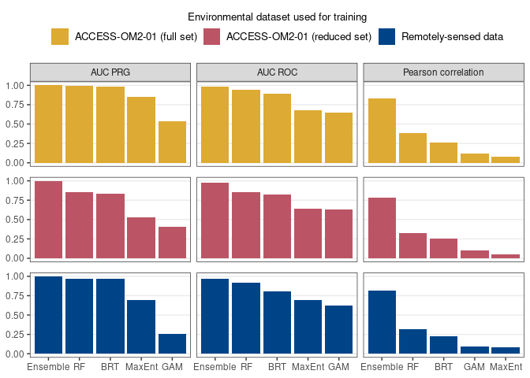

Optimising weights for ensemble mean
================
Denisse Fierro Arcos
2023-12-14

- <a href="#finding-optimal-weighting-for-ensemble-mean"
  id="toc-finding-optimal-weighting-for-ensemble-mean">Finding optimal
  weighting for ensemble mean</a>
  - <a href="#loading-libraries" id="toc-loading-libraries">Loading
    libraries</a>
  - <a href="#loading-model-evaluation-metrics"
    id="toc-loading-model-evaluation-metrics">Loading model evaluation
    metrics</a>
    - <a href="#plotting-model-performance-metrics"
      id="toc-plotting-model-performance-metrics">Plotting model performance
      metrics</a>
  - <a href="#loading-testing-data" id="toc-loading-testing-data">Loading
    testing data</a>
  - <a
    href="#loading-models-and-predicting-presence-access-om2-01-matching-observations"
    id="toc-loading-models-and-predicting-presence-access-om2-01-matching-observations">Loading
    models and predicting presence (ACCESS-OM2-01 matching observations)</a>
  - <a href="#normalising-weights" id="toc-normalising-weights">Normalising
    weights</a>
  - <a href="#calculating-ensemble-mean-and-weighted-ensemble-mean"
    id="toc-calculating-ensemble-mean-and-weighted-ensemble-mean">Calculating
    ensemble mean and weighted ensemble mean</a>
  - <a href="#saving-weights" id="toc-saving-weights">Saving weights</a>
  - <a href="#loading-models-and-predicting-presence-access-om2-01-full-set"
    id="toc-loading-models-and-predicting-presence-access-om2-01-full-set">Loading
    models and predicting presence (ACCESS-OM2-01 full set)</a>
    - <a href="#weights" id="toc-weights">Weights</a>
    - <a href="#predictions" id="toc-predictions">Predictions</a>
  - <a href="#loading-models-and-predicting-presence-observations"
    id="toc-loading-models-and-predicting-presence-observations">Loading
    models and predicting presence (Observations)</a>
    - <a href="#weights-1" id="toc-weights-1">Weights</a>
    - <a href="#predictions-1" id="toc-predictions-1">Predictions</a>

# Finding optimal weighting for ensemble mean

We calculated three model performance metric for each of the four models
to be included in the final ensemble mean. These metrics include: the
area under the the receiver operating curve (AUC ROC), the area under
the precision-recall gain curve (AUC PRG) and the Pearson correlation
between the model predictions and the testing dataset. AUC values give
an indication of how good the model is at discriminating presences and
absences, while the correlation gives us information about the agreement
between the observations and the model predictions.

Not all SDM algorithms performed equally well, with BRTs and RFs
outperforming GAMs and Maxent in all metrics. Therefore, the
contribution of each algorithm towards the mean distribution estimates
should be weighted by the model performance. In this notebook, we will
find the weighting scheme that produces the an ensemble mean that more
closely resembles observations (i.e., the weighted ensemble mean should
result in the smallest Root Mean Square Error or RMSE).

## Loading libraries

``` r
library(tidyverse)
library(tidytext)
library(mgcv)
library(SDMtune)
library(randomForest)
library(gbm)
library(prg)
library(pROC)
source("useful_functions.R")
```

``` r
knitr::opts_chunk$set(fig.path = "figures/") 
```

## Loading model evaluation metrics

These metrics were calculated for each SDM algorithm and compiled into a
single file.

``` r
mod_eval_path <- "../../SDM_outputs/model_evaluation.csv"
model_eval <- read_csv(mod_eval_path) 
```

    ## Rows: 12 Columns: 7
    ## ── Column specification ────────────────────────────────────────────────────────
    ## Delimiter: ","
    ## chr (2): model, env_trained
    ## dbl (5): auc_roc, auc_prg, pear_cor, pear_norm_weights, maxSSS
    ## 
    ## ℹ Use `spec()` to retrieve the full column specification for this data.
    ## ℹ Specify the column types or set `show_col_types = FALSE` to quiet this message.

``` r
#Check data
model_eval
```

    ## # A tibble: 12 × 7
    ##    model          env_trained auc_roc auc_prg pear_cor pear_norm_weights  maxSSS
    ##    <chr>          <chr>         <dbl>   <dbl>    <dbl>             <dbl>   <dbl>
    ##  1 GAM            mod_match_…   0.633   0.403   0.104             0.0968  0.523 
    ##  2 GAM            full_access   0.648   0.533   0.119             0.0782  0.528 
    ##  3 GAM            observatio…   0.625   0.261   0.0977            0.0469  0.479 
    ##  4 Maxent         mod_match_…   0.642   0.531   0.0529            0      NA     
    ##  5 Maxent         full_access   0.683   0.849   0.0784            0      NA     
    ##  6 Maxent         observatio…   0.693   0.696   0.0789            0      NA     
    ##  7 RandomForest   mod_match_…   0.853   0.853   0.324             0.516   0.120 
    ##  8 RandomForest   full_access   0.948   0.992   0.379             0.574   0.0496
    ##  9 RandomForest   observatio…   0.918   0.972   0.317             0.595   0.0432
    ## 10 BoostedRegres… mod_match_…   0.819   0.833   0.257             0.388   0.0805
    ## 11 BoostedRegres… full_access   0.891   0.979   0.260             0.347   0.0940
    ## 12 BoostedRegres… observatio…   0.809   0.971   0.222             0.358   0.0505

### Plotting model performance metrics

Before attempting to find the best weighting scheme, we will visualise
the data.

``` r
model_eval %>% 
  #Rearrange data to facilitate plotting
  pivot_longer(c(auc_roc:pear_cor), names_to = "metric", 
               values_to = "value") %>% 
  #Renaming models to ensure figure labels show correctly
  mutate(model = case_when(str_detect(model, "Random") ~ "RF",
                           str_detect(model, "Trees") ~ "BRT", 
                           T ~ model),
         #Turning column to factor
         model = factor(model),
         #Renaming metrics to ensure figure labels show correctly
         metric = case_when(str_detect(metric, "auc") ~ 
                              str_to_upper(str_replace(metric, "_", " ")),
                            T ~ "Pearson correlation")) %>%
  #Plot metrics as columns
  ggplot(aes(x = reorder_within(model, desc(value), metric),
             y = value))+
  geom_col(position = "dodge", aes(fill = env_trained))+
  scale_x_reordered()+
  #Divide plots by SDM algorithms and source of environmental data used for 
  #training model
  facet_grid(env_trained~metric, scales = "free_x")+
  theme_bw()+
  scale_fill_manual(values = c("#eecc66", "#6699cc", "#004488"),
                    labels = c("ACCESS-OM2-01 (full set)",
                               "ACCESS-OM2-01 (reduced set)",
                               "Observations"))+
  guides(fill = guide_legend(title = "Environmental dataset used for training",
                             title.position = "top", title.hjust = 0.5))+
  #Improving plot
  theme(axis.title = element_blank(), panel.grid.major.x = element_blank(),
        panel.grid.minor.y = element_blank(), strip.text.y = element_blank(),
        legend.position = "bottom", panel.spacing.y = unit(0.35, "cm"))
```

<!-- -->

Regardless of the source of the environmental data used to train the
model, we can see the same pattern in all of them, so we will use the
smaller ACCESS-OM2-01 environmental dataset to check the best weighting
scheme.

We can also see that AUC PRG and AUC ROC also show the same pattern,
with highest values for Random Forest (RF) and smallest values for GAMs.
However, the Pearson correlation is slightly different, with the highest
values for Random Forest (RF) and smallest values for Maxent. This is
why we will use AUC PRG and the Pearson correlation to test the best
combination of weights.

## Loading testing data

``` r
#Loading data
mod_match_obs <- read_csv(
  file.path("../../Environmental_Data/",
            "mod-match-obs_env_pres_bg_20x_Indian_weaning.csv")) %>% 
  #Setting month as factor and ordered factor
  mutate(month = as.factor(month))
```

    ## Rows: 32368 Columns: 13
    ## ── Column specification ────────────────────────────────────────────────────────
    ## Delimiter: ","
    ## dbl (13): year, month, xt_ocean, yt_ocean, presence, bottom_slope_deg, dist_...
    ## 
    ## ℹ Use `spec()` to retrieve the full column specification for this data.
    ## ℹ Specify the column types or set `show_col_types = FALSE` to quiet this message.

``` r
#Preparing training data and testing data for GAM
mod_match_obs <- prep_data(mod_match_obs, "month", split = T)

#Applying SWD format for all other algorithms
mod_data_sdm <- mod_match_obs$baked_test %>% 
  select(!year) %>% 
  sdm_format() 
```

## Loading models and predicting presence (ACCESS-OM2-01 matching observations)

``` r
#Loading models
#GAM
gam_mod <- readRDS(
  "../../SDM_outputs/GAM/Mod_match_obs/best_GAM_mod_match_obs.rds")
#Maxent
maxent_mod <- readRDS(
  file.path("../../SDM_outputs/Maxent/Mod_match_obs/reduced_Maxent_model",
            "best_red_maxent_model.rds"))
#Random Forest
rf_mod <- readRDS(
  file.path("../../SDM_outputs/RandomForest/Mod_match_obs",
            "reduced_RF_mod_match_obs.rds"))
#Boosted Regression Trees
brt_mod <- readRDS(
  file.path("../../SDM_outputs/BoostedRegressionTrees",
            "Mod_match_obs/best_BRT_mod_match_obs.rds"))

#Predictions
#GAM
gam_pred <- predict(gam_mod, mod_match_obs$baked_test, type = "response")
#Maxent
maxent_pred <- predict(maxent_mod, mod_data_sdm@data, type = "cloglog")
#Random Forest
rf_pred <- predict(rf_mod, mod_data_sdm@data, type = "response")
#Boosted Regression Trees
brt_pred <- predict(brt_mod, mod_data_sdm@data, type = "response")

#Getting all predictions into a single tibble
preds <- tibble(gam = as.numeric(gam_pred), maxent = maxent_pred, rf = rf_pred, 
                brt = brt_pred) 
```

## Normalising weights

``` r
#Getting relevant weights
weights <- model_eval %>% 
  filter(env_trained == "mod_match_obs")

#Normalising weights
weights <- weights %>% 
  ungroup() %>%
  mutate(auc_norm_weights = (auc_prg - min(auc_prg))/
           (max(auc_prg)-min(auc_prg)),
         pear_norm_weights = (pear_cor - min(pear_cor))/
           (max(pear_cor)-min(pear_cor))) %>% 
  #Ensuring values add up to 1
  mutate(auc_norm_weights = auc_norm_weights/sum(auc_norm_weights),
         pear_norm_weights = pear_norm_weights/sum(pear_norm_weights))
```

## Calculating ensemble mean and weighted ensemble mean

We will calculate the RMSE value for the unweighted ensemble mean and
weighted ensemble means. We will also use two types of weights: raw and
normalised AUC PRG and Pearson correlation values.

``` r
preds <- preds %>% 
  rowwise() %>%
  #Calculating ensemble mean (unweighted)
  mutate(ensemble_mean =  mean(c_across(gam:brt)),
         #Weighted ensemble means
         auc_weighted_ensemble_mean = 
           weighted.mean(c_across(gam:brt), w = weights$auc_prg),
         auc_norm_weighted_ensemble_mean = 
           weighted.mean(c_across(gam:brt), w = weights$auc_norm_weights),
         pear_weighted_ensemble_mean =
           weighted.mean(c_across(gam:brt), w = weights$pear_cor),
         pear_norm_weighted_ensemble_mean = 
           weighted.mean(c_across(gam:brt), w = weights$pear_norm_weights))

#Calculating performance metrics
auc_roc <- roc(mod_match_obs$baked_test$presence, 
               preds$pear_norm_weighted_ensemble_mean) %>% 
  auc() %>% 
  as.numeric()
```

    ## Setting levels: control = 0, case = 1

    ## Setting direction: controls < cases

``` r
auc_prg <- create_prg_curve(mod_match_obs$baked_test$presence, 
                            preds$pear_norm_weighted_ensemble_mean) %>% 
  calc_auprg()

cor <- cor(preds$pear_norm_weighted_ensemble_mean, 
           mod_match_obs$baked_test$presence)

#Adding to model evaluation data frame
model_eval <- model_eval %>% 
  bind_rows(data.frame(model = "WeightedEnsemble", 
                       env_trained = "mod_match_obs", 
                       auc_roc = auc_roc, auc_prg = auc_prg, pear_cor = cor,
                       pear_norm_weights = NA))

#Threshold calculation
thr_ensemble <- thresholds_adap_ensemble(mod_match_obs$baked_test,
                         preds$pear_norm_weighted_ensemble_mean) %>% 
  mutate(env_trained = "mod_match_obs")


#Checking results
head(preds)
```

    ## # A tibble: 6 × 9
    ## # Rowwise: 
    ##     gam maxent    rf    brt ensemble_mean auc_weighted_ensemble_mean
    ##   <dbl>  <dbl> <dbl>  <dbl>         <dbl>                      <dbl>
    ## 1 0.403  0.544 0.668 0.890          0.626                      0.673
    ## 2 0.322  0.190 0.654 0.857          0.506                      0.574
    ## 3 0.476  0.607 0.695 0.883          0.665                      0.703
    ## 4 0.473  0.713 0.735 0.912          0.708                      0.746
    ## 5 0.401  0.636 0.675 0.821          0.633                      0.672
    ## 6 0.472  0.712 0.170 0.0221         0.344                      0.279
    ## # ℹ 3 more variables: auc_norm_weighted_ensemble_mean <dbl>,
    ## #   pear_weighted_ensemble_mean <dbl>, pear_norm_weighted_ensemble_mean <dbl>

``` r
#Calculating RMSE values
preds %>% 
  ungroup() %>% 
  #Apply to all ensemble mean columns (weighted and unweighted)
  summarise(across(gam:pear_norm_weighted_ensemble_mean,
                ~ sqrt(mean((mod_match_obs$baked_test$presence - .x)^2)))) %>% 
  #Reorganise table to ease interpretation
  pivot_longer(everything(), names_to = "model_weighting", 
               values_to = "RMSE") %>% 
  #Arrange by RMSE values
  arrange(RMSE)
```

    ## # A tibble: 9 × 2
    ##   model_weighting                   RMSE
    ##   <chr>                            <dbl>
    ## 1 rf                               0.143
    ## 2 pear_norm_weighted_ensemble_mean 0.164
    ## 3 auc_norm_weighted_ensemble_mean  0.175
    ## 4 brt                              0.176
    ## 5 pear_weighted_ensemble_mean      0.192
    ## 6 auc_weighted_ensemble_mean       0.248
    ## 7 ensemble_mean                    0.305
    ## 8 gam                              0.492
    ## 9 maxent                           0.588

The smallest RMSE was estimated when normalised Pearson correlation
values were applied as weights. We will use these weights in the final
ensemble mean. We will now calculate the normalised Pearson values and
save the weights so we can easily apply them to the final result.

## Saving weights

``` r
model_eval %>% 
  group_by(env_trained) %>% 
  #Normalising
  mutate(pear_norm_weights = (pear_cor - min(pear_cor))/
           (max(pear_cor)-min(pear_cor))) %>% 
  #Ensuring values add up to 1
  mutate(pear_norm_weights = pear_norm_weights/sum(pear_norm_weights)) %>% 
  #Saving results
  write_csv(mod_eval_path)
```

We will now calculate the RMSE values for the full ACCESS-OM2-01 set and
observations.

## Loading models and predicting presence (ACCESS-OM2-01 full set)

``` r
#Loading models
#GAM
gam_mod <- readRDS("../../SDM_outputs/GAM/Mod_full/best_GAM_mod_full.rds")
#Maxent
maxent_mod <- readRDS(
  "../../SDM_outputs/Maxent/Mod_full/initial_Maxent_model/model.Rds")
#Random Forest
rf_mod <- readRDS("../../SDM_outputs/RandomForest/Mod_full/model.Rds")
#Boosted Regression Trees
brt_mod <- readRDS(
  "../../SDM_outputs/BoostedRegressionTrees/Mod_full/model.Rds")

#Loading data
mod_full <- read_csv(
  "../../Environmental_Data/model_env_pres_bg_20x_Indian_weaning.csv") %>% 
  #Setting month as factor and ordered factor
  mutate(month = as.factor(month))
```

    ## Rows: 32366 Columns: 23
    ## ── Column specification ────────────────────────────────────────────────────────
    ## Delimiter: ","
    ## dbl (23): year, month, xt_ocean, yt_ocean, presence, bottom_slope_deg, dist_...
    ## 
    ## ℹ Use `spec()` to retrieve the full column specification for this data.
    ## ℹ Specify the column types or set `show_col_types = FALSE` to quiet this message.

``` r
#Preparing training data and testing data for GAM
mod_full <- prep_data(mod_full, "month", split = T)

#Applying SWD format for all other algorithms
mod_full_data_sdm <- mod_full$baked_test %>% 
  select(!year) %>% 
  sdm_format() 

#Predictions
#GAM
gam_pred <- predict(gam_mod, mod_full$baked_test, type = "response")
#Maxent
maxent_pred <- predict(maxent_mod, mod_full_data_sdm@data, type = "cloglog")
#Random Forest
rf_pred <- predict(rf_mod, mod_full_data_sdm@data, type = "response")
#Boosted Regression Trees
brt_pred <- predict(brt_mod, mod_full_data_sdm@data, type = "response")

#Getting all predictions into a single tibble
preds <- tibble(gam = as.numeric(gam_pred), maxent = maxent_pred, rf = rf_pred, 
                brt = brt_pred) 
```

### Weights

``` r
#Getting relevant weights
weights <- model_eval %>% 
  filter(env_trained == "full_access")

#Normalising weights
weights <- weights %>% 
  ungroup() %>%
  mutate(auc_norm_weights = (auc_prg - min(auc_prg))/
           (max(auc_prg)-min(auc_prg)),
         pear_norm_weights = (pear_cor - min(pear_cor))/
           (max(pear_cor)-min(pear_cor))) %>% 
  #Ensuring values add up to 1
  mutate(auc_norm_weights = auc_norm_weights/sum(auc_norm_weights),
         pear_norm_weights = pear_norm_weights/sum(pear_norm_weights))
```

### Predictions

``` r
preds <- preds %>% 
  rowwise() %>%
  #Calculating ensemble mean (unweighted)
  mutate(ensemble_mean =  mean(c_across(gam:brt)),
         #Weighted ensemble means
         auc_weighted_ensemble_mean = 
           weighted.mean(c_across(gam:brt), w = weights$auc_prg),
         auc_norm_weighted_ensemble_mean = 
           weighted.mean(c_across(gam:brt), w = weights$auc_norm_weights),
         pear_weighted_ensemble_mean = 
           weighted.mean(c_across(gam:brt), w = weights$pear_cor),
         pear_norm_weighted_ensemble_mean = 
           weighted.mean(c_across(gam:brt), w = weights$pear_norm_weights))

#Calculating performance metrics
auc_roc <- roc(mod_full$baked_test$presence, 
               preds$pear_norm_weighted_ensemble_mean) %>% 
  auc() %>% 
  as.numeric()
```

    ## Setting levels: control = 0, case = 1

    ## Setting direction: controls < cases

``` r
auc_prg <- create_prg_curve(mod_full$baked_test$presence, 
                            preds$pear_norm_weighted_ensemble_mean) %>% 
  calc_auprg()

cor <- cor(preds$pear_norm_weighted_ensemble_mean, 
           mod_full$baked_test$presence)

#Adding to model evaluation data frame
model_eval <- model_eval %>% 
  bind_rows(data.frame(model = "WeightedEnsemble", 
                       env_trained = "full_access", 
                       auc_roc = auc_roc, auc_prg = auc_prg, pear_cor = cor,
                       pear_norm_weights = NA))

#Threshold calculation
thr_ensemble <- thresholds_adap_ensemble(mod_full$baked_test,
                                         preds$pear_norm_weighted_ensemble_mean) %>% 
  mutate(env_trained = "full_access") %>% 
  bind_rows(thr_ensemble)

#Calculating RMSE values
preds %>% 
  ungroup() %>% 
  #Apply to all ensemble mean columns (weighted and unweighted)
  summarise(across(gam:pear_norm_weighted_ensemble_mean,
                ~ sqrt(mean((mod_full$baked_test$presence - .x)^2)))) %>% 
  #Reorganise table to ease interpretation
  pivot_longer(everything(), names_to = "model_weighting", 
               values_to = "RMSE") %>% 
  #Arrange by RMSE values
  arrange(RMSE)
```

    ## # A tibble: 9 × 2
    ##   model_weighting                   RMSE
    ##   <chr>                            <dbl>
    ## 1 rf                               0.140
    ## 2 pear_norm_weighted_ensemble_mean 0.149
    ## 3 brt                              0.154
    ## 4 pear_weighted_ensemble_mean      0.185
    ## 5 auc_norm_weighted_ensemble_mean  0.198
    ## 6 auc_weighted_ensemble_mean       0.250
    ## 7 ensemble_mean                    0.284
    ## 8 gam                              0.487
    ## 9 maxent                           0.541

## Loading models and predicting presence (Observations)

``` r
#Loading models
#GAM
gam_mod <- readRDS("../../SDM_outputs/GAM/Obs/best_GAM_obs.rds")
#Maxent
maxent_mod <- readRDS(
  file.path("../../SDM_outputs/Maxent/Obs/reduced_Maxent_model",
            "best_red_maxent_model.rds"))
#Random Forest
rf_mod <- readRDS("../../SDM_outputs/RandomForest/Obs/model.Rds")
#Boosted Regression Trees
brt_mod <- readRDS("../../SDM_outputs/BoostedRegressionTrees/Obs/model.Rds")

#Loading data
obs <- read_csv(
  "../../Environmental_Data/obs_env_pres_bg_20x_Indian_weaning.csv") %>% 
  #Setting month as factor and ordered factor
  mutate(month = as.factor(month))
```

    ## Rows: 32033 Columns: 13
    ## ── Column specification ────────────────────────────────────────────────────────
    ## Delimiter: ","
    ## dbl (13): year, month, xt_ocean, yt_ocean, presence, bottom_slope_deg, dist_...
    ## 
    ## ℹ Use `spec()` to retrieve the full column specification for this data.
    ## ℹ Specify the column types or set `show_col_types = FALSE` to quiet this message.

``` r
#Preparing training data and testing data for GAM
obs <- prep_data(obs, "month", split = T)

#Applying SWD format for all other algorithms
obs_data_sdm <- obs$baked_test %>% 
  select(!year) %>% 
  sdm_format() 

#Predictions
#GAM
gam_pred <- predict(gam_mod, obs$baked_test, type = "response")
#Maxent
maxent_pred <- predict(maxent_mod, obs_data_sdm@data, type = "cloglog")
#Random Forest
rf_pred <- predict(rf_mod, obs_data_sdm@data, type = "response")
#Boosted Regression Trees
brt_pred <- predict(brt_mod, obs_data_sdm@data, type = "response")

#Getting all predictions into a single tibble
preds <- tibble(gam = as.numeric(gam_pred), maxent = maxent_pred, rf = rf_pred, 
                brt = brt_pred) 
```

### Weights

``` r
#Getting relevant weights
weights <- model_eval %>% 
  filter(env_trained == "observations")

#Normalising weights
weights <- weights %>% 
  ungroup() %>%
  mutate(auc_norm_weights = (auc_prg - min(auc_prg))/
           (max(auc_prg)-min(auc_prg)),
         pear_norm_weights = (pear_cor - min(pear_cor))/
           (max(pear_cor)-min(pear_cor))) %>% 
  #Ensuring values add up to 1
  mutate(auc_norm_weights = auc_norm_weights/sum(auc_norm_weights),
         pear_norm_weights = pear_norm_weights/sum(pear_norm_weights))
```

### Predictions

``` r
preds <- preds %>% 
  rowwise() %>%
  #Calculating ensemble mean (unweighted)
  mutate(ensemble_mean =  mean(c_across(gam:brt)),
         #Weighted ensemble means
         auc_weighted_ensemble_mean = 
           weighted.mean(c_across(gam:brt), w = weights$auc_prg),
         auc_norm_weighted_ensemble_mean = 
           weighted.mean(c_across(gam:brt), w = weights$auc_norm_weights),
         pear_weighted_ensemble_mean = 
           weighted.mean(c_across(gam:brt), w = weights$pear_cor),
         pear_norm_weighted_ensemble_mean = 
           weighted.mean(c_across(gam:brt), w = weights$pear_norm_weights))

#Calculating performance metrics
auc_roc <- roc(obs$baked_test$presence, 
               preds$pear_norm_weighted_ensemble_mean) %>% 
  auc() %>% 
  as.numeric()
```

    ## Setting levels: control = 0, case = 1

    ## Setting direction: controls < cases

``` r
auc_prg <- create_prg_curve(obs$baked_test$presence, 
                            preds$pear_norm_weighted_ensemble_mean) %>% 
  calc_auprg()

cor <- cor(preds$pear_norm_weighted_ensemble_mean, 
           obs$baked_test$presence)

#Adding to model evaluation data frame
model_eval <- model_eval %>% 
  bind_rows(data.frame(model = "WeightedEnsemble", 
                       env_trained = "observations", 
                       auc_roc = auc_roc, auc_prg = auc_prg, pear_cor = cor,
                       pear_norm_weights = NA))


#Threshold calculation
thr_ensemble <- thresholds_adap_ensemble(obs$baked_test,
                                         preds$pear_norm_weighted_ensemble_mean) %>% 
  mutate(env_trained = "observations") %>% 
  bind_rows(thr_ensemble)

#Calculating RMSE values
preds %>% 
  ungroup() %>% 
  #Apply to all ensemble mean columns (weighted and unweighted)
  summarise(across(gam:pear_norm_weighted_ensemble_mean,
                ~ sqrt(mean((obs$baked_test$presence - .x)^2)))) %>% 
  #Reorganise table to ease interpretation
  pivot_longer(everything(), names_to = "model_weighting",
               values_to = "RMSE") %>% 
  #Arrange by RMSE values
  arrange(RMSE)
```

    ## # A tibble: 9 × 2
    ##   model_weighting                   RMSE
    ##   <chr>                            <dbl>
    ## 1 rf                               0.145
    ## 2 pear_norm_weighted_ensemble_mean 0.156
    ## 3 brt                              0.174
    ## 4 pear_weighted_ensemble_mean      0.196
    ## 5 auc_norm_weighted_ensemble_mean  0.198
    ## 6 auc_weighted_ensemble_mean       0.227
    ## 7 ensemble_mean                    0.289
    ## 8 gam                              0.486
    ## 9 maxent                           0.542

Saving weighted ensemble results.

``` r
model_eval %>% 
  write_csv("../../SDM_outputs/model_evaluation_plus_ensemble.csv")
```
