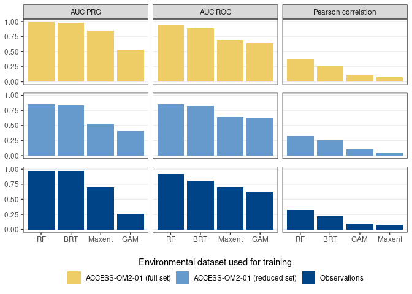
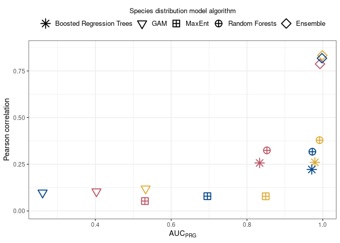
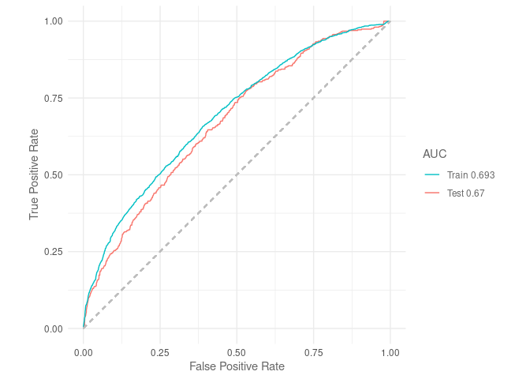
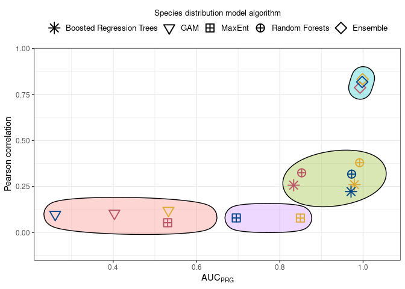
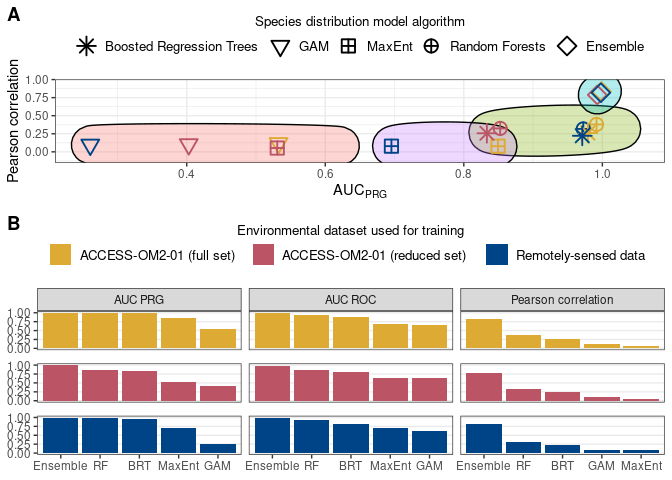

SDMs performance plots
================
Denisse Fierro Arcos
2024-03-28

- <a href="#performance-of-species-distribution-models-sdms"
  id="toc-performance-of-species-distribution-models-sdms">Performance of
  Species Distribution Models (SDMs)</a>
  - <a href="#loading-libraries" id="toc-loading-libraries">Loading
    libraries</a>
  - <a href="#loading-model-evaluation-metrics"
    id="toc-loading-model-evaluation-metrics">Loading model evaluation
    metrics</a>
  - <a href="#bar-plot" id="toc-bar-plot">Bar plot</a>
  - <a href="#scatter-plot" id="toc-scatter-plot">Scatter plot</a>

# Performance of Species Distribution Models (SDMs)

We will use the three performance metrics calculated in this project
($AUC_{PRG}$, $AUC_{ROC}$, and Pearson correlation) to create plots
comparing the predictive performance of all models.

## Loading libraries

``` r
library(tidyverse)
library(tidytext)
library(ggforce)
library(cowplot)
```

``` r
knitr::opts_chunk$set(fig.path = "figures/") 
```

## Loading model evaluation metrics

These metrics were calculated for each SDM algorithm and compiled into a
single file.

``` r
mod_eval_path <- "../../SDM_outputs/model_evaluation_plus_ensemble.csv"
model_eval <- read_csv(mod_eval_path) 
```

    ## Rows: 15 Columns: 6
    ## ── Column specification ────────────────────────────────────────────────────────
    ## Delimiter: ","
    ## chr (2): model, env_trained
    ## dbl (4): auc_roc, auc_prg, pear_cor, pear_norm_weights
    ## 
    ## ℹ Use `spec()` to retrieve the full column specification for this data.
    ## ℹ Specify the column types or set `show_col_types = FALSE` to quiet this message.

## Bar plot

``` r
bars <- model_eval %>% 
  #Rearrange data to facilitate plotting
  pivot_longer(c(auc_roc:pear_cor), names_to = "metric", 
               values_to = "value") %>% 
  #Renaming models to ensure figure labels show correctly
  mutate(model = case_when(str_detect(model, "Random") ~ "RF",
                           str_detect(model, "Trees") ~ "BRT",
                           model == "Maxent" ~ "MaxEnt",
                           str_detect(model, "Weight") ~ "Ensemble",
                           T ~ model),
         #Turning column to factor
         model = factor(model),
         #Renaming metrics to ensure figure labels show correctly
         metric = case_when(str_detect(metric, "auc") ~ 
                              str_to_upper(str_replace(metric, "_", " ")),
                            T ~ "Pearson correlation")) %>%
  #Plot metrics as columns
  ggplot(aes(x = reorder_within(model, desc(value), metric),
             y = value))+
  geom_col(position = "dodge", aes(fill = env_trained))+
  scale_x_reordered()+
  #Divide plots by SDM algorithms and source of environmental data used for 
  #training the model
  facet_grid(env_trained~metric, scales = "free_x")+
  theme_bw()+
  scale_fill_manual(values = c("#ddaa33", "#bb5566", "#004488"),
                    labels = c("ACCESS-OM2-01 (full set)",
                               "ACCESS-OM2-01 (reduced set)",
                               "Remotely-sensed data"))+
  guides(fill = guide_legend(title = "Environmental dataset used for training",
                             title.position = "top", title.hjust = 0.5))+
  #Improving plot
  theme(axis.title = element_blank(), panel.grid.major.x = element_blank(),
        panel.grid.minor.y = element_blank(), strip.text.y = element_blank(),
        legend.position = "top", panel.spacing.y = unit(0.35, "cm"), 
        legend.title = element_text(size = 10), 
        legend.text = element_text(size = 10))

bars
```

<!-- -->

## Scatter plot

We will plot discrimination ability ($AUC_{PRG}$) against correlation to
training data.

``` r
model_eval %>%
  #Initialise plot
  ggplot(aes(auc_prg, pear_cor))+
  #Color points by model and change shape based on environmental dataset
  geom_point(aes(colour = env_trained, shape = model), size = 4, stroke = 1)+
  #Apply predefined theme
  theme_bw()+
  #Change axis titles
  xlab(bquote(AUC[PRG]))+
  ylab("Pearson correlation")+
  #Removing colour legend as it shared with bar plot
  guides(colour = "none",
         #Changing labels for model legend
         shape = guide_legend(title = "Species distribution model algorithm",
                              position = "top"))+
  #Assign new shapes and labels
  scale_shape_manual(labels = c("Boosted Regression Trees", "GAM", "MaxEnt",
                                "Random Forests", "Ensemble"),
                     values = c(8, 6, 12, 10, 5))+
  #Assign same colours as previous figure
  scale_colour_manual(values = c("#ddaa33", "#bb5566", "#004488"))+
  #Change legend title position
  theme(legend.title.position = "top", 
        legend.title = element_text(hjust = 0.5, size = 10), 
        legend.text = element_text(size = 10))+
  lims(y = c(0, 0.87))
```

<!-- -->

We will cluster the SDM algorithms using the metrics shown above
($AUC_{PRG}$ and correlation) to find which ones have similar
performance.

``` r
# We will create a new data frame containing only relevant columns
data <- model_eval %>% 
  unite("model", model:env_trained) %>% 
  select(model, auc_prg, pear_cor) %>% 
  column_to_rownames("model")

# First we will calculate clustering and plot a dendogram to identify a 
# suitable number of clusters for our data
dist <- dist(data, diag = T)
hc <- hclust(dist)

# Now we can plot the results
plot(hc)
```

<!-- -->

From the above plot, it seems four groups will capture our data well. We
will now calculate kmeans using four groups and use this information to
plot it over the performance plot.

``` r
#Calculating kmeans
cls <- kmeans(data, centers = 4)

# Creating plot
scatter <- model_eval %>%
  mutate(cluster = factor(cls$cluster)) %>%
  #Initialise plot
  ggplot(aes(auc_prg, pear_cor))+
  geom_mark_ellipse(aes(fill = cluster), show.legend = F)+
  #Color points by model and change shape based on environmental dataset
  geom_point(aes(colour = env_trained, shape = model), size = 4, stroke = 1)+
  #Apply predefined theme
  theme_bw()+
  #Change axis titles
  xlab(bquote(AUC[PRG]))+
  ylab("Pearson correlation")+
  #Removing colour legend as it shared with bar plot
  guides(colour = "none",
         #Changing labels for model legend
         shape = guide_legend(title = "Species distribution model algorithm",
                              position = "top"))+
  #Assign new shapes and labels
  scale_shape_manual(labels = c("Boosted Regression Trees", "GAM", "MaxEnt",
                                "Random Forests", "Ensemble"),
                     values = c(8, 6, 12, 10, 5))+
  #Assign same colours as previous figure
  scale_colour_manual(values = c("#ddaa33", "#bb5566", "#004488"))+
  #Change legend title position
  theme(legend.title.position = "top", 
        legend.title = element_text(hjust = 0.5, size = 10), 
        legend.text = element_text(size = 10))+
  lims(y = c(-0.1, 0.95), x = c(0.25, 1.05))

#Checking result
scatter
```

<!-- -->

Created a multipanel plot.

``` r
a <- plot_grid(scatter, bars, nrow = 2, labels = c("A", "B"), 
               rel_heights = c(1, 1.3))
a
```

<!-- -->

Saving figure to disk.

``` r
ggsave("../../SDM_outputs/model_metrics_grid.pdf", width = 9, height = 7)
```
