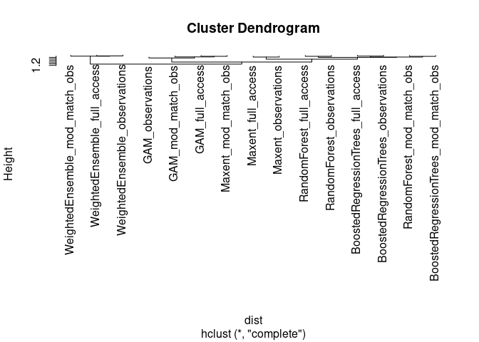

SDMs performance plots
================
Denisse Fierro Arcos
2024-03-28

- <a href="#performance-of-species-distribution-models-sdms"
  id="toc-performance-of-species-distribution-models-sdms">Performance of
  Species Distribution Models (SDMs)</a>
  - <a href="#loading-libraries" id="toc-loading-libraries">Loading
    libraries</a>
  - <a href="#loading-model-evaluation-metrics"
    id="toc-loading-model-evaluation-metrics">Loading model evaluation
    metrics</a>
  - <a href="#bar-plot" id="toc-bar-plot">Bar plot</a>
  - <a href="#scatter-plot" id="toc-scatter-plot">Scatter plot</a>

# Performance of Species Distribution Models (SDMs)

We will use the three performance metrics calculated in this project
($AUC_{PRG}$, $AUC_{ROC}$, and Pearson correlation) to create plots
comparing the predictive performance of all models.

## Loading libraries

``` r
library(tidyverse)
library(tidytext)
library(cowplot)
```

## Loading model evaluation metrics

These metrics were calculated for each SDM algorithm and compiled into a
single file.

``` r
mod_eval_path <- "../../SDM_outputs/model_evaluation.csv"
model_eval <- read_csv(mod_eval_path) 
```

    ## Rows: 14 Columns: 6
    ## ── Column specification ────────────────────────────────────────────────────────
    ## Delimiter: ","
    ## chr (2): model, env_trained
    ## dbl (4): auc_roc, auc_prg, pear_cor, pear_norm_weights
    ## 
    ## ℹ Use `spec()` to retrieve the full column specification for this data.
    ## ℹ Specify the column types or set `show_col_types = FALSE` to quiet this message.

## Bar plot

``` r
bars <- model_eval %>% 
  #Rearrange data to facilitate plotting
  pivot_longer(c(auc_roc:pear_cor), names_to = "metric", 
               values_to = "value") %>% 
  #Renaming models to ensure figure labels show correctly
  mutate(model = case_when(str_detect(model, "Random") ~ "RF",
                           str_detect(model, "Trees") ~ "BRT",
                           model == "Maxent" ~ "MaxEnt",
                           T ~ model),
         #Turning column to factor
         model = factor(model),
         #Renaming metrics to ensure figure labels show correctly
         metric = case_when(str_detect(metric, "auc") ~ 
                              str_to_upper(str_replace(metric, "_", " ")),
                            T ~ "Pearson correlation")) %>%
  #Plot metrics as columns
  ggplot(aes(x = reorder_within(model, desc(value), metric),
             y = value))+
  geom_col(position = "dodge", aes(fill = env_trained))+
  scale_x_reordered()+
  #Divide plots by SDM algorithms and source of environmental data used for training model
  facet_grid(env_trained~metric, scales = "free_x")+
  theme_bw()+
  scale_fill_manual(values = c("#ddaa33", "#bb5566", "#004488"),
                    labels = c("ACCESS-OM2-01 (full set)",
                               "ACCESS-OM2-01 (reduced set)",
                               "Observations"))+
  guides(fill = guide_legend(title = "Environmental dataset used for training",
                             title.position = "top", title.hjust = 0.5))+
  #Improving plot
  theme(axis.title = element_blank(), panel.grid.major.x = element_blank(),
        panel.grid.minor.y = element_blank(), strip.text.y = element_blank(),
        legend.position = "top", panel.spacing.y = unit(0.35, "cm"))

bars
```

<!-- -->

## Scatter plot

We will plot discrimination ability ($AUC_{PRG}$) against correlation to
training data.

``` r
scatter <- model_eval %>%
  #Initialise plot
  ggplot(aes(auc_prg, pear_cor))+
  #Color points by model and change shape based on environmental dataset
  geom_point(aes(colour = env_trained, shape = model), size = 4, stroke = 1)+
  #Apply predefined theme
  theme_bw()+
  #Change axis titles
  xlab(bquote(AUC[PRG]))+
  ylab("Pearson correlation")+
  #Removing colour legend as it shared with bar plot
  guides(colour = "none",
         #Changing labels for model legend
         shape = guide_legend(title = "Species distribution model algorithm",
                              position = "top"))+
  #Assign new shapes and labels
  scale_shape_manual(labels = c("Boosted Regression Trees", "GAM", "MaxEnt",
                                "Random Forests"),
                     values = c(8, 6, 12, 10))+
  #Assign same colours as previous figure
  scale_colour_manual(values = c("#ddaa33", "#bb5566", "#004488"))+
  #Change legend title position
  theme(legend.title.position = "top", 
        legend.title = element_text(hjust = 0.5))+
  lims(y = c(0, 0.4))

scatter
```

<!-- -->

Created a multipanel plot.

``` r
a <- plot_grid(scatter, bars, nrow = 2, labels = c("A", "B"), 
          rel_heights = c(1, 1.3))
a
```

<!-- -->

Saving figure to disk.

``` r
ggsave("../../SDM_outputs/model_metrics_grid.png", width = 9, height = 7)
```
